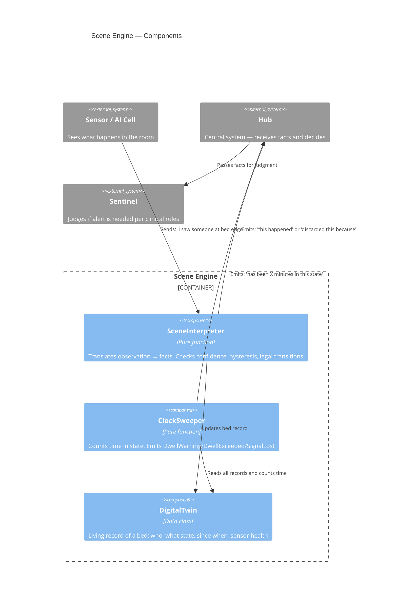
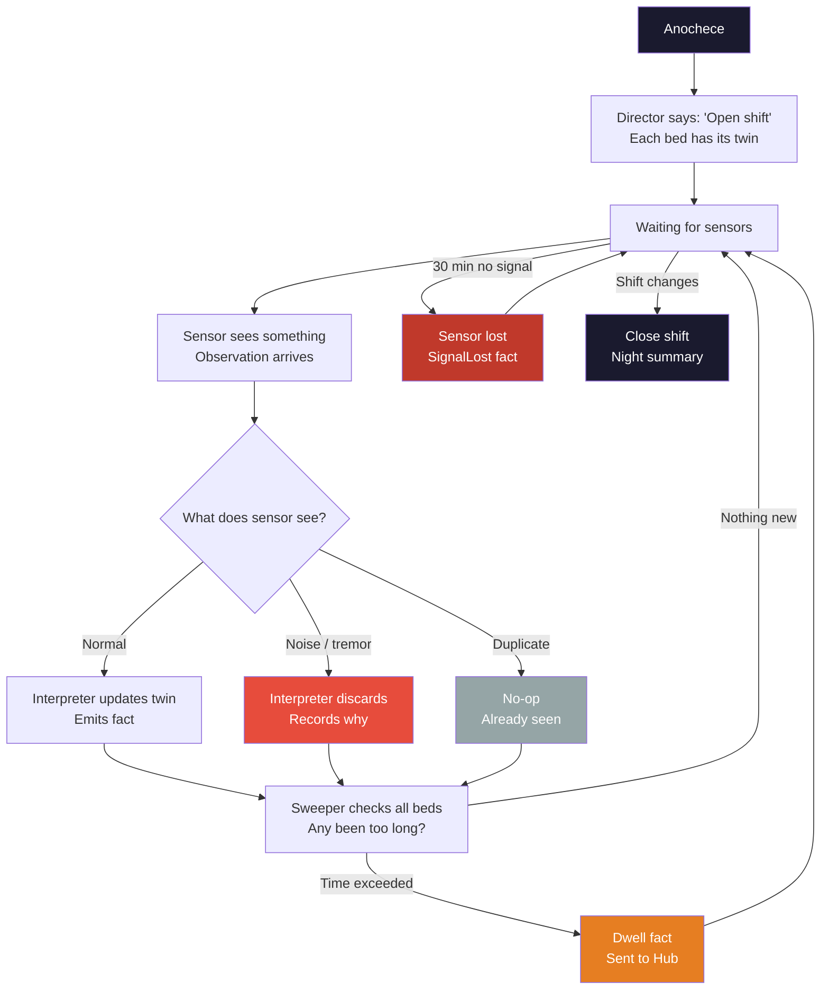
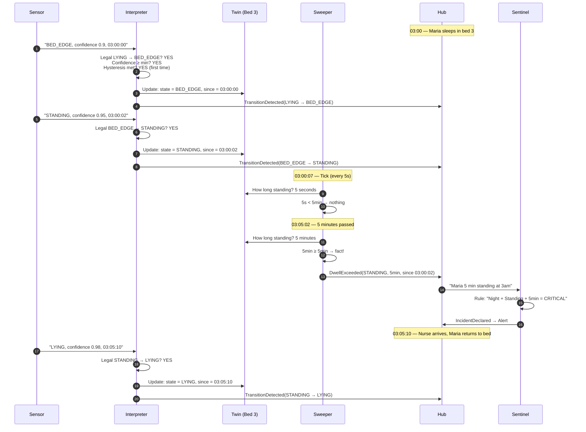
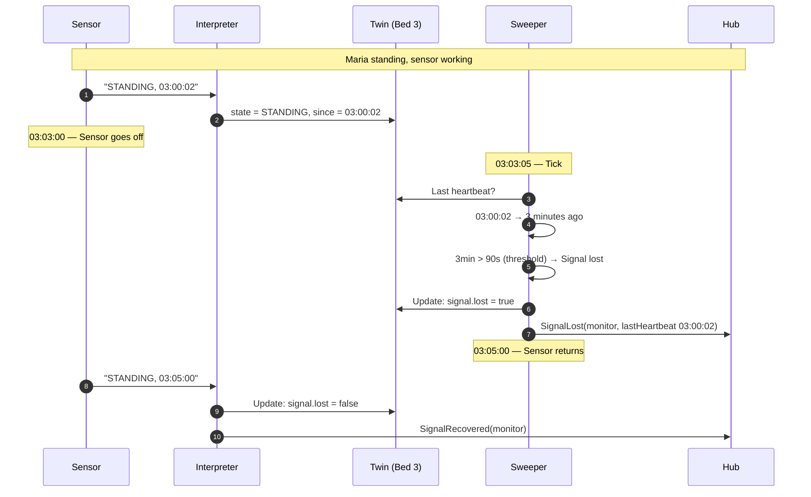
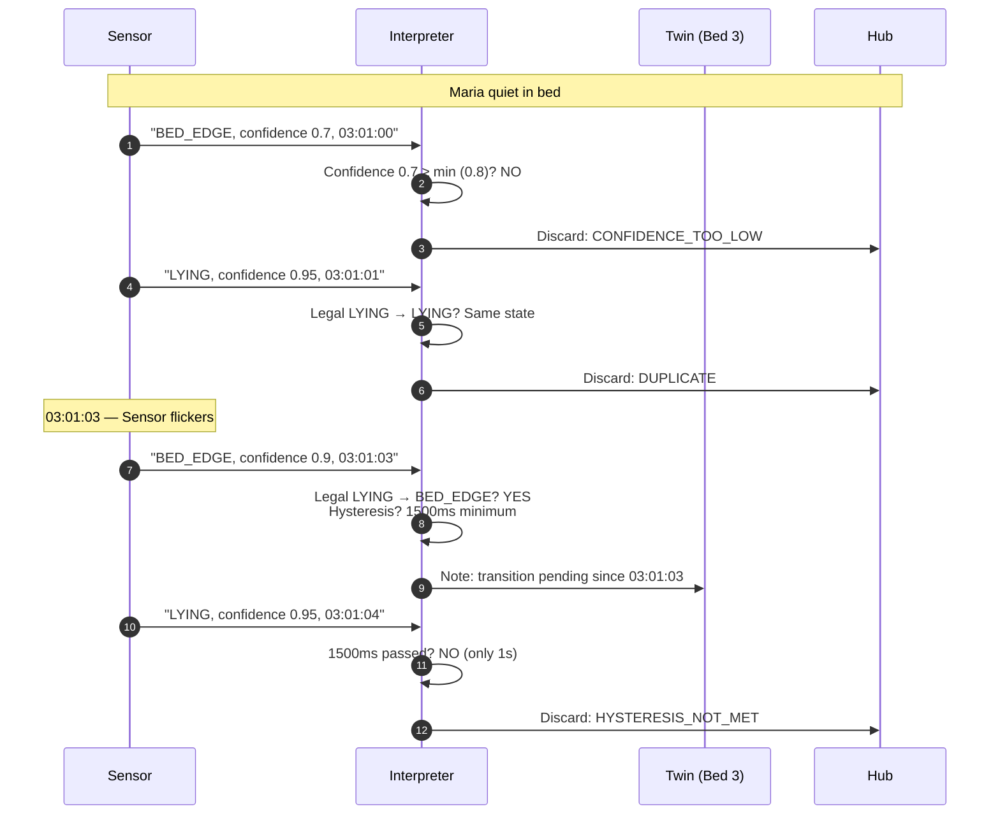

# Scene Engine — Design

**Last updated:** 2026-08-22
**Status:** Sprint 3 complete (SE-1 through SE-20)

---

## 1. Components — Who Does What



### Responsibility Table

| Component | What it does | What it does NOT do | Example |
|-----------|-------------|---------------------|---------|
| **Interpreter** | Translates sensor → fact | Decides if alerting | "Maria went from lying to standing" |
| **Sweeper** | Counts time in state | Knows clinical rules | "Has been standing 5 minutes" |
| **Twin** | Stores current bed state | Stores history | "Bed 3: Maria, standing, since 03:00:02" |

---

## 2. Night Lifecycle



---

## 3. Sequence: Maria's Fall at 03:00



---

## 4. Sequence: Sensor Loss



---

## 5. Sequence: Sensor Noise



---

## 6. Interpreter Pipeline — Pseudocode

```
interpret(twin, observation, now):

  1. CONFIDENCE
     if observation.confidence < calibration.minConfidence[observation.kind]:
         DISCARD → CONFIDENCE_TOO_LOW

  2. SENSOR RECOVERY
     if twin.signal.lost AND kind != HEARTBEAT:
         twin = twin.copy(signal = signal.copy(lost = false))
         facts += SignalRecovered
         // continue evaluating

  3. DUPLICATE
     if observation.kind.toPersonState() == twin.state:
         DISCARD → DUPLICATE

  4. ILLEGAL TRANSITION
     if NOT calibration.table.isLegal(twin.state.kind, newState.kind):
         DISCARD → ILLEGAL_TRANSITION

  5. HYSTERESIS
     durationInState = now - twin.stateSince
     minimum = calibration.table.hysteresis(twin.state.kind, newState.kind)
     if durationInState < minimum:
         DISCARD → HYSTERESIS_NOT_MET

  6. VALID TRANSITION
     newTwin = twin.copy(state = newState, stateSince = now)
     facts += TransitionDetected(from, to)
```

---

## 7. Sweeper Pipeline — Pseudocode

```
sweep(twins, now, catalog, marks):

  FOR EACH twin IN twins:

    // Per-twin catalog resolution (SE-18)
    catalog = twin.calibration?.toDwellCatalog() ?: defaults

    1. SENSOR LOST — skip
       if twin.signal.lost: continue

    2. DURATION IN STATE
       duration = now - twin.stateSince

    3. THRESHOLD EXISTS?
       threshold = catalog.byState[twin.state.kind]
       if threshold == null: continue

    4. ALREADY EMITTED?
       mark = DwellMarkKey(twin.bed, state, since, warning=false)
       if mark in marks.emitted: continue

    5. WARNING (explicit threshold from DwellThreshold)
       if duration >= threshold.warning:
           warningMark = mark.copy(warning=true)
           if warningMark NOT in marks.emitted:
               facts += DwellWarning

    6. EXCEEDED
       if duration >= threshold.exceeded:
           facts += DwellExceeded

    7. SIGNAL LOST
       if heartbeat timeout exceeded:
           facts += SignalLost

  return SweepResult(facts, DwellMarks(marks.emitted + newMarks))
```

---

## 8. Test Scenarios

### A. The Fall at 03:00 ✅
```
GIVEN: Maria in bed 3, asleep, sensor alive
WHEN: sensor sees bed edge → standing → 5 min standing
THEN:
  1. TransitionDetected(LYING → BED_EDGE)
  2. TransitionDetected(BED_EDGE → STANDING)
  3. DwellExceeded(STANDING, 5min)
  → Hub receives 3 facts and can alert
```

### B. Quiet Night ✅
```
GIVEN: 30 beds, all residents asleep
WHEN: 8 hours pass with nothing
THEN:
  1. Zero transition facts
  2. Zero dwell facts
  3. System doesn't scream
  → Silence = normalcy
```

### C. Sensor Loss ✅
```
GIVEN: Maria standing, sensor alive
WHEN: sensor loses signal for 90 seconds
THEN:
  1. SignalLost(monitor, last heartbeat)
  2. Twin goes to UNKNOWN(SIGNAL_LOST)
  → System says "I don't know" instead of assuming all is well
```

### D. Sensor Noise ✅
```
GIVEN: Maria lying
WHEN: BED_EDGE 800ms, back to LYING
THEN: DISCARD (hysteresis not met)
```

### E. Illegal Transition ✅
```
GIVEN: Maria lying
WHEN: OUT_OF_ROOM (without going through standing)
THEN: DISCARD (illegal transition)
```

---

## 9. What Scene Engine Does NOT Need to Know

| Doesn't need | Why |
|--------------|-----|
| Maria's name | Only knows "bed 3 has someone standing" |
| That it's night | Only knows "the observation arrived at 03:00" |
| That 5 minutes is serious | Only knows "has been 5 min in this state" — someone else decides |
| That a nurse is in the hallway | That's staff sensor, suppressed by Sentinel |
| That an alert was sent before | That's Sentinel with its episodes |

---

*Design reference — derived from code. The code is the truth.*
