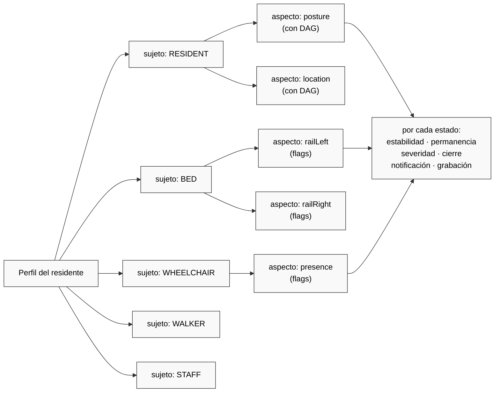
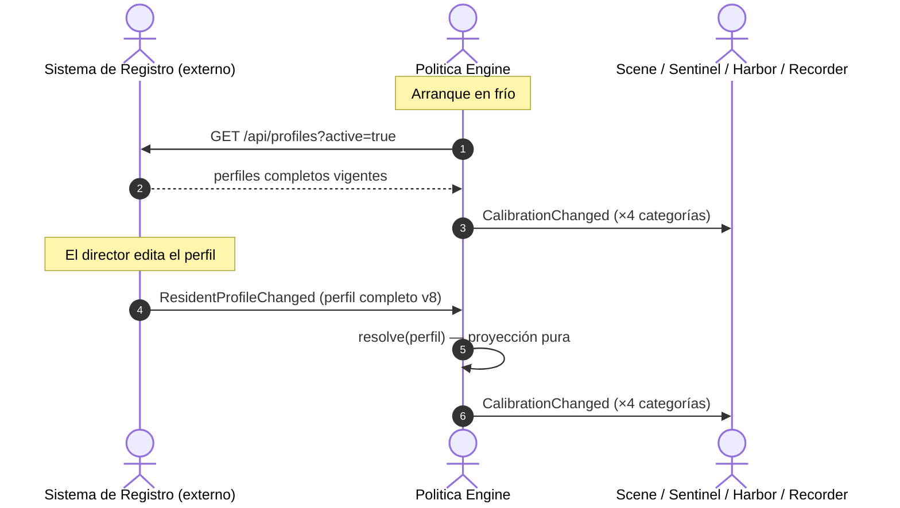

# SPEC-02 — El Perfil del Residente

**Fecha:** 2026-08-29
**Estado:** Propuesta de diseño — pendiente de aprobación
**Reemplaza:** el modelo `AlarmProfile` + `PolicyOverride`
**Build de referencia:** `./gradlew :engines:politica-engine:politica-domain:test`

---

## 0. La tesis

> El motor de políticas está bien por dentro. Lo que está mal es **cómo se lo administra desde afuera**.

Hoy el sistema de registro nos manda *un template más una bolsa de parches*. Nosotros los aplicamos en tres capas de precedencia y producimos calibraciones. Ese formato de cable es peor que los dos modelos que conecta, y es el origen de casi todos los problemas de gestión que estamos teniendo.

La propuesta es una sola idea, y todo lo demás se deriva de ella:

> **Nos llega el perfil completo del residente, inmutable y versionado. Pisamos lo que teníamos. No hay parches, no hay capas, no hay precedencia.**

El catálogo deja de ser una capa de runtime y pasa a ser lo que siempre fue conceptualmente: **una plantilla de autoría**. Se elige, se clona entera, se edita, y a partir de ahí es el perfil de ese residente.

---

## 1. Diagnóstico: qué está roto hoy

### 1.1 La bolsa de overrides tiene agujeros estructurales

`PolicyOverride` tiene tres variantes y son asimétricas sin razón:

| Variante | Lleva umbral | Lleva severidad | Lleva cierre |
|---|:---:|:---:|:---:|
| `HysteresisOverride` | ✓ | — | — |
| `DwellOverride` | ✓ | — | — |
| `ComeBackOverride` | ✓ | ✓ | ✓ |

Como `DwellOverride` no trae severidad, el resolver **la inventa**:

```kotlin
// PolicyResolver.kt — resolveAlertRulesFromDag()
buildAlertRule(
    state = override.state,
    severity = Severity.WARNING,                 // ← nadie lo pidió
    closureCondition = ClosureCondition.STAFF_OR_SAFE,  // ← nadie lo pidió
    triggerOn = TriggerOn.DWELL,
)
```

El director cambió un tiempo y el sistema le eligió la severidad y la condición de cierre por él.

### 1.2 El parche saltea las invariantes del DSL

`DagDsl.kt:127` prohíbe que un estado tenga `alertOnEntry()` y `alertAfter()` a la vez — son excluyentes por razones clínicas:

```kotlin
require(!(onEntry && alertAfter != null)) {
    "$state: alertOnEntry() y alertAfter() son excluyentes"
}
```

Pero un `DwellOverride` **no pasa por el builder**: escribe directo en el mapa resuelto. Se puede terminar con un umbral de permanencia en Scene y una regla de entrada en Sentinel para el mismo estado. La regla que el DSL protege, el override la viola.

### 1.3 Un parche no sabe borrar

Puede cambiar un número. No puede decir *"esta regla ya no aplica a Elena"*. Para sacar una regla hay que tocar el catálogo global, y ahí se le saca a todos.

### 1.4 Nadie puede leer el perfil de un residente

Está repartido entre un catálogo global, un template y N parches. Para saber qué rige sobre Elena esta noche hay que **ejecutar el resolver**. No existe un objeto que el director pueda abrir y leer.

### 1.5 La doble traducción con pérdida

Este es el hallazgo que cierra el diagnóstico. El hub **no piensa en overrides**. Su modelo interno es rico:

```kotlin
// hub/hub-domain/.../PolicyLayers.kt
data class PolicyLayers(
    val level: WatchLevel,
    val template: LevelTemplate,
    val adjustments: List<ManualAdjustment>,  // con actor, at, reason
    val windows: List<TimeWindow>,            // ventanas horarias
)
```

Y después lo **aplasta** en overrides sintéticos solo para poder mandárnoslos:

```kotlin
// PolicyProjection.kt
val ruleId = RuleId("layer-${state.name.lowercase()}")
```

Nosotros los recibimos y los re-expandimos. Los dos lados tienen modelos más ricos que el formato que los une. **El formato de cable es el eslabón más pobre de la cadena, y es el único que no eligió nadie.**

### 1.6 El fingerprint del evento no identifica las reglas

`DefaultPolicyChangeProcessor` descarta el fingerprint que calculó el resolver y computa otro sobre **valores resueltos**:

```kotlin
private fun PolicyCalibration.fingerprint(): Fingerprint = buildFingerprint(
    "hysteresis" to scene.hysteresis,
    "dwell" to scene.dwellThresholds,
    "confidence" to scene.confidence,
)
```

No incluye versión de catálogo, ni template, ni Sentinel, ni Harbor, ni Recorder, ni `comeBackThresholds`. Consecuencia concreta: **cambiar la severidad de una alerta, la condición de cierre, una ventana de grabación o un umbral de come-back produce el mismo fingerprint**. La propiedad que el propio comentario del resolver defiende — *"dos catálogos de versión distinta deben dar huellas distintas"* — no se cumple aguas abajo.

Con perfil inmutable esto se disuelve: la huella es el hash del perfil, y punto.

---

## 2. El modelo de dominio: sujeto × aspecto → estado

Hoy el modelo es "estados del residente" y "estados de la habitación". Es la partición equivocada. El modelo correcto es:



### 2.1 Dos clases de aspecto

La distinción es real y es lo único que cambia entre uno y otro:

| | **Aspecto con DAG** | **Aspecto de flags** |
|---|---|---|
| Ejemplos | postura, ubicación del residente | barandas, silla, andador, staff |
| ¿Hay precedente? | Sí — transiciones enumeradas | No — está o no está |
| Estabilidad | por **arista** (`from(A).to(B) stableFor`) | por **estado** (debounce) |
| Permanencia (dwell) | igual | igual |
| Come-back | necesario (muchos valores) | **redundante** — es el dwell del complemento |
| Severidad, cierre, notificación, grabación | igual | igual |

> Con dos valores, `comeBack(X)` ≡ `dwell(¬X)`. Los aspectos de flags son **más simples** que los de DAG, no más complejos.

### 2.2 `StateKind` mezcla dos ejes ortogonales

Un problema que ya existe y que este modelo destapa:

```kotlin
enum class StateKind {
    LYING, SITTING_IN_BED, BED_EDGE, STANDING,   // ← postura
    IN_ROOM, IN_BATHROOM, ABSENT,                // ← ubicación
}
```

Son mutuamente excluyentes en el enum pero no en la realidad. **Hoy no se puede representar "parada en el baño".** El catálogo tiene una transición `STANDING → IN_BATHROOM`, como si entrar al baño te hiciera dejar de estar parada.

Y la traducción entre los dos enums paralelos de Scene pierde información con consecuencias clínicas:

```kotlin
// SceneDagToTransitionTable.kt:107
SceneState.ON_FLOOR -> StateKind.STANDING  // "Closest mapping"
StateKind.BED_EDGE  -> SceneState.SITTING_IN_BED
```

**Un residente en el piso se representa como parado.** Y `BED_EDGE` — que en `FALL_RISK_CATALOG` es la regla `CRITICAL` con `alertOnEntry` — vuelve del viaje de ida y vuelta convertido en `SITTING_IN_BED`.

### 2.3 Identidad de estado abierta

Las observaciones las emite el edge server, no nosotros. **Llegan las tratemos o no.** Un enum cerrado solo puede representar lo que se compiló: lo que llegue nuevo se fuerza contra el vecino más parecido (como `ON_FLOOR`) o se descarta en silencio.

Por lo tanto la identidad del estado tiene que ser **abierta** y viajar entera de punta a punta, sin tabla de traducción intermedia.

La semántica para un estado no declarado ya existe en el modelo y no hay que inventarla: **bloque vacío = observar sin alertar**, que es exactamente lo que significa `lying { }` en `STANDARD_CATALOG`. Se agrega una sola cosa: que ese caso quede **contabilizado y visible**, no mudo.

### 2.4 "Sin estado" tiene que ser un estado, y el default

`SceneState` arranca así:

```kotlin
val wheelchair: PresenceState = PresenceState.NotPresent
val left:  RailState = RailState.Down
val right: RailState = RailState.Down
```

Un gemelo recién creado **afirma** *"no hay silla, no hay andador, ambos barrales bajos"* sin que ningún sensor haya mirado. Si se escribe la regla "barral bajo con residente acostado = alerta", dispara en todas las camas al arrancar.

`UNKNOWN` debe existir en cada aspecto **y ser el valor inicial**. No alerta nunca por sí mismo. Opcionalmente, un aspecto puede declarar `unknownAfter` para avisarle a mantenimiento que un sensor lleva demasiado tiempo mudo — que es un problema técnico, no clínico.

### 2.5 Las reglas miran un solo estado — y está bien así

La composición **no va en la regla, va en el episodio**. Cada cosa que pasa trae su nivel de criticidad, y con eso alcanza para decidir sin componer nada:

| Situación | Qué hace el sistema |
|---|---|
| Evento de criticidad **menor** que el episodio abierto | entra al episodio como **neutro** — queda registrado, no notifica |
| Evento del **mismo** nivel que el episodio abierto | es parte del mismo episodio — no vuelve a notificar |
| Evento de criticidad **mayor** | eleva el episodio y notifica |

De noche pasan muchas cosas críticas a la vez. Agruparlas por episodio y dejar que la severidad decida qué notifica es más simple y más correcto que enseñarle a una regla a mirar tres estados.

> **Nada es excluyente entre sí. La única dimensión aparte es el cierre.**

Para el MVP el cierre tiene dos disparadores: **personal en la habitación**, y —cuando el aspecto declara un estado seguro— la llegada a ese estado. Es exactamente `ClosureCondition { STAFF_ONLY, SAFE_ONLY, STAFF_OR_SAFE }`, que ya existe y no cambia.

**Consecuencia de diseño:** la absorción por severidad es un **invariante de Sentinel**, no una regla que el perfil tenga que declarar. Se deriva de comparar la severidad del evento con la del episodio abierto. Conviene revisar si el campo `umbrellaEvents` de `AlertRule` —hoy un `Set` por regla— sigue haciendo falta, o si esta comparación lo reemplaza entero.

### 2.6 La unidad es el residente

No hay entidad "habitación" compartida. El ciudadano del sistema es el **residente**, y la habitación es su lugar. Si hay dos personas en un cuarto, para nosotros son **dos habitaciones virtuales**.

Por eso el perfil del residente **es** la unidad completa: no hay que componerlo con un perfil de habitación, ni resolver a quién le corresponde una baranda. La cama, la silla, el andador y el staff son aspectos *de ese residente*, aunque físicamente el objeto sea uno solo.

---

## 3. El contrato externo

### 3.1 Las dos vías, ambas obligatorias



1. **Novedad por evento** cuando el perfil cambia — trae el perfil **entero**, nunca un delta.
2. **Endpoint de consulta** para el arranque en frío. Sin esto no hay recuperación después de un reinicio: hoy dependemos de que alguien vuelva a tocar la política.

### 3.2 El perfil que nos tiene que llegar

```json
{
  "profileId": "elena@v8",
  "residentId": "elena",
  "version": 8,
  "supersedes": 7,
  "validFrom": "2026-08-29T22:00:00Z",

  "provenance": {
    "template": "FALL_RISK",
    "templateVersion": "2.1.0",
    "authoredBy": "dr-mendez",
    "authoredAt": "2026-08-29T14:31:12Z",
    "reason": "Post-caída del 27/8: adelanto el aviso de baño y exijo barandas."
  },

  "windows": [
    { "id": "always", "from": "00:00", "to": "24:00" },
    { "id": "night",  "from": "22:00", "to": "07:00" }
  ],

  "subjects": {
    "resident": {
      "kind": "dag",
      "aspects": {
        "posture": {
          "unknownIsInitial": true,
          "confidence": { "BED_EDGE": 0.90, "STANDING": 0.85 },
          "transitions": [
            { "from": "LYING",    "to": "BED_EDGE", "stableFor": "PT1.5S",
              "record": { "before": "PT30S", "after": "PT2M" } },
            { "from": "BED_EDGE", "to": "STANDING", "stableFor": "PT1.5S" }
          ],
          "states": {
            "LYING": {
              "comeBack": [
                { "window": "always", "warningAfter": "PT10M", "alertAfter": "PT20M",
                  "severity": "CRITICAL", "closure": "STAFF_OR_SAFE",
                  "notify": { "channels": ["PUSH","TABLET"], "escalateAfter": "PT5M" } }
              ]
            },
            "BED_EDGE": {
              "onEntry": [
                { "window": "always", "severity": "CRITICAL", "closure": "STAFF_ONLY",
                  "notify": { "channels": ["PUSH","TABLET","WARD_BOARD"], "escalateAfter": "PT0S" },
                  "record": { "before": "PT30S", "after": "PT2M", "quality": "HIGH" } }
              ]
            },
            "STANDING": { "observeOnly": true }
          }
        },

        "location": {
          "unknownIsInitial": true,
          "states": {
            "IN_BATHROOM": {
              "dwell": [
                { "window": "always", "warningAfter": "PT10M", "alertAfter": "PT15M",
                  "severity": "WARNING", "closure": "SAFE_ONLY",
                  "notify": { "channels": ["TABLET"], "escalateAfter": "PT10M" } },
                { "window": "night",  "warningAfter": "PT5M",  "alertAfter": "PT8M",
                  "severity": "CRITICAL",    "closure": "STAFF_OR_SAFE",
                  "notify": { "channels": ["PUSH","TABLET"], "escalateAfter": "PT3M" } }
              ]
            }
          }
        }
      }
    },

    "bed": {
      "kind": "flags",
      "aspects": {
        "railLeft": {
          "unknownIsInitial": true,
          "states": {
            "DOWN": {
              "stableFor": "PT3S",
              "dwell": [
                { "window": "night", "alertAfter": "PT1M", "severity": "CRITICAL",
                  "closure": "STAFF_ONLY",
                  "notify": { "channels": ["PUSH","TABLET"], "escalateAfter": "PT2M" } }
              ]
            }
          }
        },
        "railRight": { "sameAs": "railLeft" }
      }
    },

    "wheelchair": {
      "kind": "flags",
      "aspects": {
        "presence": {
          "unknownIsInitial": true,
          "unknownAfter": "PT30M",
          "states": {
            "OUT_OF_REACH": {
              "stableFor": "PT5S",
              "dwell": [
                { "window": "always", "warningAfter": "PT2M", "alertAfter": "PT5M",
                  "severity": "WARNING", "closure": "SAFE_ONLY",
                  "notify": { "channels": ["TABLET"], "escalateAfter": "PT5M" } }
              ]
            }
          }
        }
      }
    },

    "staff": {
      "kind": "flags",
      "aspects": {
        "presence": {
          "unknownIsInitial": true,
          "states": { "PRESENT": { "observeOnly": true, "closesEpisodes": true } }
        }
      }
    }
  }
}
```

**Notas de diseño sobre esta estructura:**

- **Duraciones en ISO-8601** (`PT1.5S`, `PT10M`). Sin ambigüedad de unidad, parseables por `java.time.Duration.parse`.
- **`observeOnly: true`** es el bloque vacío del DSL: lo veo, lo anoto, no alerto. Es también el default de todo estado no mencionado.
- **`closesEpisodes: true`** en staff le da referente real a `ClosureCondition.STAFF_ONLY`. Hoy es un enum opaco: el sistema promete "cierra cuando llega el staff" sin tener forma de saber que llegó.
- **`provenance.reason` es obligatorio.** El hub ya lo exige hoy con un `require` cuyo mensaje dice *"a change of watch nobody can explain"*. Sube del ajuste al perfil.
- **No hay `mobilityAid`.** Si usa andador, es porque el perfil tiene `subjects.walker`. Deja de ser una etiqueta y pasa a ser estructura.

### 3.3 Ventanas horarias sin reintroducir el merge

Las ventanas son la única cosa que se parece a una capa, y hay que resolverlas sin volver a la precedencia. La solución:

> **Cada regla declara a qué ventana pertenece. Politica resuelve una calibración por ventana y las emite en el borde horario.**

A las 22:00 Politica emite `CalibrationChanged` con la calibración nocturna; a las 07:00 emite la diurna. Los motores siguen teniendo **una sola calibración vigente** y no cambian en nada.

Ventajas: resolución pura (sin dependencia del reloj dentro de `resolve`), cero impacto en motores, y el cambio de régimen queda **en el bus y en el log de auditoría** — que es donde tiene que estar, porque "a las 22:00 cambiaron las reglas" es un hecho clínico.

### 3.4 API

| Método | Ruta | Para qué |
|---|---|---|
| `GET` | `/api/profiles?active=true` | arranque en frío — todos los perfiles vigentes |
| `GET` | `/api/profiles/{residentId}` | perfil vigente de un residente |
| `GET` | `/api/profiles/{residentId}/versions` | historial completo |
| `GET` | `/api/profiles/{residentId}?at={instant}` | qué regía en un instante — **la consulta del auditor** |
| `PUT` | `/api/profiles/{residentId}` | publicar versión nueva (perfil entero) |

**Se eliminan:** `PUT /api/policies/{id}/watch-level`, `POST /api/policies/{id}/adjustments`, `DELETE /api/policies/{id}/adjustments/{adjId}`. Ese es el API de parches.

### 3.5 Nombres: hay dos "hub"

Nuestro módulo `hub/` se llama igual que el sistema de registro real y externo. Con un contrato de frontera explícito la confusión se vuelve cara. Propuesta: nuestro módulo pasa a llamarse por lo que hace — **`policy-gateway`** o **`policy-shim`** — y "hub" queda reservado para el sistema real.

---

## 4. Qué guardamos nosotros

Somos **caché de lectura, no sistema de registro**. Guardamos:

```
perfil vigente por residente   (el documento completo, tal como llegó)
+ versión y validFrom
+ fingerprint = hash(documento)
+ las N versiones anteriores    (para la consulta del auditor)
```

Inmutable: una versión nueva **no muta** la anterior, la sucede. `v7` sigue existiendo y sigue siendo consultable. Esa es la única forma de contestar *"¿con qué reglas se decidió la noche del 27?"* sin reconstruir nada.

Y el fingerprint deja de ser un problema: **es el hash del documento**. No hay que decidir qué campos entran.

---

## 5. Qué recibe cada motor

`resolve()` deja de ser un merge y pasa a ser una **proyección**:

```
resolve(perfil) → { scene, sentinel, harbor, recorder }
```

### 5.1 Scene

```json
{
  "residentId": "elena", "fingerprint": "sha256:4f2a…", "window": "night",
  "table": { "LYING→BED_EDGE": "PT1.5S", "BED_EDGE→STANDING": "PT1.5S" },
  "confidence": { "BED_EDGE": 0.90, "STANDING": 0.85 },
  "heartbeatTimeout": "PT90S",
  "dwellThresholds":    { "IN_BATHROOM": { "warning": "PT5M",  "exceeded": "PT8M" } },
  "comeBackThresholds": { "LYING":       { "warning": "PT10M", "exceeded": "PT20M" } },
  "sceneHysteresis": { "bed.left": "PT3S", "wheelchair": "PT5S" },
  "sceneThresholds": { "bed.left":   { "warning": "PT30S", "exceeded": "PT1M" },
                       "wheelchair": { "warning": "PT2M",  "exceeded": "PT5M" } }
}
```

> `sceneHysteresis` y `sceneThresholds` **ya existen** en `SceneCalibration`. Hoy llegan vacíos.

### 5.2 Sentinel

```json
{
  "residentId": "elena", "fingerprint": "sha256:4f2a…",
  "transitionRules": {
    "BED_EDGE": { "id": "alert-bed_edge", "triggerOn": "ENTRY",
                  "severity": "CRITICAL", "closure": "STAFF_ONLY", "requiresNvr": true }
  },
  "dwellRules": {
    "IN_BATHROOM": { "id": "alert-in_bathroom", "triggerOn": "DWELL",
                     "severity": "CRITICAL", "closure": "STAFF_OR_SAFE" }
  },
  "comeBackRules": {
    "LYING": { "id": "comeback-lying", "triggerOn": "COME_BACK",
               "severity": "CRITICAL", "closure": "STAFF_OR_SAFE" }
  },
  "sceneStateRules": {
    "bed.left":   { "id": "alert-bed-left-down", "severity": "CRITICAL", "closure": "STAFF_ONLY" },
    "wheelchair": { "id": "alert-wheelchair-out", "severity": "WARNING", "closure": "SAFE_ONLY" }
  }
}
```

> `sceneStateRules` **ya existe** en `SentinelCalibration`. Hoy llega vacío.

### 5.3 Harbor

```json
{
  "residentId": "elena",
  "defaultChannels": {
    "CRITICAL": ["PUSH","TABLET","WARD_BOARD"],
        "WARNING":  ["TABLET"]
  },
  "escalationTimeouts": { "CRITICAL": "PT0S", "WARNING": "PT10M" }
}
```

> **Cambio de fondo:** hoy `PolicyResolver` emite `HarborPolicy(emptyMap(), emptyMap())` y los canales por severidad están **hardcodeados en el adapter**. O sea la política de notificación no está en la política. Con el perfil, el `notify` de cada regla es la fuente y el adapter deja de inventar.

### 5.4 Recorder

```json
{
  "residentId": "elena",
  "rules": [
    { "id": "rec-bed_edge-entry", "trigger": { "onEpisodeOpened": "CRITICAL" },
      "window": { "before": "PT30S", "after": "PT2M" }, "quality": "HIGH" },
    { "id": "rec-lying-to-bed_edge", "trigger": { "onTransition": "LYING→BED_EDGE" },
      "window": { "before": "PT30S", "after": "PT2M" }, "quality": "HIGH" }
  ]
}
```

---

## 6. Mapa del gap

Lo más importante del relevamiento: **las puntas ya están construidas**. El agujero está exactamente en el medio.

| Componente | Estado | Detalle |
|---|:---:|---|
| `SceneState` (twin): staff, silla, andador, barandas | ✅ construido | presencia + alcance, barral izq/der con `Down→Up→Cover`, bitmask, `diff()` |
| `DigitalTwin.scene` + `evolveScene()` + `emitSceneStateChanged()` | ✅ construido | emite cambio por campo |
| `SceneCalibration.sceneHysteresis` / `.sceneThresholds` | ✅ construido | **llegan vacíos** |
| `SentinelCalibration.sceneStateRules` | ✅ construido | **llega vacío** |
| Harbor / Recorder: ¿ramifican sobre estados concretos? | ✅ no | clave opaca — costo cero |
| **`PolicyCalibration`: transporte de campos de escena** | ❌ falta | no tiene dónde llevarlos |
| **DSL: autoría de reglas de habitación** | ❌ falta | `room { }` solo sabe `staffEnters { closeEpisode() }` |
| **Contrato externo: perfil completo** | ❌ falta | hoy es template + parches |
| **Reloj por slot en el gemelo** | ❌ falta | un solo `sceneSince` para todo el compuesto |
| **`UNKNOWN` como valor inicial** | ❌ falta | defaults `NotPresent` / `Down` afirman sin haber mirado |
| **Identidad de estado abierta** | ❌ falta | dos enums paralelos con mapeo con pérdida |

### El bug que hay que arreglar sí o sí

> Hay **un solo `sceneSince`** para todo el `SceneState` compuesto. Si el barral baja a las 3:00 y la silla se mueve a las 3:10, `sceneSince` se resetea y se pierde que el barral lleva diez minutos abajo. **Hoy la permanencia por campo no se puede calcular**, aunque los slots de calibración existan. Cada aspecto necesita su propio `since`.

---

## 7. Plan de trabajo

Las fases son secuenciales: cada una deja el sistema andando y verde.

### Fase 1 — Reloj por slot y `UNKNOWN`
`SceneState` pasa de campos sueltos a un mapa `aspecto → (estado, desde)`. Se agrega `UNKNOWN` a cada jerarquía y se lo hace valor inicial. El `ClockSweeper` barre todos los slots en vez de uno.
**Toca:** `scene-domain`. **No toca:** políticas, contrato externo.
**Prueba:** el barral lleva 10 minutos abajo aunque la silla se haya movido en el medio.

### Fase 2 — Identidad de estado abierta
Se unifican `SceneState`(enum) y `StateKind` en una identidad `sujeto × aspecto × estado`, abierta. Muere la tabla de traducción y con ella la degradación `ON_FLOOR → STANDING`.
**Toca:** `contracts`, `scene-domain`. **Compilador-guiado**, mecánico.
**Prueba:** una observación de un estado nunca visto llega, se registra, no alerta, y **queda contada**.

### Fase 3 — El perfil como contrato
Nace `ResidentProfile` con su DSL y su JSON. Mueren `AlarmProfile`, `PolicyOverride`, `PolicySource`, `applyOverrides()` y las tres capas. `resolve()` pasa a ser proyección pura.
**Toca:** `contracts`, `politica-domain`, `politica-adapters`.
**Prueba:** un perfil completo entra, cuatro calibraciones salen, sin ninguna precedencia.

### Fase 4 — Transporte de los campos de escena
`PolicyCalibration` gana el transporte; los adapters llenan `sceneHysteresis`, `sceneThresholds` y `sceneStateRules`, que ya existen.
**Toca:** `contracts`, `politica-adapters`.
**Prueba:** "barral bajo un minuto de noche" abre episodio en Sentinel, de punta a punta.

### Fase 5 — Frontera externa
Los dos canales: evento de novedad y endpoint de arranque. Se eliminan los endpoints de parches. Se renombra nuestro `hub`. Ventanas horarias por re-emisión en el borde.
**Toca:** `hub` (→ `policy-gateway`), `messaging`.
**Prueba:** reinicio en frío recupera todos los perfiles vigentes sin que nadie toque nada.

### Fase 6 — Notificación de vuelta a la política
`HarborPolicy` se llena desde el `notify` del perfil; el adapter deja de hardcodear canales por severidad.
**Toca:** `politica-adapters`, `harbor-domain`.

---

## 8. Decisiones tomadas

| # | Decisión | Por qué |
|---|---|---|
| 1 | **Versionado inmutable** con historial | Hace trivial el fingerprint y da respuesta a "¿con qué reglas se decidió esa noche?" sin reconstruir |
| 2 | **Reemplazo total**, nunca delta | Elimina precedencia, defaults inventados e invariantes salteadas |
| 3 | **Dos canales**, evento + endpoint | Sin el endpoint no hay arranque en frío |
| 4 | **Ventanas por re-emisión** en el borde horario | Cero impacto en motores; el cambio de régimen queda auditado |
| 5 | **`UNKNOWN` inicial** en todo aspecto | Un default que afirma sin haber mirado es un falso positivo garantizado |
| 6 | El catálogo es **plantilla de autoría**, no capa de runtime | Es lo que ya es conceptualmente; el `templateId` queda como procedencia |
| 7 | **Una regla mira un solo estado** | La composición va en el episodio; la severidad decide qué notifica. Sin condiciones cruzadas |
| 8 | **La unidad es el residente** | Dos ocupantes = dos habitaciones virtuales. El perfil es autosuficiente |

### `mostProtective` — dónde vive ahora

Hoy el hub, al colapsar capas, aplica *"gana el umbral más protector"* (`PolicyProjection.kt:130`). Es una regla clínica real y no se puede perder. En el modelo nuevo **no tiene lugar en la resolución** — porque ya no hay capas que colapsar. Pasa a ser una **validación de autoría**: cuando el director publica un perfil menos protector que la plantilla de la que nació, el sistema se lo advierte y le pide confirmación explícita. Deja de ser una regla silenciosa de merge y pasa a ser una conversación con quien firma.

---

## 9. Preguntas cerradas

Las tres se cerraron.

| Pregunta | Respuesta |
|---|---|
| ¿Estados de habitación compartidos? | **No.** La unidad es el residente; dos ocupantes son dos habitaciones virtuales. El perfil es la unidad completa y no se compone con nada. |
| ¿Condiciones cruzadas (barral bajo **y** acostado **y** sin staff)? | **No, y no hacen falta.** Las reglas miran un solo estado a propósito: la composición ocurre en el episodio y la severidad decide qué notifica. Ver §2.5. |
| ¿Quién construye la UI de autoría? | **La proponemos nosotros.** Si nosotros definimos la estructura, el panel sale de la estructura y no al revés. Brief y wireframes entregados al equipo de UX. |

---

## 10. El contrato, publicado

El modelo de §3 está **tipado y publicado como librería**, no sólo descrito acá:

```
com.manahive:profile-api:1.0.0-SNAPSHOT
```

Módulo `platform/profile-api`. Es `pure-domain`, así que el guard de pureza garantiza que el jar no arrastra **ninguna dependencia externa**: sólo la stdlib de Kotlin. El equipo que implemente el sistema de registro compila contra él en vez de deducir la estructura de un ejemplo de JSON.

| Qué contiene | Para qué |
|---|---|
| `ResidentProfileDto` y su árbol | la estructura exacta que recibimos, en primitivos (String, Int, Map) |
| `ProfileEndpoints` | las cinco firmas que el sistema de registro tiene que exponer |
| `ResidentProfileChanged` | el evento de novedad |
| `ProfileValidation.validate()` | **la misma validación que vamos a correr nosotros**, para que la corran antes de mandar |
| `ResidentProfileSpec` | el perfil de Elena completo como ejemplo canónico ejecutable |

`ProfileValidation` devuelve **todos** los problemas con su ruta exacta —
`subjects.bed.aspects.railLeft.states.DOWN.dwell[0].warningAfter` — no el primero: quien arma un perfil quiere la lista entera, no una carrera de un error por vez.

Y protege en la frontera las invariantes que hoy los overrides saltean: entrada/permanencia/no-retorno excluyentes, preaviso antes del plazo, ventana declarada, motivo obligatorio, `unknownIsInitial`, y come-back rechazado en aspectos binarios por redundante.

---

## Apéndice — Fuentes

| Afirmación | Archivo |
|---|---|
| Precedencia en tres capas, `applyOverrides` | `engines/politica-engine/politica-domain/.../PolicyResolver.kt` |
| Severidad inventada para `DwellOverride` | `PolicyResolver.kt` → `resolveAlertRulesFromDag()` |
| Invariante entry/dwell | `platform/contracts/.../policy/DagDsl.kt:127` |
| Fingerprint del evento sin versión de catálogo | `.../politica/DefaultPolicyChangeProcessor.kt:53` |
| Capas ricas del hub, `mostProtective`, ventanas | `hub/hub-domain/.../policy/PolicyLayers.kt`, `PolicyProjection.kt` |
| Overrides sintéticos `layer-{state}` | `PolicyProjection.kt` |
| `SceneState` con staff/silla/andador/barandas | `platform/contracts/.../scene/SceneState.kt` |
| Un solo `sceneSince` | `engines/scene-engine/scene-domain/.../core/DigitalTwin.kt:46` |
| Mapeo con pérdida `ON_FLOOR → STANDING` | `.../scene/core/SceneDagToTransitionTable.kt:107` |
| Slots ya existentes en las calibraciones | `.../scene/calibration/SceneCalibration.kt:27`, `.../sentinel/SentinelCalibration.kt:49` |
| Canales de Harbor hardcodeados | `engines/politica-engine/politica-adapters/.../PolicyAdapters.kt` |
| API de parches | `hub/hub-service/.../api/PolicyController.kt` |
