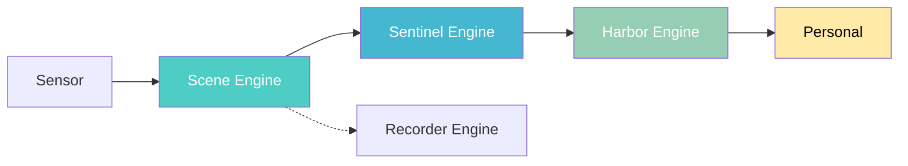
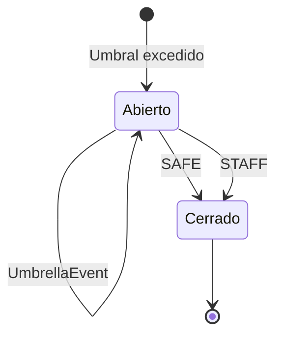

# SPEC-01: Flujo de Datos Reactivo entre Motores de Dominio Puro

## 1. Resumen Ejecutivo

El sistema Hisso monitorea la actividad de residentes en entornos de cuidado crítico mediante un pipeline reactivode 4 motores. Detecta automáticamente situaciones de riesgo (caídas, permanencia excesiva, ausencia) y notifica al personal en tiempo real.

**Objetivo:** Transformar telemetría de sensores en acciones de cuidado antes de que ocurra un incidente.

**Métricas clave:**
| Métrica | Valor | Objetivo |
|---------|-------|----------|
| Latencia de detección | <1s | <5s |
| Tiempo de notificación | <2s | <10s |
| Falsos positivos | 0% | <5% |

---

## 2. Pipeline Reactivo de Cuatro Etapas



### 2.1 Scene Engine (Gemelo Digital)

**Función:** Recibe observaciones del sensor y mantiene el estado actual del residente.

**Entrada:** `Observation` (kind, confidence, timestamp)
**Salida:** `SceneEvent` (TransitionDetected, ComeBackExceeded, DwellExceeded)

**Lógica:**
1. Valida confianza ≥ 0.8
2. Verifica transición en tabla legal
3. Aplica hysteresis (1500ms anti-flickering)
4. ClockSweeper evalúa umbrales periódicamente

### 2.2 Sentinel Engine (Juicio Clínico)

**Función:** Evalúa eventos de escena y decide si abrir/cerrar episodios de seguridad.

**Entrada:** `SceneEvent`
**Salida:** `SentinelSignal` (EpisodeOpened, UmbrellaEvent, EpisodeClosed)

**Lógica:**
1. Abre episodio cuando umbral se excede
2. Escala severidad si riesgo aumenta
3. Cierra episodio según condición (STAFF_OR_SAFE)

### 2.3 Harbor Engine (Logística)

**Función:** Convierte señales clínicas en notificaciones al personal.

**Entrada:** `SentinelSignal`
**Salida:** `NoticeCommand` (Create, Dispatch, Resolve)

**Canales disponibles:**
- `CONSOLE` - Log del sistema
- `PUSH` - Notificación móvil
- `TABLET` - Tablet de enfermería
- `WARD_BOARD` - Pantalla del pasillo

### 2.4 Recorder Engine (Evidencia)

**Función:** Captura video antes/después de un incidente.

**Entrada:** `SceneEvent`, `SentinelSignal`
**Salida:** `RecordingCommand` (Start, Stop)

---

## 3. Configuración de Políticas

### 3.1 Parámetros Configurables

| Parámetro | Descripción | Rango típico |
|-----------|-------------|---------------|
| **comeBack.warning** | Tiempo para pre-warning | 5-30 min |
| **comeBack.exceeded** | Tiempo para alerta | 10-60 min |
| **dwell.warning** | Permanencia para aviso | 5-30 min |
| **dwell.exceeded** | Permanencia para alerta | 10-60 min |
| **severity** | Nivel de severidad | WARNING, CRITICAL |
| **closure** | Condición de cierre | SAFE_ONLY, STAFF_OR_SAFE, STAFF_AND_SAFE |

### 3.2 Ejemplo: Configuración Básica

```kotlin
sceneCalibration {
    comeBack {
        LYING warning 12min exceeded 15min
    }
    dwell {
        SITTING_IN_BED warning 10min exceeded 15min
    }
}
```

---

## 4. Episodios y Ciclo de Vida



### 4.1 Condiciones de Cierre

| Condición | Descripción |
|-----------|-------------|
| `SAFE_ONLY` | Residente vuelve a estado seguro |
| `STAFF_OR_SAFE` | Personal llega O residente seguro |
| `STAFF_AND_SAFE` | Personal Y residente seguro |

---

## 5. Notificaciones

### 5.1 Prioridad por Severidad

| Severidad | Suprimida por budget | Canales |
|-----------|---------------------|---------|
| WARNING | Sí | PUSH, TABLET |
| CRITICAL | **No** | PUSH, TABLET, WARD_BOARD |

### 5.2 Anti-fatiga (Notification Budget)

El sistema limita notificaciones por residente para evitar fatiga del personal, pero **nunca suprime alertas CRITICAL**.

---

## 6. Validación mediante Blueprints

Los blueprints son escenarios ejecutables que validan el comportamiento del sistema.

### 6.1 Ejecución

```bash
# Blueprint específico
./gradlew :blueprints:jose-301-sitting-bed:run

# Todos los blueprints
./scripts/blueprints.sh
```

### 6.2 Resultados Esperados

| Métrica | Valor |
|---------|-------|
| Total checks | 36 |
| Checks pasados | 36 ✅ |
| Tasa de éxito | 100% |

---

## 7. Referencias

- **Anexo A:** Escenario E1 - José 301 (17 min sin acostarse)
- **Blueprint:** `jose-301-sitting-bed`
- **Código fuente:** `engines/scene-engine/scene-bdd/Scenario.kt`
