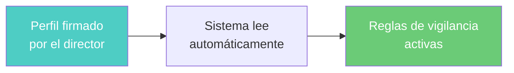
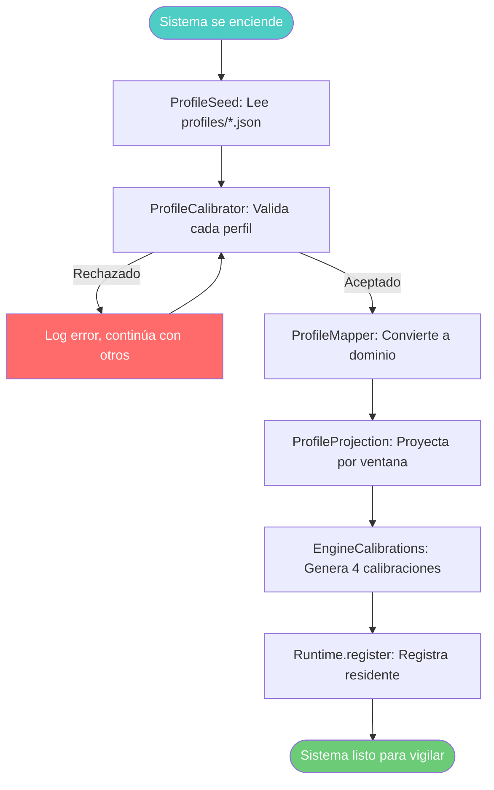
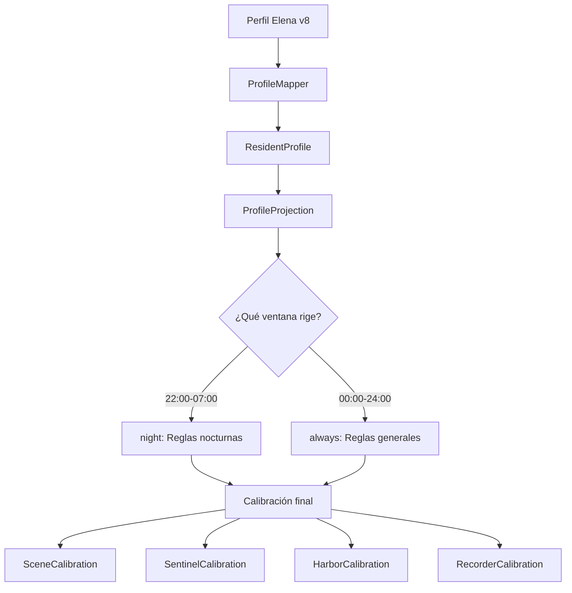
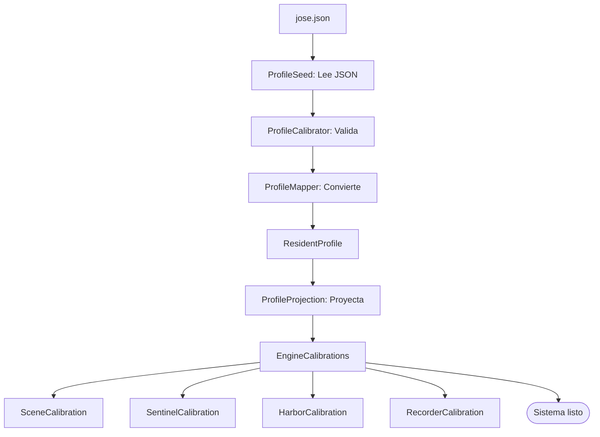

# SPEC-02: Arranque en Frío - Sistema de Políticas

## 1. Resumen para Director Geriátrico

### ¿Qué es el "Arranque en Frío"?

Cuando el sistema se enciende después de un apagado (maintenance, reset, power outage), debe recuperar automáticamente todas las reglas de vigilancia de cada residente **sin intervención manual**.

**Sin arranque en frío:** Después de un reinicio, el sistema queda ciego hasta que alguien vuelva a tocar una política a mano. En un turno noche, eso es inaceptable.

### ¿Cómo funciona?



| Paso | Qué sucede | Quién lo hace |
|------|------------|---------------|
| 1 | Director firma perfil del residente | Director Geriátrico |
| 2 | Sistema guarda el documento | Sistema de Registro (Hub) |
| 3 | Al encender, sistema lee perfiles | Motor de Políticas |
| 4 | Reglas se aplican automáticamente | Motores de Vigilancia |

---

## 2. Diagrama: Flujo de Arranque



### Detalle del Flujo

```
┌─────────────────────────────────────────────────────────────────────────────┐
│  ARRANQUE EN FRÍO                                                           │
├─────────────────────────────────────────────────────────────────────────────┤
│                                                                             │
│  1. ProfileSeed lee directorio: profiles/*.json                            │
│     └── Excluye census.json (no es perfil)                                 │
│                                                                             │
│  2. Por cada archivo:                                                       │
│     ├── ProfileCalibrator.accept(dto)                                      │
│     │   ├── ProfileMapper.map(dto) → Validar estructura                    │
│     │   ├── Verificar versión > versión anterior                           │
│     │   └── ProfileProjection.project(profile, window)                     │
│     │       └── Genera calibración para ventana activa                     │
│     │                                                                      │
│     └── Runtime.register() o recalibrate()                                 │
│         └── Aplica calibración a los 4 motores                            │
│                                                                             │
│  3. Resultado: Todos los residentes con reglas activas                     │
│                                                                             │
└─────────────────────────────────────────────────────────────────────────────┘
```

---

## 3. Diagrama: Resolución de Perfil



### Resolución por Ventanas

| Hora | Ventana activa | Reglas que aplican |
|------|----------------|-------------------|
| 10:00 | always | Generales (dwell baño 15min) |
| 21:00 | always | Generales |
| 22:00 | **night** | Nocturnas (dwell baño 8min) |
| 03:00 | **night** | Nocturnas |
| 07:00 | always | Generales |

---

## 4. Método: ProfileCalibrator

### Función principal: `accept()`

```kotlin
fun accept(dto: ResidentProfileDto): Boolean {
    // 1. Validar y convertir
    val profile = when (val mapped = ProfileMapper.map(dto)) {
        is ProfileMapping.Accepted -> mapped.profile
        is ProfileMapping.Rejected -> {
            mapped.problems.forEach { log.error("  {} — {}", it.path, it.message) }
            return false
        }
    }
    
    // 2. Verificar versión (no retroceder)
    val anterior = vigentes[profile.residentId]?.profile
    if (anterior != null && profile.version <= anterior.version) {
        log.warn("Perfil v{} descartado: ya rige v{}", profile.version, anterior.version)
        return false
    }
    
    // 3. Proyectar por ventana activa
    val window = activeWindow(profile)
    return apply(profile, window)
}
```

### Función: `activeWindow()`

```kotlin
fun activeWindow(profile: ResidentProfile): String {
    val ahora = LocalTime.now(clock)
    return profile.windows.firstOrNull { it.isActiveAt(ahora) }?.id
        ?: ResidentProfile.ALWAYS
}
```

### Función: `apply()`

```kotlin
private fun apply(profile: ResidentProfile, window: String): Boolean {
    // 1. Proyectar perfil según ventana
    val proyectada = ProfileProjection.project(profile, window)
    
    // 2. Generar calibraciones para motores
    val calibrations = EngineCalibrations.from(proyectada.value)
    
    // 3. Registrar o actualizar en runtime
    val existing = runtime.get(profile.residentId)
    if (existing == null) {
        runtime.register(profile.residentId, bed, night, monitor, calibrations)
    } else {
        runtime.recalibrate(profile.residentId, calibrations)
    }
    
    // 4. Guardar perfil vigente
    vigentes[profile.residentId] = Vigente(profile, window)
    return true
}
```

---

## 5. Diseño: Estructura de Perfil

### Jerarquía del Perfil

```
┌─────────────────────────────────────────────────────────────────┐
│  RESIDENTE (Elena v8)                                          │
├─────────────────────────────────────────────────────────────────┤
│  Ventanas: [night: 22:00-07:00]                                │
├─────────────────────────────────────────────────────────────────┤
│  SUJETO: resident (kind: dag)                                  │
│  ├── Aspecto: posture                                           │
│  │   ├── LYING → comeBack 10/20min (CRITICAL)                 │
│  │   ├── BED_EDGE → onEntry inmediato (CRITICAL)              │
│  │   └── STANDING → observeOnly                                │
│  └── Aspecto: location                                          │
│      └── IN_BATHROOM → dwell 10/15min (WARNING)                │
│          └── night: dwell 5/8min (CRITICAL) ← CAMBIA DE NOCHE │
├─────────────────────────────────────────────────────────────────┤
│  SUJETO: bed (kind: flags)                                     │
│  └── Aspecto: left                                              │
│      └── DOWN → dwell 1min night (HIGH)                        │
├─────────────────────────────────────────────────────────────────┤
│  SUJETO: wheelchair (kind: flags)                              │
│  └── Aspecto: presence                                          │
│      └── OUT_OF_REACH → dwell 2/5min (WARNING)                 │
├─────────────────────────────────────────────────────────────────┤
│  SUJETO: staff (kind: flags)                                   │
│  └── Aspecto: presence                                          │
│      └── PRESENT → observeOnly, closesEpisodes                 │
└─────────────────────────────────────────────────────────────────┘
```

### Tabla de Tipos de Sujetos

| Sujeto | Kind | Aspectos | Ejemplo |
|--------|------|----------|---------|
| resident | dag | posture, location | LYING, IN_BATHROOM |
| bed | flags | railLeft, railRight | DOWN, UP |
| wheelchair | flags | presence | IN_REACH, OUT_OF_REACH |
| walker | flags | presence | IN_REACH, OUT_OF_REACH |
| staff | flags | presence | PRESENT, ABSENT |

### Tabla de Tipos de Reglas

| Regla | Descripción | Ejemplo |
|-------|-------------|---------|
| **comeBack** | Tiempo sin volver a estado base | 15min sin acostarse |
| **dwell** | Tiempo permaneciendo en estado | 10min en baño |
| **onEntry** | Dispara al entrar al estado | Baranda baja = alerta inmediata |
| **observeOnly** | Solo registra, no alerta | STANDING |

---

## 6. Contrato: API Externa

### Endpoints del Sistema de Registro

```
┌─────────────────────────────────────────────────────────────────┐
│  GET  /api/profiles?active=true                                │
│       → Arranque en frío: todos los perfiles vigentes          │
│                                                                 │
│  GET  /api/profiles/{residentId}                               │
│       → Perfil vigente de un residente                         │
│                                                                 │
│  GET  /api/profiles/{residentId}/versions                      │
│       → Historial completo (nueva → vieja)                     │
│                                                                 │
│  GET  /api/profiles/{residentId}?at={instant}                  │
│       → Auditoría: qué regía en un momento dado                │
│                                                                 │
│  PUT  /api/profiles/{residentId}                               │
│       → Publicar versión nueva (perfil completo)               │
└─────────────────────────────────────────────────────────────────┘
```

### Evento de Cambio en Tiempo Real

```kotlin
data class ResidentProfileChanged(
    val at: String,                    // ISO-8601
    val profile: ResidentProfileDto,   // Perfil completo
)
```

### Contrato de Inmutabilidad

> "Cada versión es completa e inmutable. No hay deltas, no hay parches, no hay capas de precedencia. Llega un perfil, se pisa el anterior, se reinterpreta todo."

---

## 7. Ejemplo: Elena v8 (FALL_RISK)

### JSON Completo

```json
{
  "profileId": "elena@v8",
  "residentId": "elena",
  "version": 8,
  "supersedes": 7,
  "validFrom": "2026-08-29T22:00:00Z",
  "provenance": {
    "template": "FALL_RISK",
    "templateVersion": "2.1.0",
    "authoredBy": "dr-mendez",
    "authoredAt": "2026-08-29T14:31:12Z",
    "reason": "Post-caída del 27/8: adelanto el aviso de baño y exijo barandas."
  },
  "windows": [
    { "id": "night", "from": "22:00", "to": "07:00" }
  ],
  "subjects": {
    "resident": {
      "kind": "dag",
      "aspects": {
        "posture": {
          "unknownIsInitial": true,
          "confidence": { "BED_EDGE": 0.9, "STANDING": 0.85 },
          "transitions": [
            { "from": "LYING", "to": "BED_EDGE", "stableFor": "PT1.5S",
              "record": { "before": "PT30S", "after": "PT2M", "quality": "HIGH" } },
            { "from": "BED_EDGE", "to": "STANDING", "stableFor": "PT1.5S" }
          ],
          "states": {
            "LYING": {
              "comeBack": [
                { "window": "always", "warningAfter": "PT10M", "alertAfter": "PT20M",
                  "severity": "CRITICAL", "closure": "STAFF_OR_SAFE",
                  "notify": { "channels": ["PUSH","TABLET"], "escalateAfter": "PT5M" } }
              ]
            },
            "BED_EDGE": {
              "onEntry": [
                { "window": "always", "severity": "CRITICAL", "closure": "STAFF_AND_SAFE",
                  "notify": { "channels": ["PUSH","TABLET","WARD_BOARD"], "escalateAfter": "PT0S" },
                  "record": { "before": "PT30S", "after": "PT2M", "quality": "HIGH" } }
              ]
            },
            "STANDING": { "observeOnly": true }
          }
        },
        "location": {
          "unknownIsInitial": true,
          "states": {
            "IN_BATHROOM": {
              "dwell": [
                { "window": "always", "warningAfter": "PT10M", "alertAfter": "PT15M",
                  "severity": "WARNING", "closure": "SAFE_ONLY" },
                { "window": "night", "warningAfter": "PT5M", "alertAfter": "PT8M",
                  "severity": "CRITICAL", "closure": "STAFF_OR_SAFE",
                  "notify": { "channels": ["PUSH","TABLET"], "escalateAfter": "PT3M" } }
              ]
            }
          }
        }
      }
    },
    "bed": {
      "kind": "flags",
      "aspects": {
        "railLeft": {
          "unknownIsInitial": true,
          "states": {
            "DOWN": {
              "stableFor": "PT3S",
              "dwell": [
                { "window": "night", "alertAfter": "PT1M", "severity": "HIGH",
                  "closure": "STAFF_AND_SAFE",
                  "notify": { "channels": ["PUSH","TABLET"], "escalateAfter": "PT2M" } }
              ]
            }
          }
        }
      }
    },
    "wheelchair": {
      "kind": "flags",
      "aspects": {
        "presence": {
          "unknownIsInitial": true,
          "unknownAfter": "PT30M",
          "states": {
            "OUT_OF_REACH": {
              "stableFor": "PT5S",
              "dwell": [
                { "window": "always", "warningAfter": "PT2M", "alertAfter": "PT5M",
                  "severity": "WARNING", "closure": "SAFE_ONLY" }
              ]
            }
          }
        }
      }
    },
    "staff": {
      "kind": "flags",
      "aspects": {
        "presence": {
          "unknownIsInitial": true,
          "states": {
            "PRESENT": { "observeOnly": true, "closesEpisodes": true }
          }
        }
      }
    }
  }
}
```

### Resumen de Reglas de Elena

| Sujeto | Aspecto | Estado | Regla | Ventana | Severidad |
|--------|---------|--------|-------|---------|-----------|
| resident | posture | LYING | comeBack 10/20min | always | CRITICAL |
| resident | posture | BED_EDGE | onEntry inmediato | always | CRITICAL |
| resident | location | IN_BATHROOM | dwell 10/15min | always | WARNING |
| resident | location | IN_BATHROOM | dwell 5/8min | night | CRITICAL |
| bed | railLeft | DOWN | dwell 1min | night | HIGH |
| wheelchair | presence | OUT_OF_REACH | dwell 2/5min | always | WARNING |
| staff | presence | PRESENT | observeOnly | - | - |

---

## 8. Ejemplo: José E1 (ComeBack 12/15m)

### JSON Completo

```json
{
  "profileId": "jose@v1",
  "residentId": "jose",
  "version": 1,
  "supersedes": null,
  "validFrom": "2024-01-15T22:00:00Z",
  "provenance": {
    "template": "STANDARD",
    "templateVersion": "1.0.0",
    "authoredBy": "dr-sistema",
    "authoredAt": "2024-01-15T10:00:00Z",
    "reason": "Configuración inicial para escenario E1: ComeBack 12/15 minutos"
  },
  "windows": [],
  "subjects": {
    "resident": {
      "kind": "dag",
      "aspects": {
        "posture": {
          "unknownIsInitial": true,
          "confidence": { "SITTING_IN_BED": 0.8 },
          "transitions": [
            { "from": "LYING", "to": "SITTING_IN_BED", "stableFor": "PT1.5S" },
            { "from": "SITTING_IN_BED", "to": "LYING", "stableFor": "PT1.5S" }
          ],
          "states": {
            "LYING": {
              "comeBack": [
                { 
                  "window": "always", 
                  "warningAfter": "PT12M", 
                  "alertAfter": "PT15M",
                  "severity": "WARNING", 
                  "closure": "STAFF_OR_SAFE",
                  "notify": { 
                    "channels": ["PUSH", "TABLET"], 
                    "escalateAfter": "PT5M" 
                  } 
                }
              ]
            },
            "SITTING_IN_BED": {
              "observeOnly": true
            }
          }
        }
      }
    }
  }
}
```

### Resumen de Reglas de José

| Sujeto | Aspecto | Estado | Regla | Ventana | Severidad |
|--------|---------|--------|-------|---------|-----------|
| resident | posture | LYING | comeBack 12/15min | always | WARNING |
| resident | posture | SITTING_IN_BED | observeOnly | - | - |

### Traducción: JSON → Blueprint

```kotlin
// El JSON de José se traduce a esto en el blueprint:
val configBasica = sceneCalibration {
    table = TransitionTable.RELEASE_2
    confidence { StateKind.SITTING_IN_BED min 0.8 }
    comeBack {
        LYING warning Duration.ofMinutes(12) exceeded Duration.ofMinutes(15)
    }
    heartbeatTimeout = Duration.ofSeconds(90)
}
```

---

## 9. Comparación: Elena vs José

| Característica | Elena v8 | José E1 |
|----------------|----------|---------|
| **Nivel de riesgo** | FALL_RISK (alto) | STANDARD (bajo) |
| **Versión** | 8 (revisado múltiples veces) | 1 (inicial) |
| **Ventanas** | night (22:00-07:00) | always (24/7) |
| **Sujetos** | resident, bed, wheelchair | resident |
| **Aspectos** | posture, location, railLeft | posture |
| **ComeBack** | 10/20min CRITICAL | 12/15min WARNING |
| **Dwell baño** | 10/15min WARNING | No configurado |
| **Barandas** | 1min night HIGH | No configurado |
| **Grabación** | Sí (bed_edge, transiciones) | No |

---

## 10. Flujo Completo: JSON → Sistema



---

## 11. Café en Mano: Escenario Próximo

| Pregunta | Respuesta pendiente |
|----------|---------------------|
| ¿Qué sensores detectan "café en mano"? | ? |
| ¿Qué regla clínica aplica? | ? |
| ¿Qué severity tiene? | ? |
| ¿Qué canales notifican? | ? |

---

**Referencia:** `SPEC-01-Flujo-Datos-Reactivo.md` | `ANEXO-A-Jose301-EscenarioE1.md`
