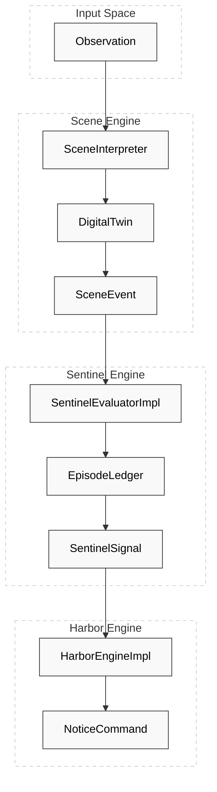
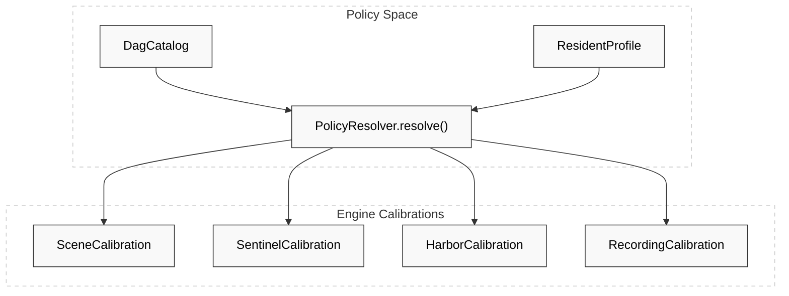

# Project Overview

Relevant source files

- 
- 
- 
- 
- 
- 
- 

Hisso is a resident safety monitoring platform designed for care facilities. It processes real-time observations from sensors (such as cameras or floor radars) to detect resident activity, manage safety episodes, and dispatch notifications to staff when care thresholds are exceeded.

The system is built on **Pure Domain** principles, utilizing a **Hexagonal Architecture** to separate core logic from infrastructure like NATS messaging and REST APIs.

## Core Pipeline Architecture

The system operates as a four-stage reactive pipeline. Each stage is a "Pure Domain Engine" that receives input, evaluates it against a specific `PolicyCalibration`, and produces output without side effects.

### The Four Engines

1. **Scene Engine**: Translates raw `Observation` data into high-level `SceneEvent` objects (e.g., transitions between states like `Lying` to `SittingInBed`).
2. **Sentinel Engine**: Monitors `SceneEvent` streams to manage the lifecycle of an `Episode`. It determines when an event constitutes a safety risk based on duration (Dwell) or immediate entry.
3. **Harbor Engine** (also known as **Vigia**): Routes `SentinelSignal` outputs to specific communication channels (Console, Push, Tablet) as `NoticeCommand` objects.
4. **Recorder Engine**: Decides when to trigger NVR (Network Video Recorder) evidence gathering based on specific events or signals.

### Data Flow Mapping

The following diagram maps the conceptual pipeline to the primary code entities that handle the transformations.

**Diagram: Pipeline Logic to Code Entity Map**

**Sources:** [blueprints/jose-301-e2e-pipeline/src/main/kotlin/jose301e2e/Main.kt143-173](https://github.com/pbaalerta-wq/hisso1/blob/d9fca861/blueprints/jose-301-e2e-pipeline/src/main/kotlin/jose301e2e/Main.kt#L143-L173) [blueprints/jose-301-sitting-bed/README.md130-141](https://github.com/pbaalerta-wq/hisso1/blob/d9fca861/blueprints/jose-301-sitting-bed/README.md?plain=1#L130-L141)

---

## Architectural Principles

### 1. Pure Domain & Hexagonal Architecture

The core logic of every engine is "pure"—it does not perform I/O, use reflections, or depend on frameworks. This allows the same logic to run in a production NATS-based microservice, a CLI batch processor, or a BDD test harness.

- **Domain**: Interfaces like `Engine` and `Decider`.
- **Infrastructure**: Adapters for NATS (e.g., `SceneNatsEgress`) and Spring Boot services.

### 2. Policy-Driven Behavior

System behavior is not hard-coded but derived from a `PolicyCalibration`. The **Politica** engine resolves high-level "Director's Language" (e.g., "Alert me if Jose sits for 15 minutes") into technical thresholds for each engine.

**Diagram: Policy Resolution to Engine Calibration**

**Sources:** [blueprints/jose-301-e2e-pipeline/src/main/kotlin/jose301e2e/Main.kt29-53](https://github.com/pbaalerta-wq/hisso1/blob/d9fca861/blueprints/jose-301-e2e-pipeline/src/main/kotlin/jose301e2e/Main.kt#L29-L53) [engines/politica-engine/politica-domain/src/test/kotlin/com/manahive/politica/TriggerSemanticsSpec.kt46-80](https://github.com/pbaalerta-wq/hisso1/blob/d9fca861/engines/politica-engine/politica-domain/src/test/kotlin/com/manahive/politica/TriggerSemanticsSpec.kt#L46-L80)

### 3. NATS Messaging Backbone

Services communicate asynchronously via NATS JetStream. Each engine is typically wrapped in a service that ingests from one NATS subject and publishes to another, maintaining strict resident isolation through subject taxonomy.

---

## Documentation Map

This wiki is organized into the following detailed sections:

|Section|Title|Description|
|---|---|---|
|**1.1**|[Getting Started & Build System](https://github.com/pbaalerta-wq/hisso1/blob/d9fca861/Getting%20Started%20&%20Build%20System)|Build requirements, Gradle conventions, and project structure.|
|**1.2**|[Domain Kernel & Shared Contracts](https://github.com/pbaalerta-wq/hisso1/blob/d9fca861/Domain%20Kernel%20&%20Shared%20Contracts)|Foundational types: `BedId`, `SceneEvent`, and `Observation`.|
|**2**|[Core ArchitectureNaN-NaN](https://github.com/pbaalerta-wq/hisso1/blob/d9fca861/Core%20Architecture#LNaN-LNaN)|Detailed breakdown of the Scene, Sentinel, Harbor, and Recorder engines.|
|**3**|[Policy Engine (Politica)](https://github.com/pbaalerta-wq/hisso1/blob/d9fca861/Policy%20Engine%20\(Politica\))|The DSL and resolution logic that translates care requirements into system settings.|
|**4**|[Night-Watch Runtime](https://github.com/pbaalerta-wq/hisso1/blob/d9fca861/Night-Watch%20Runtime)|The production orchestrator that wires engines together for real-time monitoring.|
|**5**|[Hub Service](https://github.com/pbaalerta-wq/hisso1/blob/d9fca861/Hub%20Service)|The system of record for resident policies and the census.|
|**6**|[Messaging Infrastructure (NATS)](https://github.com/pbaalerta-wq/hisso1/blob/d9fca861/Messaging%20Infrastructure%20\(NATS\))|Subject taxonomy, JetStream configuration, and connectivity patterns.|
|**9**|[Blueprints & BDD Testing](https://github.com/pbaalerta-wq/hisso1/blob/d9fca861/Blueprints%20&%20BDD%20Testing)|Executable specifications (like `jose-301`) used for end-to-end verification.|

For a high-level overview of the build system and how to run your first blueprint, see **[Getting Started & Build System](https://deepwiki.com/pbaalerta-wq/hisso1/1.1-getting-started-and-build-system)**. For details on the common data types used across the pipeline, see **[Domain Kernel & Shared Contracts](https://deepwiki.com/pbaalerta-wq/hisso1/1.2-domain-kernel-and-shared-contracts)**.

**Sources:** [gradle/libs.versions.toml1-31](https://github.com/pbaalerta-wq/hisso1/blob/d9fca861/gradle/libs.versions.toml#L1-L31) [blueprints/jose-301-sitting-bed/README.md147-157](https://github.com/pbaalerta-wq/hisso1/blob/d9fca861/blueprints/jose-301-sitting-bed/README.md?plain=1#L147-L157) [hub/hub-service/src/main/resources/application.yml1-37](https://github.com/pbaalerta-wq/hisso1/blob/d9fca861/hub/hub-service/src/main/resources/application.yml#L1-L37)

### On this page

- [Project Overview](https://deepwiki.com/pbaalerta-wq/hisso1/1-project-overview#project-overview)
- [Core Pipeline Architecture](https://deepwiki.com/pbaalerta-wq/hisso1/1-project-overview#core-pipeline-architecture)
- [The Four Engines](https://deepwiki.com/pbaalerta-wq/hisso1/1-project-overview#the-four-engines)
- [Data Flow Mapping](https://deepwiki.com/pbaalerta-wq/hisso1/1-project-overview#data-flow-mapping)
- [Architectural Principles](https://deepwiki.com/pbaalerta-wq/hisso1/1-project-overview#architectural-principles)
- [1. Pure Domain & Hexagonal Architecture](https://deepwiki.com/pbaalerta-wq/hisso1/1-project-overview#1-pure-domain-hexagonal-architecture)
- [2. Policy-Driven Behavior](https://deepwiki.com/pbaalerta-wq/hisso1/1-project-overview#2-policy-driven-behavior)
- [3. NATS Messaging Backbone](https://deepwiki.com/pbaalerta-wq/hisso1/1-project-overview#3-nats-messaging-backbone)
- [Documentation Map](https://deepwiki.com/pbaalerta-wq/hisso1/1-project-overview#documentation-map)
