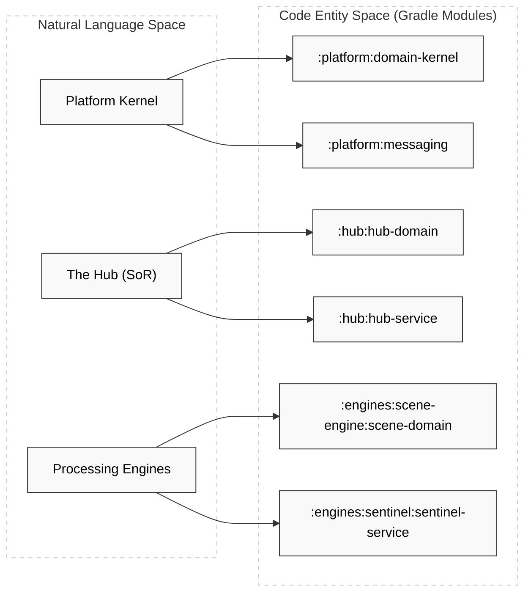
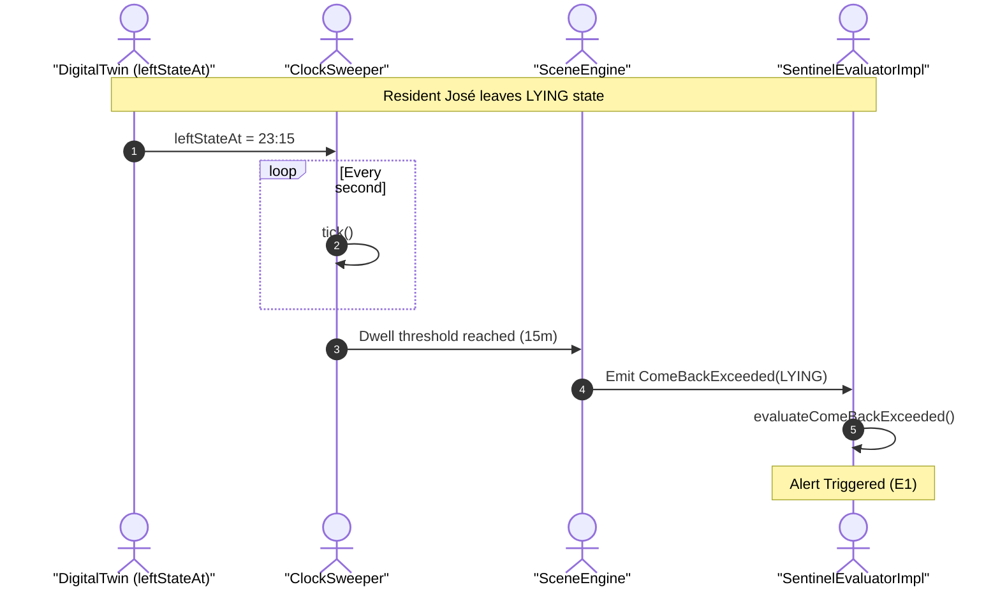

# 1.1. Getting Started & Build System

Relevant source files

- [](https://github.com/pbaalerta-wq/hisso1/blob/d9fca861/.gitignore)
- [](https://github.com/pbaalerta-wq/hisso1/blob/d9fca861/blueprints/jose-301-sitting-bed/README.md?plain=1)
- [](https://github.com/pbaalerta-wq/hisso1/blob/d9fca861/build-logic/build.gradle.kts)
- [](https://github.com/pbaalerta-wq/hisso1/blob/d9fca861/build-logic/settings.gradle.kts)
- [](https://github.com/pbaalerta-wq/hisso1/blob/d9fca861/build-logic/src/main/kotlin/manahive.kotlin-common.gradle.kts)
- [](https://github.com/pbaalerta-wq/hisso1/blob/d9fca861/build-logic/src/main/kotlin/manahive.pure-domain.gradle.kts)
- [](https://github.com/pbaalerta-wq/hisso1/blob/d9fca861/build-logic/src/main/kotlin/manahive.spring-service.gradle.kts)
- [](https://github.com/pbaalerta-wq/hisso1/blob/d9fca861/engines/sentinel/sentinel-service/src/main/kotlin/com/manahive/sentinel/service/SentinelApplication.kt)
- [](https://github.com/pbaalerta-wq/hisso1/blob/d9fca861/gradle/libs.versions.toml)
- [](https://github.com/pbaalerta-wq/hisso1/blob/d9fca861/gradle/wrapper/gradle-wrapper.jar)
- [](https://github.com/pbaalerta-wq/hisso1/blob/d9fca861/gradle/wrapper/gradle-wrapper.properties)
- [](https://github.com/pbaalerta-wq/hisso1/blob/d9fca861/hub/hub-service/src/main/resources/application.yml)
- [](https://github.com/pbaalerta-wq/hisso1/blob/d9fca861/platform/messaging/src/main/kotlin/com/manahive/messaging/NatsTopology.kt)
- [](https://github.com/pbaalerta-wq/hisso1/blob/d9fca861/settings.gradle.kts)

This page details the technical environment, build configuration, and execution procedures for the Hisso codebase. The project is built using Kotlin and a modular Gradle structure, emphasizing architectural purity through custom convention plugins.

## 1. Environment Setup

The project uses the **Gradle Wrapper** to ensure build consistency across environments. The wrapper and version catalog are stored in the repository and should not be ignored by version control [`.gitignore`:10-12](https://deepwiki.com/pbaalerta-wq/hisso1/1.1-getting-started-and-build-system).

- **JDK Version**: Java 25 (configured via JVM Toolchain) [`build-logic/src/main/kotlin/manahive.kotlin-common.gradle.kts`:6](https://deepwiki.com/pbaalerta-wq/hisso1/1.1-getting-started-and-build-system).
- **Build Tool**: Gradle 9.6.0 [`gradle/wrapper/gradle-wrapper.properties`:3](https://deepwiki.com/pbaalerta-wq/hisso1/1.1-getting-started-and-build-system).
- **Kotlin Version**: 2.4.20-RC [`gradle/libs.versions.toml`:2](https://deepwiki.com/pbaalerta-wq/hisso1/1.1-getting-started-and-build-system).
- **Spring Boot**: 4.0.1 [`gradle/libs.versions.toml`:3](https://deepwiki.com/pbaalerta-wq/hisso1/1.1-getting-started-and-build-system).

### Cloning and Building

To initialize the project, clone the repository and run the build command:

```
git clone https://github.com/pbaalerta-wq/hisso1.gitcd hisso1./gradlew build
```

## 2. Build System Architecture

Hisso employs a **Composite Build** pattern where the build logic is separated into a `build-logic` directory [`settings.gradle.kts`:2](https://deepwiki.com/pbaalerta-wq/hisso1/1.1-getting-started-and-build-system). This directory contains convention plugins that enforce architectural constraints across all modules.

### Version Catalog

All dependencies and versions are centralized in `gradle/libs.versions.toml` [`gradle/libs.versions.toml`:1-32](https://deepwiki.com/pbaalerta-wq/hisso1/1.1-getting-started-and-build-system). This allows for type-safe dependency management across the project.

### Convention Plugins

The system defines three primary convention plugins in `build-logic`:

|Plugin|Purpose|Key Features|
|---|---|---|
|`manahive.kotlin-common`|Base configuration for all Kotlin modules.|Sets JVM toolchain to 25, enables `-Xjsr305=strict`, and enforces the **Test-dependency guard** [`build-logic/src/main/kotlin/manahive.kotlin-common.gradle.kts`:6-61](https://deepwiki.com/pbaalerta-wq/hisso1/1.1-getting-started-and-build-system).|
|`manahive.pure-domain`|Enforces Hexagonal Architecture "Core" purity.|Enables `explicitApi()`. Includes the **Purity Guard** which fails the build if external dependencies (other than Kotlin stdlib) are detected in the runtime classpath [`build-logic/src/main/kotlin/manahive.pure-domain.gradle.kts`:6-33](https://deepwiki.com/pbaalerta-wq/hisso1/1.1-getting-started-and-build-system).|
|`manahive.spring-service`|Configures Spring Boot microservices.|Applies Spring Boot and Kotlin-Spring plugins; manages `spring-boot-dependencies` platform [`build-logic/src/main/kotlin/manahive.spring-service.gradle.kts`:1-15](https://deepwiki.com/pbaalerta-wq/hisso1/1.1-getting-started-and-build-system).|

### Architectural Guards

The build system implements automated enforcement of architectural rules:

1. **Production Purity**: Production modules cannot depend on modules ending in `-bdd` or `-test-data` [`build-logic/src/main/kotlin/manahive.kotlin-common.gradle.kts`:32-61](https://deepwiki.com/pbaalerta-wq/hisso1/1.1-getting-started-and-build-system).
2. **External Dependency Block**: Pure domain modules are restricted from using Spring, NATS, or JDBC to ensure they remain platform-agnostic [`build-logic/src/main/kotlin/manahive.pure-domain.gradle.kts`:20-33](https://deepwiki.com/pbaalerta-wq/hisso1/1.1-getting-started-and-build-system).


**Sources:** [`build-logic/src/main/kotlin/manahive.kotlin-common.gradle.kts`:1-65](https://deepwiki.com/pbaalerta-wq/hisso1/1.1-getting-started-and-build-system), [`build-logic/src/main/kotlin/manahive.pure-domain.gradle.kts`:1-34](https://deepwiki.com/pbaalerta-wq/hisso1/1.1-getting-started-and-build-system), [`gradle/libs.versions.toml`:1-32](https://deepwiki.com/pbaalerta-wq/hisso1/1.1-getting-started-and-build-system)

## 3. Module Layout

The project is organized into functional areas, each following a specific naming convention:

### Code Entity to Module Mapping

The following diagram illustrates how natural language system components map to specific Gradle module paths.

**System Component to Code Mapping**




**Sources:** [`settings.gradle.kts`:22-49](https://deepwiki.com/pbaalerta-wq/hisso1/1.1-getting-started-and-build-system)

### Module Categorization

- **`:platform`**: Shared foundational code (kernel, contracts, NATS messaging) [`settings.gradle.kts`:23-26](https://deepwiki.com/pbaalerta-wq/hisso1/1.1-getting-started-and-build-system).
- **`:hub`**: The System of Record for policies and census data [`settings.gradle.kts`:29-31](https://deepwiki.com/pbaalerta-wq/hisso1/1.1-getting-started-and-build-system).
- **`:engines`**: Individual processing units (Scene, Sentinel, Harbor, Recorder, Politica). Each engine typically has three sub-modules:
    - `*-domain`: Pure logic (Hexagonal Core).
    - `*-service`: Spring Boot shell (Adapters).
    - `*-batch`: CLI tools for offline processing [`settings.gradle.kts`:34-48](https://deepwiki.com/pbaalerta-wq/hisso1/1.1-getting-started-and-build-system).

## 4. Running the Project

### Spring Boot Services

Services like the `hub-service` or `sentinel-service` can be run via Gradle. Note that the Hub currently defaults to in-memory storage, excluding `DataSourceAutoConfiguration` to avoid startup errors without a database URL [`hub/hub-service/src/main/resources/application.yml`:14-16](https://deepwiki.com/pbaalerta-wq/hisso1/1.1-getting-started-and-build-system).

```
./gradlew :hub:hub-service:bootRun
./gradlew :engines:sentinel:sentinel-service:bootRun
```

### Infrastructure (NATS)

The services communicate via NATS. The `NatsTopology` class is responsible for ensuring the required JetStream streams and consumers exist [`platform/messaging/src/main/kotlin/com/manahive/messaging/NatsTopology.kt`](https://deepwiki.com/pbaalerta-wq/hisso1/1.1-getting-started-and-build-system). Default connection is `nats://localhost:4222` [`hub/hub-service/src/main/resources/application.yml`:36](https://deepwiki.com/pbaalerta-wq/hisso1/1.1-getting-started-and-build-system).

## 5. Blueprints & Verification

Blueprints are executable end-to-end scenarios located in the `/blueprints` directory. They serve as the primary method for verifying system behavior against resident safety requirements.

### Case Study: José 301

The `jose-301-sitting-bed` blueprint verifies three distinct configurations for a single resident, ranging from simple transition detection to complex "ComeBack" (inverse dwell) alerts [`blueprints/jose-301-sitting-bed/README.md`:42-68](https://deepwiki.com/pbaalerta-wq/hisso1/1.1-getting-started-and-build-system).

**Data Flow: ComeBack Verification (SPEC-05)** This diagram shows how a "ComeBack" event flows from detection in the Scene Engine to alert generation in the Sentinel Engine.



**Sources:** [`blueprints/jose-301-sitting-bed/README.md`:100-143](https://deepwiki.com/pbaalerta-wq/hisso1/1.1-getting-started-and-build-system)

### Executing Blueprints

To run a specific blueprint and verify its outcomes:

```
# Runs the full scenario and checks expected vs actual output
./gradlew :blueprints:jose-301-sitting-bed:run
```

Note: Standard `./gradlew check` compiles blueprints but does not execute them as they are not part of the standard test source sets [`blueprints/jose-301-sitting-bed/README.md`:154-157](https://deepwiki.com/pbaalerta-wq/hisso1/1.1-getting-started-and-build-system).

**Sources:** [`blueprints/jose-301-sitting-bed/README.md`:1-158](https://deepwiki.com/pbaalerta-wq/hisso1/1.1-getting-started-and-build-system)


### On this page

- [1.1. Getting Started & Build System](https://deepwiki.com/pbaalerta-wq/hisso1/1.1-getting-started-and-build-system#11-getting-started-build-system)
- [1. Environment Setup](https://deepwiki.com/pbaalerta-wq/hisso1/1.1-getting-started-and-build-system#1-environment-setup)
- [Cloning and Building](https://deepwiki.com/pbaalerta-wq/hisso1/1.1-getting-started-and-build-system#cloning-and-building)
- [2. Build System Architecture](https://deepwiki.com/pbaalerta-wq/hisso1/1.1-getting-started-and-build-system#2-build-system-architecture)
- [Version Catalog](https://deepwiki.com/pbaalerta-wq/hisso1/1.1-getting-started-and-build-system#version-catalog)
- [Convention Plugins](https://deepwiki.com/pbaalerta-wq/hisso1/1.1-getting-started-and-build-system#convention-plugins)
- [Architectural Guards](https://deepwiki.com/pbaalerta-wq/hisso1/1.1-getting-started-and-build-system#architectural-guards)
- [3. Module Layout](https://deepwiki.com/pbaalerta-wq/hisso1/1.1-getting-started-and-build-system#3-module-layout)
- [Code Entity to Module Mapping](https://deepwiki.com/pbaalerta-wq/hisso1/1.1-getting-started-and-build-system#code-entity-to-module-mapping)
- [Module Categorization](https://deepwiki.com/pbaalerta-wq/hisso1/1.1-getting-started-and-build-system#module-categorization)
- [4. Running the Project](https://deepwiki.com/pbaalerta-wq/hisso1/1.1-getting-started-and-build-system#4-running-the-project)
- [Spring Boot Services](https://deepwiki.com/pbaalerta-wq/hisso1/1.1-getting-started-and-build-system#spring-boot-services)
- [Infrastructure (NATS)](https://deepwiki.com/pbaalerta-wq/hisso1/1.1-getting-started-and-build-system#infrastructure-nats)
- [5. Blueprints & Verification](https://deepwiki.com/pbaalerta-wq/hisso1/1.1-getting-started-and-build-system#5-blueprints-verification)
- [Case Study: José 301](https://deepwiki.com/pbaalerta-wq/hisso1/1.1-getting-started-and-build-system#case-study-jos-301)
- [Executing Blueprints](https://deepwiki.com/pbaalerta-wq/hisso1/1.1-getting-started-and-build-system#executing-blueprints)

