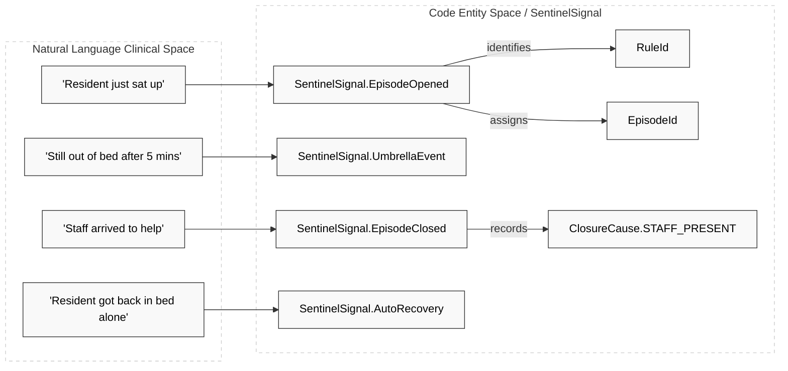
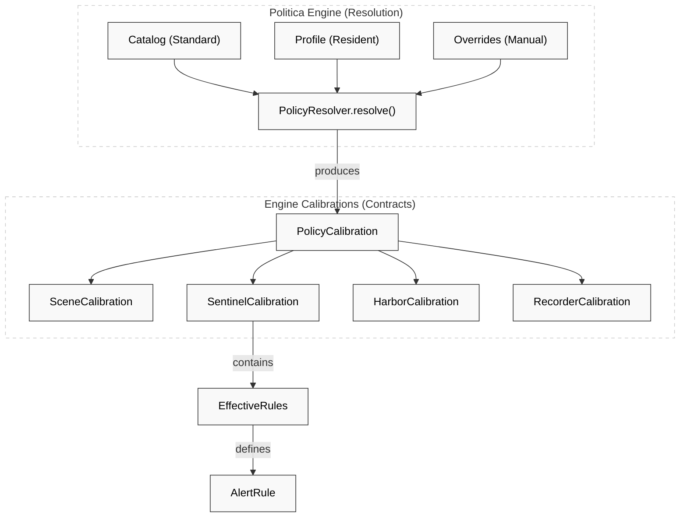

# Domain Kernel & Shared Contracts

Relevant source files

- 
- 
- 

The Domain Kernel serves as the foundational layer of the Hisso platform, providing the shared language and structural contracts that ensure consistency across the four-engine pipeline (Scene, Sentinel, Harbor, and Recorder). It defines the strongly-typed primitives, the execution patterns for domain logic, and the wire formats for inter-service communication.

## Strongly-Typed Identifiers

To prevent "Primitive Obsession" and accidental parameter swapping, the kernel utilizes Kotlin value classes for all domain identifiers. These types ensure that a `ResidentId` cannot be mistakenly passed to a function expecting a `BedId`.

|Type|Purpose|Source|
|---|---|---|
|`BedId`|Unique identifier for a physical bed location.|[platform/kernel/src/main/kotlin/com/manahive/kernel/Ids.kt5](https://github.com/pbaalerta-wq/hisso1/blob/d9fca861/platform/kernel/src/main/kotlin/com/manahive/kernel/Ids.kt#L5-L5)|
|`ResidentId`|Unique identifier for a resident assigned to a bed.|[platform/kernel/src/main/kotlin/com/manahive/kernel/Ids.kt6](https://github.com/pbaalerta-wq/hisso1/blob/d9fca861/platform/kernel/src/main/kotlin/com/manahive/kernel/Ids.kt#L6-L6)|
|`EpisodeId`|Identifies a continuous safety event (e.g., a fall or prolonged absence).|[platform/kernel/src/main/kotlin/com/manahive/kernel/Ids.kt7](https://github.com/pbaalerta-wq/hisso1/blob/d9fca861/platform/kernel/src/main/kotlin/com/manahive/kernel/Ids.kt#L7-L7)|
|`RuleId`|References a specific clinical rule within a policy catalog.|[platform/kernel/src/main/kotlin/com/manahive/kernel/Ids.kt8](https://github.com/pbaalerta-wq/hisso1/blob/d9fca861/platform/kernel/src/main/kotlin/com/manahive/kernel/Ids.kt#L8-L8)|
|`EventRef`|A correlation ID used to link signals back to original sensor facts.|[platform/kernel/src/main/kotlin/com/manahive/kernel/Ids.kt9](https://github.com/pbaalerta-wq/hisso1/blob/d9fca861/platform/kernel/src/main/kotlin/com/manahive/kernel/Ids.kt#L9-L9)|

**Sources:** [platform/kernel/src/main/kotlin/com/manahive/kernel/Ids.kt1-15](https://github.com/pbaalerta-wq/hisso1/blob/d9fca861/platform/kernel/src/main/kotlin/com/manahive/kernel/Ids.kt#L1-L15)

---

## The Engine & Decider Interfaces

The system follows a functional core pattern where domain logic is encapsulated in pure functions. The `Decider` and `Engine` interfaces standardize how these functions interact with state and inputs.

### Engine Architecture

The `Engine` interface defines the primary entry point for processing inputs. It typically wraps a `Decider` to manage state transitions and produces a `Discardable<T>` result, which explicitly handles cases where an input is ignored (e.g., late data).

- **`Engine<S, I, C, O>`**: A stateful component that takes an Input (`I`) and a Calibration (`C`), updates its internal State (`S`), and produces an Output (`O`). [platform/kernel/src/main/kotlin/com/manahive/kernel/Engine.kt10-15](https://github.com/pbaalerta-wq/hisso1/blob/d9fca861/platform/kernel/src/main/kotlin/com/manahive/kernel/Engine.kt#L10-L15)
- **`Decider<S, I, C, O>`**: The pure-logic component. It contains an `evaluate` function that returns an `Effect<S, O>`, representing the new state and the resulting events. [platform/kernel/src/main/kotlin/com/manahive/kernel/Decider.kt10-20](https://github.com/pbaalerta-wq/hisso1/blob/d9fca861/platform/kernel/src/main/kotlin/com/manahive/kernel/Decider.kt#L10-L20)

### Auditability: Explained

For critical policy decisions, the kernel uses the `Explained<T>` wrapper. This carries both the result of a calculation and a list of `Reason` strings, providing a built-in audit trail for why a specific threshold or severity was chosen.

**Sources:** [platform/kernel/src/main/kotlin/com/manahive/kernel/Engine.kt1-25](https://github.com/pbaalerta-wq/hisso1/blob/d9fca861/platform/kernel/src/main/kotlin/com/manahive/kernel/Engine.kt#L1-L25) [platform/kernel/src/main/kotlin/com/manahive/kernel/Decider.kt1-25](https://github.com/pbaalerta-wq/hisso1/blob/d9fca861/platform/kernel/src/main/kotlin/com/manahive/kernel/Decider.kt#L1-L25) [platform/kernel/src/main/kotlin/com/manahive/kernel/Explained.kt1-20](https://github.com/pbaalerta-wq/hisso1/blob/d9fca861/platform/kernel/src/main/kotlin/com/manahive/kernel/Explained.kt#L1-L20)

---

## Observation & Fact Space

The pipeline begins with `Observation` objects, which represent raw sensor data or system signals.

- **`Observation`**: Carries a `kind` (e.g., `BED_PRESSURE`), a `value` (e.g., `IN_BED`), and a timestamp. [platform/contracts/src/main/kotlin/com/manahive/contracts/scene/Observation.kt8-13](https://github.com/pbaalerta-wq/hisso1/blob/d9fca861/platform/contracts/src/main/kotlin/com/manahive/contracts/scene/Observation.kt#L8-L13)
- **`ObservationKind`**: An enum defining the types of telemetry the system accepts, such as `BED_PRESSURE`, `CHAIR_PRESSURE`, or `VIRTUAL_SENSOR`. [platform/contracts/src/main/kotlin/com/manahive/contracts/scene/Observation.kt15-20](https://github.com/pbaalerta-wq/hisso1/blob/d9fca861/platform/contracts/src/main/kotlin/com/manahive/contracts/scene/Observation.kt#L15-L20)

### SceneEvent Hierarchy

The **Scene Engine** translates observations into `SceneEvent` objects. These represent high-level interpretations of resident movement.

|Event Type|Description|
|---|---|
|`TransitionDetected`|Immediate detection of a state change (e.g., Lying to Sitting).|
|`DwellWarning`|Resident has stayed in a non-safe state for a pre-defined warning period.|
|`DwellExceeded`|Resident has exceeded the maximum allowed time in a state.|
|`ComeBackExceeded`|Resident left a baseline (e.g., Bed) and failed to return within the limit.|
|`SignalLost`|The system has stopped receiving updates for a specific bed.|

**Sources:** [platform/contracts/src/main/kotlin/com/manahive/contracts/scene/Observation.kt1-25](https://github.com/pbaalerta-wq/hisso1/blob/d9fca861/platform/contracts/src/main/kotlin/com/manahive/contracts/scene/Observation.kt#L1-L25) [platform/contracts/src/main/kotlin/com/manahive/contracts/scene/SceneEvent.kt1-100](https://github.com/pbaalerta-wq/hisso1/blob/d9fca861/platform/contracts/src/main/kotlin/com/manahive/contracts/scene/SceneEvent.kt#L1-L100)

---

## Sentinel & Signaling Space

The **Sentinel Engine** evaluates `SceneEvents` against `EffectiveRules` to manage the lifecycle of a safety episode.

### SentinelSignal Hierarchy

Signals are published to the message bus to trigger downstream actions like notifications or recording.

- **`EpisodeOpened`**: A new safety incident has started. Includes `severity`, `requiresNvr`, and `confirmationWindow`. [platform/contracts/src/main/kotlin/com/manahive/contracts/sentinel/SentinelSignal.kt55-68](https://github.com/pbaalerta-wq/hisso1/blob/d9fca861/platform/contracts/src/main/kotlin/com/manahive/contracts/sentinel/SentinelSignal.kt#L55-L68)
- **`UmbrellaEvent`**: A subsequent event that occurs while an episode is already open (e.g., moving from "Sitting" to "Out of Bed" during a fall risk episode). [platform/contracts/src/main/kotlin/com/manahive/contracts/sentinel/SentinelSignal.kt74-94](https://github.com/pbaalerta-wq/hisso1/blob/d9fca861/platform/contracts/src/main/kotlin/com/manahive/contracts/sentinel/SentinelSignal.kt#L74-L94)
- **`AutoRecovery`**: The resident returned to a safe state without staff intervention. [platform/contracts/src/main/kotlin/com/manahive/contracts/sentinel/SentinelSignal.kt101-111](https://github.com/pbaalerta-wq/hisso1/blob/d9fca861/platform/contracts/src/main/kotlin/com/manahive/contracts/sentinel/SentinelSignal.kt#L101-L111)
- **`EpisodeClosed`**: The incident is resolved, citing a `ClosureCause` (e.g., `STAFF_PRESENT`). [platform/contracts/src/main/kotlin/com/manahive/contracts/sentinel/SentinelSignal.kt117-127](https://github.com/pbaalerta-wq/hisso1/blob/d9fca861/platform/contracts/src/main/kotlin/com/manahive/contracts/sentinel/SentinelSignal.kt#L117-L127)

### Logic to Code Mapping: Signaling

This diagram maps clinical concepts to the `SentinelSignal` implementations.

"Clinical Event to Sentinel Code Mapping"

**Sources:** [platform/contracts/src/main/kotlin/com/manahive/contracts/sentinel/SentinelSignal.kt1-130](https://github.com/pbaalerta-wq/hisso1/blob/d9fca861/platform/contracts/src/main/kotlin/com/manahive/contracts/sentinel/SentinelSignal.kt#L1-L130)

---

## Policy & Calibration Contracts

The `PolicyCalibration` is the "Master Contract" that ties the entire pipeline together. It is produced by the **Politica Engine** and contains the specific configurations for every other engine.

### Policy Components

1. **`EffectiveRules`**: The resolved set of `AlertRule` objects for a resident. Each rule defines a `triggerOn` condition (`ENTRY`, `DWELL`, or `COME_BACK`) and the resulting `Severity`. [platform/contracts/src/main/kotlin/com/manahive/contracts/policy/EffectiveRules.kt18-44](https://github.com/pbaalerta-wq/hisso1/blob/d9fca861/platform/contracts/src/main/kotlin/com/manahive/contracts/policy/EffectiveRules.kt#L18-L44)
2. **`SceneCalibration`**: Thresholds for hysteresis and dwell times.
3. **`HarborCalibration`**: Notification routing and escalation rules.
4. **`RecorderCalibration`**: Settings for NVR triggers and pre/post-roll durations.

### Trigger Logic

The `TriggerOn` enum determines which `SceneEvent` initiates an episode:

- `ENTRY`: Opens on `TransitionDetected`. [platform/contracts/src/main/kotlin/com/manahive/contracts/policy/EffectiveRules.kt61](https://github.com/pbaalerta-wq/hisso1/blob/d9fca861/platform/contracts/src/main/kotlin/com/manahive/contracts/policy/EffectiveRules.kt#L61-L61)
- `DWELL`: Opens on `DwellExceeded`. [platform/contracts/src/main/kotlin/com/manahive/contracts/policy/EffectiveRules.kt62](https://github.com/pbaalerta-wq/hisso1/blob/d9fca861/platform/contracts/src/main/kotlin/com/manahive/contracts/policy/EffectiveRules.kt#L62-L62)
- `COME_BACK`: Opens on `ComeBackExceeded`. [platform/contracts/src/main/kotlin/com/manahive/contracts/policy/EffectiveRules.kt63](https://github.com/pbaalerta-wq/hisso1/blob/d9fca861/platform/contracts/src/main/kotlin/com/manahive/contracts/policy/EffectiveRules.kt#L63-L63)

"Policy Resolution to Engine Calibration"

**Sources:** [platform/contracts/src/main/kotlin/com/manahive/contracts/policy/EffectiveRules.kt1-73](https://github.com/pbaalerta-wq/hisso1/blob/d9fca861/platform/contracts/src/main/kotlin/com/manahive/contracts/policy/EffectiveRules.kt#L1-L73) [platform/contracts/src/main/kotlin/com/manahive/contracts/policy/PolicyOverride.kt1-50](https://github.com/pbaalerta-wq/hisso1/blob/d9fca861/platform/contracts/src/main/kotlin/com/manahive/contracts/policy/PolicyOverride.kt#L1-L50)

---

## Wire Format: EventEnvelope

All domain events are wrapped in a standard `EventEnvelope` before being published to the NATS messaging backbone. This ensures metadata consistency for routing and tracing.

|Field|Type|Description|
|---|---|---|
|`id`|`UUID`|Unique identifier for the message instance.|
|`source`|`String`|The service that generated the event (e.g., `scene-engine`).|
|`type`|`String`|The qualified name of the payload type.|
|`at`|`Instant`|The time the event was published.|
|`payload`|`T`|The actual domain object (e.g., `SentinelSignal`).|

**Sources:** [platform/kernel/src/main/kotlin/com/manahive/kernel/EventEnvelope.kt1-15](https://github.com/pbaalerta-wq/hisso1/blob/d9fca861/platform/kernel/src/main/kotlin/com/manahive/kernel/EventEnvelope.kt#L1-L15)

### On this page

- [Domain Kernel & Shared Contracts](https://deepwiki.com/pbaalerta-wq/hisso1/1.2-domain-kernel-and-shared-contracts#domain-kernel-shared-contracts)
- [Strongly-Typed Identifiers](https://deepwiki.com/pbaalerta-wq/hisso1/1.2-domain-kernel-and-shared-contracts#strongly-typed-identifiers)
- [The Engine & Decider Interfaces](https://deepwiki.com/pbaalerta-wq/hisso1/1.2-domain-kernel-and-shared-contracts#the-engine-decider-interfaces)
- [Engine Architecture](https://deepwiki.com/pbaalerta-wq/hisso1/1.2-domain-kernel-and-shared-contracts#engine-architecture)
- [Auditability: Explained](https://deepwiki.com/pbaalerta-wq/hisso1/1.2-domain-kernel-and-shared-contracts#auditability-explainedt)
- [Observation & Fact Space](https://deepwiki.com/pbaalerta-wq/hisso1/1.2-domain-kernel-and-shared-contracts#observation-fact-space)
- [SceneEvent Hierarchy](https://deepwiki.com/pbaalerta-wq/hisso1/1.2-domain-kernel-and-shared-contracts#sceneevent-hierarchy)
- [Sentinel & Signaling Space](https://deepwiki.com/pbaalerta-wq/hisso1/1.2-domain-kernel-and-shared-contracts#sentinel-signaling-space)
- [SentinelSignal Hierarchy](https://deepwiki.com/pbaalerta-wq/hisso1/1.2-domain-kernel-and-shared-contracts#sentinelsignal-hierarchy)
- [Logic to Code Mapping: Signaling](https://deepwiki.com/pbaalerta-wq/hisso1/1.2-domain-kernel-and-shared-contracts#logic-to-code-mapping-signaling)
- [Policy & Calibration Contracts](https://deepwiki.com/pbaalerta-wq/hisso1/1.2-domain-kernel-and-shared-contracts#policy-calibration-contracts)
- [Policy Components](https://deepwiki.com/pbaalerta-wq/hisso1/1.2-domain-kernel-and-shared-contracts#policy-components)
- [Trigger Logic](https://deepwiki.com/pbaalerta-wq/hisso1/1.2-domain-kernel-and-shared-contracts#trigger-logic)
- [Wire Format: EventEnvelope](https://deepwiki.com/pbaalerta-wq/hisso1/1.2-domain-kernel-and-shared-contracts#wire-format-eventenvelope)
