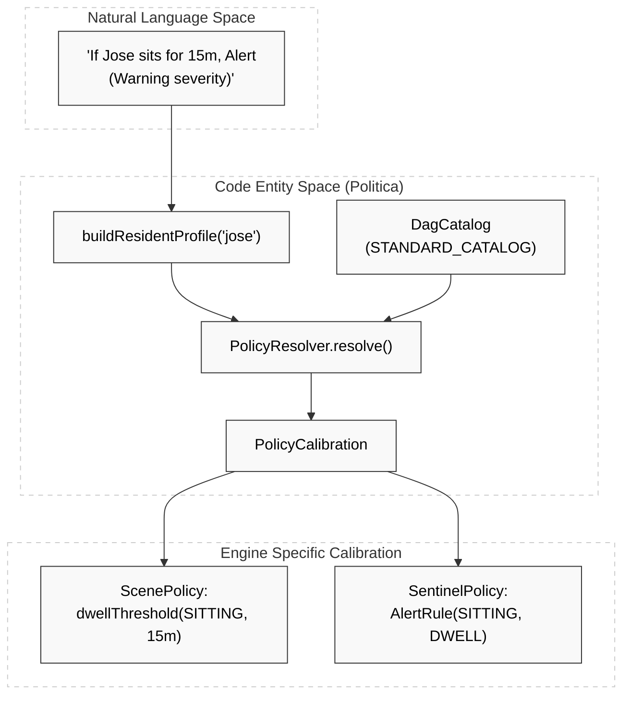
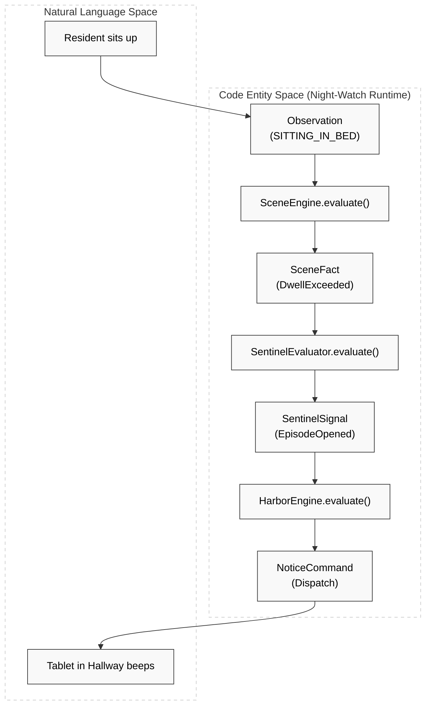

# Glossary

Relevant source files

- 
- 
- 
- 
- 
- 
- 
- 
- 
- 
- 
- 
- 
- 
- 
- 
- 
- 

This glossary defines the domain concepts, technical terms, and architectural components specific to the Hisso platform. It serves as a reference for onboarding engineers to understand how natural language safety requirements (e.g., "Alert me if José sits up for 15 minutes") map to specific code entities and data structures.

---

## Core Domain Concepts

### The Pipeline

The sequence of four pure-domain engines that process resident safety data. The flow is: **Scene → Sentinel → Harbor → Recorder**.

- **Scene Engine**: Maintains the "Digital Twin" of the resident, converting raw sensor observations into semantic events like `TransitionDetected` or `DwellExceeded` [blueprints/jose-301-e2e-pipeline/src/main/kotlin/jose301e2e/Main.kt122-123](https://github.com/pbaalerta-wq/hisso1/blob/d9fca861/blueprints/jose-301-e2e-pipeline/src/main/kotlin/jose301e2e/Main.kt#L122-L123)
- **Sentinel Engine**: Manages the lifecycle of safety "Episodes". It decides if a Scene event warrants an alert based on resident-specific rules [engines/sentinel/sentinel-service/src/main/kotlin/com/manahive/sentinel/service/nats/SentinelNatsIngest.kt23-28](https://github.com/pbaalerta-wq/hisso1/blob/d9fca861/engines/sentinel/sentinel-service/src/main/kotlin/com/manahive/sentinel/service/nats/SentinelNatsIngest.kt#L23-L28)
- **Harbor Engine (Vigia)**: Handles the delivery and escalation of alerts across different channels (Tablet, Console, etc.) [engines/harbor/harbor-service/src/main/kotlin/com/manahive/harbor/service/nats/HarborNatsIngest.kt21-26](https://github.com/pbaalerta-wq/hisso1/blob/d9fca861/engines/harbor/harbor-service/src/main/kotlin/com/manahive/harbor/service/nats/HarborNatsIngest.kt#L21-L26)
- **Recorder Engine**: Controls NVR (Network Video Recorder) triggers, ensuring evidence is captured before and after significant safety events [engines/recorder/recorder-service/src/main/kotlin/com/manahive/recorder/service/nats/RecorderNatsIngest.kt24-29](https://github.com/pbaalerta-wq/hisso1/blob/d9fca861/engines/recorder/recorder-service/src/main/kotlin/com/manahive/recorder/service/nats/RecorderNatsIngest.kt#L24-L29)

### Policy & Calibration

- **Policy**: The high-level definition of care requirements (e.g., `WatchLevel.FALL_RISK`) [blueprints/jose-301-e2e-pipeline/src/main/kotlin/jose301e2e/Main.kt32](https://github.com/pbaalerta-wq/hisso1/blob/d9fca861/blueprints/jose-301-e2e-pipeline/src/main/kotlin/jose301e2e/Main.kt#L32-L32)
- **Calibration**: The engine-specific configuration derived from a Policy. A `PolicyCalibration` object contains sub-calibrations for each engine: `ScenePolicy`, `SentinelPolicy`, `HarborPolicy`, and `RecorderPolicy` [platform/contracts/src/main/kotlin/com/manahive/contracts/policy/PolicyCalibration.kt1-20](https://github.com/pbaalerta-wq/hisso1/blob/d9fca861/platform/contracts/src/main/kotlin/com/manahive/contracts/policy/PolicyCalibration.kt#L1-L20)
- **DagCatalog**: A Directed Acyclic Graph based catalog defining the "rules of the house" for different resident and room states [platform/contracts/src/main/kotlin/com/manahive/contracts/policy/DagDsl.kt11-48](https://github.com/pbaalerta-wq/hisso1/blob/d9fca861/platform/contracts/src/main/kotlin/com/manahive/contracts/policy/DagDsl.kt#L11-L48)

### Resident States

Semantic states detected by the Scene engine:

- `LYING`: Resident is lying down in bed.
- `SITTING_IN_BED`: Resident is sitting up.
- `BED_EDGE`: Resident is at the edge of the bed (often a critical transition) [platform/contracts/src/main/kotlin/com/manahive/contracts/policy/DagDsl.kt55-78](https://github.com/pbaalerta-wq/hisso1/blob/d9fca861/platform/contracts/src/main/kotlin/com/manahive/contracts/policy/DagDsl.kt#L55-L78)
- `IN_BATHROOM`: Resident has entered the bathroom area.

---

## Technical Terms & Entities

|Term|Definition|Code Pointer|
|---|---|---|
|**Dwell**|The duration a resident stays in a specific state.|[platform/contracts/src/main/kotlin/com/manahive/contracts/policy/DagDsl.kt153](https://github.com/pbaalerta-wq/hisso1/blob/d9fca861/platform/contracts/src/main/kotlin/com/manahive/contracts/policy/DagDsl.kt#L153-L153)|
|**Hysteresis**|Time buffer to prevent "flickering" alerts during state transitions.|[engines/politica-engine/politica-domain/src/main/kotlin/com/manahive/politica/PolicyResolver.kt143](https://github.com/pbaalerta-wq/hisso1/blob/d9fca861/engines/politica-engine/politica-domain/src/main/kotlin/com/manahive/politica/PolicyResolver.kt#L143-L143)|
|**Episode**|A period of active safety concern, starting with an `EpisodeOpened` signal and ending with `EpisodeClosed`.|[platform/serialization/src/main/kotlin/com/manahive/serialization/SentinelSignalCodec.kt49-93](https://github.com/pbaalerta-wq/hisso1/blob/d9fca861/platform/serialization/src/main/kotlin/com/manahive/serialization/SentinelSignalCodec.kt#L49-L93)|
|**Fingerprint**|A unique hash representing the exact set of rules that generated a calibration, used for auditability.|[engines/politica-engine/politica-domain/src/main/kotlin/com/manahive/politica/PolicyResolver.kt95-103](https://github.com/pbaalerta-wq/hisso1/blob/d9fca861/engines/politica-engine/politica-domain/src/main/kotlin/com/manahive/politica/PolicyResolver.kt#L95-L103)|
|**Explained**|A wrapper that carries both a result and a list of `ExplanationStep` objects describing _why_ the system made a decision.|[engines/politica-engine/politica-domain/src/main/kotlin/com/manahive/politica/PolicyResolver.kt53-84](https://github.com/pbaalerta-wq/hisso1/blob/d9fca861/engines/politica-engine/politica-domain/src/main/kotlin/com/manahive/politica/PolicyResolver.kt#L53-L84)|
|**EventEnvelope**|The standard wire format for all NATS messages, containing metadata like `eventId`, `occurredAt`, and `payloadJson`.|[engines/scene-engine/scene-service/src/main/kotlin/com/manahive/scene/service/nats/SceneNatsEgress.kt47-54](https://github.com/pbaalerta-wq/hisso1/blob/d9fca861/engines/scene-engine/scene-service/src/main/kotlin/com/manahive/scene/service/nats/SceneNatsEgress.kt#L47-L54)|

---

## Mapping: Natural Language to Code Entities

The following diagrams illustrate how a human-readable safety requirement is transformed into system components.

### 1. Policy Resolution Flow

_How a Director's intent becomes Engine configuration._

**Sources:** [blueprints/jose-301-e2e-pipeline/src/main/kotlin/jose301e2e/Main.kt29-52](https://github.com/pbaalerta-wq/hisso1/blob/d9fca861/blueprints/jose-301-e2e-pipeline/src/main/kotlin/jose301e2e/Main.kt#L29-L52) [engines/politica-engine/politica-domain/src/main/kotlin/com/manahive/politica/PolicyResolver.kt53-84](https://github.com/pbaalerta-wq/hisso1/blob/d9fca861/engines/politica-engine/politica-domain/src/main/kotlin/com/manahive/politica/PolicyResolver.kt#L53-L84)

### 2. Runtime Execution Flow

_How a sensor observation triggers a physical alert._

**Sources:** [engines/night-watch-runtime/src/main/kotlin/com/manahive/runtime/NightWatchRuntime.kt55-62](https://github.com/pbaalerta-wq/hisso1/blob/d9fca861/engines/night-watch-runtime/src/main/kotlin/com/manahive/runtime/NightWatchRuntime.kt#L55-L62) [engines/sentinel/sentinel-service/src/main/kotlin/com/manahive/sentinel/service/nats/SentinelNatsIngest.kt96-104](https://github.com/pbaalerta-wq/hisso1/blob/d9fca861/engines/sentinel/sentinel-service/src/main/kotlin/com/manahive/sentinel/service/nats/SentinelNatsIngest.kt#L96-L104) [engines/harbor/harbor-service/src/main/kotlin/com/manahive/harbor/service/nats/HarborNatsIngest.kt89-97](https://github.com/pbaalerta-wq/hisso1/blob/d9fca861/engines/harbor/harbor-service/src/main/kotlin/com/manahive/harbor/service/nats/HarborNatsIngest.kt#L89-L97)

---

## Infrastructure Abbreviations

- **NATS**: The message bus used for inter-service communication.
- **JetStream**: The persistence layer for NATS, allowing for event replay.
- **NVR**: Network Video Recorder; managed by the `RecorderEngine`.
- **DSL**: Domain Specific Language; used for defining `DagCatalog` [platform/contracts/src/main/kotlin/com/manahive/contracts/policy/DagDsl.kt11](https://github.com/pbaalerta-wq/hisso1/blob/d9fca861/platform/contracts/src/main/kotlin/com/manahive/contracts/policy/DagDsl.kt#L11-L11) and `ResidentProfile` [blueprints/jose-301-e2e-pipeline/src/main/kotlin/jose301e2e/Main.kt29](https://github.com/pbaalerta-wq/hisso1/blob/d9fca861/blueprints/jose-301-e2e-pipeline/src/main/kotlin/jose301e2e/Main.kt#L29-L29)

**Sources:** [engines/scene-engine/scene-service/src/main/kotlin/com/manahive/scene/service/nats/SceneNatsEgress.kt9](https://github.com/pbaalerta-wq/hisso1/blob/d9fca861/engines/scene-engine/scene-service/src/main/kotlin/com/manahive/scene/service/nats/SceneNatsEgress.kt#L9-L9) [platform/messaging/src/main/kotlin/com/manahive/messaging/NatsConfig.kt15](https://github.com/pbaalerta-wq/hisso1/blob/d9fca861/platform/messaging/src/main/kotlin/com/manahive/messaging/NatsConfig.kt#L15-L15) [platform/contracts/src/main/kotlin/com/manahive/contracts/policy/DagDsl.kt15](https://github.com/pbaalerta-wq/hisso1/blob/d9fca861/platform/contracts/src/main/kotlin/com/manahive/contracts/policy/DagDsl.kt#L15-L15)

### On this page

- [Glossary](https://deepwiki.com/pbaalerta-wq/hisso1/10-glossary#glossary)
- [Core Domain Concepts](https://deepwiki.com/pbaalerta-wq/hisso1/10-glossary#core-domain-concepts)
- [The Pipeline](https://deepwiki.com/pbaalerta-wq/hisso1/10-glossary#the-pipeline)
- [Policy & Calibration](https://deepwiki.com/pbaalerta-wq/hisso1/10-glossary#policy-calibration)
- [Resident States](https://deepwiki.com/pbaalerta-wq/hisso1/10-glossary#resident-states)
- [Technical Terms & Entities](https://deepwiki.com/pbaalerta-wq/hisso1/10-glossary#technical-terms-entities)
- [Mapping: Natural Language to Code Entities](https://deepwiki.com/pbaalerta-wq/hisso1/10-glossary#mapping-natural-language-to-code-entities)
- [1. Policy Resolution Flow](https://deepwiki.com/pbaalerta-wq/hisso1/10-glossary#1-policy-resolution-flow)
- [2. Runtime Execution Flow](https://deepwiki.com/pbaalerta-wq/hisso1/10-glossary#2-runtime-execution-flow)
- [Infrastructure Abbreviations](https://deepwiki.com/pbaalerta-wq/hisso1/10-glossary#infrastructure-abbreviations)
