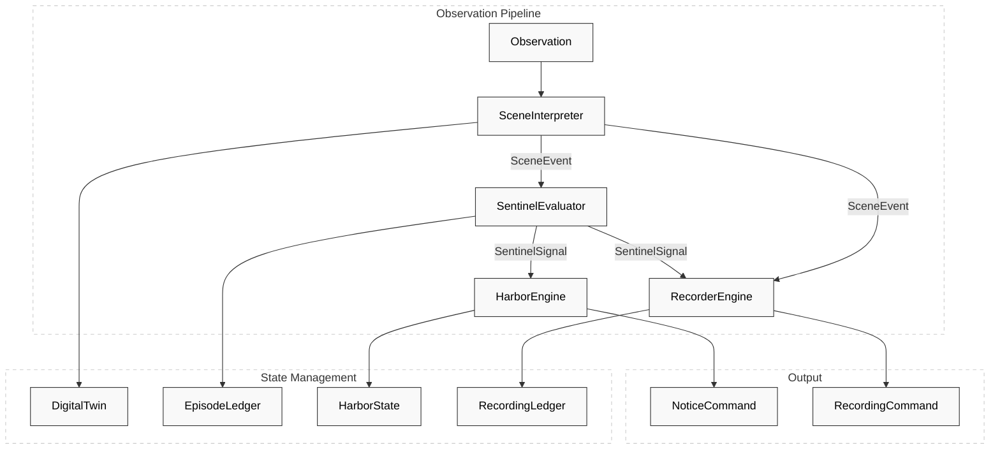
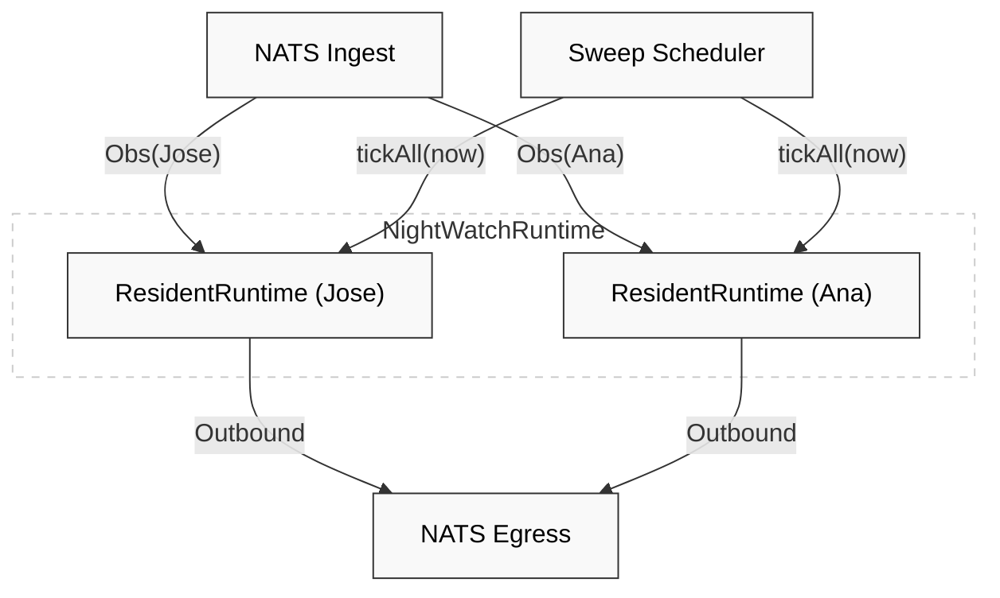

# Core Architecture: The Four-Engine Pipeline

Relevant source files

- 
- 
- 
- 
- 

The Hisso system processes resident safety monitoring through a linear, four-stage pipeline. Each stage is a "pure domain engine"—a functional unit that takes a current state and an input event, returning a new state and a list of outbound commands or facts. This architecture ensures that the complex clinical logic for resident safety is decoupled from infrastructure concerns like NATS messaging, database persistence, or HTTP APIs.

### The Pipeline Overview

The pipeline operates on a **Consume-Evaluate-Publish** pattern. When a camera or sensor generates an `Observation`, it enters the pipeline and flows through four specialized engines:

1. **Scene Engine**: Translates raw sensor data into high-level human movements (e.g., "Resident is sitting").
2. **Sentinel Engine**: Evaluates clinical risk and manages the lifecycle of safety episodes (e.g., "Sitting for too long; open a warning episode").
3. **Harbor Engine**: Manages the notification budget and determines which staff members should be alerted via which channel.
4. **Recorder Engine**: Decides if video evidence should be captured and stored based on the clinical significance of the events.

### ResidentRuntime: The Pipeline Orchestrator

In the production service, these engines are composed by the `ResidentRuntime`. This class wires the engines together using standard function calls on domain values, avoiding the overhead of serialization between stages [engines/night-watch-runtime/src/main/kotlin/com/manahive/runtime/ResidentRuntime.kt40-45](https://github.com/pbaalerta-wq/hisso1/blob/d9fca861/engines/night-watch-runtime/src/main/kotlin/com/manahive/runtime/ResidentRuntime.kt#L40-L45)

#### Data Flow and Code Entities

The following diagram bridges the conceptual pipeline stages to the specific code entities that implement them within the `ResidentRuntime`.

**Pipeline Composition Diagram**

**Sources:** [engines/night-watch-runtime/src/main/kotlin/com/manahive/runtime/ResidentRuntime.kt53-75](https://github.com/pbaalerta-wq/hisso1/blob/d9fca861/engines/night-watch-runtime/src/main/kotlin/com/manahive/runtime/ResidentRuntime.kt#L53-L75) [engines/night-watch-runtime/src/main/kotlin/com/manahive/runtime/ResidentRuntime.kt116-166](https://github.com/pbaalerta-wq/hisso1/blob/d9fca861/engines/night-watch-runtime/src/main/kotlin/com/manahive/runtime/ResidentRuntime.kt#L116-L166)

### The Four Engines

#### 1. Scene Engine

The **Scene Engine** is the first stage. It maintains a `DigitalTwin` of the resident, representing their current physical state (e.g., `Lying`, `Sitting`, `Standing`). It uses a `SceneInterpreter` to process new observations and a `ClockSweeper` to handle time-based events like dwell thresholds.

- **Key Input:** `Observation`
- **Key Output:** `SceneEvent` (e.g., `TransitionDetected`, `DwellExceeded`)
- **For details, see [Scene Engine](https://deepwiki.com/pbaalerta-wq/hisso1/2.1-scene-engine).**
- **Sources:** [engines/night-watch-runtime/src/main/kotlin/com/manahive/runtime/ResidentRuntime.kt130-132](https://github.com/pbaalerta-wq/hisso1/blob/d9fca861/engines/night-watch-runtime/src/main/kotlin/com/manahive/runtime/ResidentRuntime.kt#L130-L132) [blueprints/jose-301-e2e-pipeline/src/main/kotlin/jose301e2e/Main.kt151-152](https://github.com/pbaalerta-wq/hisso1/blob/d9fca861/blueprints/jose-301-e2e-pipeline/src/main/kotlin/jose301e2e/Main.kt#L151-L152)

#### 2. Sentinel Engine

The **Sentinel Engine** receives `SceneEvents` and determines if they constitute a clinical "Episode." It tracks the duration of risks and handles "Umbrella" logic where multiple events might be grouped into a single resident incident.

- **Key Input:** `SceneEvent`
- **Key Output:** `SentinelSignal` (e.g., `EpisodeOpened`, `EpisodeClosed`)
- **For details, see [Sentinel Engine](https://deepwiki.com/pbaalerta-wq/hisso1/2.2-sentinel-engine).**
- **Sources:** [engines/night-watch-runtime/src/main/kotlin/com/manahive/runtime/ResidentRuntime.kt135-140](https://github.com/pbaalerta-wq/hisso1/blob/d9fca861/engines/night-watch-runtime/src/main/kotlin/com/manahive/runtime/ResidentRuntime.kt#L135-L140) [engines/politica-engine/politica-domain/src/test/kotlin/com/manahive/politica/TriggerSemanticsSpec.kt61-69](https://github.com/pbaalerta-wq/hisso1/blob/d9fca861/engines/politica-engine/politica-domain/src/test/kotlin/com/manahive/politica/TriggerSemanticsSpec.kt#L61-L69)

#### 3. Harbor Engine

The **Harbor Engine** (internally called **Vigia**) acts as a communication router. It takes `SentinelSignals` and converts them into `NoticeCommands` for specific channels (Console, Push, etc.). It is responsible for ensuring that the staff is not overwhelmed by managing a notification budget.

- **Key Input:** `SentinelSignal`
- **Key Output:** `NoticeCommand` (e.g., `Dispatch`)
- **For details, see [Harbor Engine](https://deepwiki.com/pbaalerta-wq/hisso1/2.3-harbor-engine).**
- **Sources:** [engines/night-watch-runtime/src/main/kotlin/com/manahive/runtime/ResidentRuntime.kt143-148](https://github.com/pbaalerta-wq/hisso1/blob/d9fca861/engines/night-watch-runtime/src/main/kotlin/com/manahive/runtime/ResidentRuntime.kt#L143-L148) [blueprints/jose-301-e2e-pipeline/src/main/kotlin/jose301e2e/Main.kt156](https://github.com/pbaalerta-wq/hisso1/blob/d9fca861/blueprints/jose-301-e2e-pipeline/src/main/kotlin/jose301e2e/Main.kt#L156-L156)

#### 4. Recorder Engine

The **Recorder Engine** operates in parallel to Harbor. It monitors both `SceneEvents` and `SentinelSignals` to trigger NVR (Network Video Recorder) captures. It uses a "window" system to ensure video is captured both before and after a significant event occurs.

- **Key Input:** `SceneEvent`, `SentinelSignal`
- **Key Output:** `RecordingCommand`
- **For details, see [Recorder Engine](https://deepwiki.com/pbaalerta-wq/hisso1/2.4-recorder-engine).**
- **Sources:** [engines/night-watch-runtime/src/main/kotlin/com/manahive/runtime/ResidentRuntime.kt151-163](https://github.com/pbaalerta-wq/hisso1/blob/d9fca861/engines/night-watch-runtime/src/main/kotlin/com/manahive/runtime/ResidentRuntime.kt#L151-L163) [blueprints/jose-301-e2e-pipeline/src/main/kotlin/jose301e2e/Main.kt56-80](https://github.com/pbaalerta-wq/hisso1/blob/d9fca861/blueprints/jose-301-e2e-pipeline/src/main/kotlin/jose301e2e/Main.kt#L56-L80)

### Multi-Resident Execution

The `NightWatchRuntime` manages multiple `ResidentRuntime` instances. It uses a `ConcurrentHashMap` to ensure that while different residents are processed in parallel, the observations for a single resident are processed sequentially to maintain state integrity [engines/night-watch-runtime/src/main/kotlin/com/manahive/runtime/NightWatchRuntime.kt18-24](https://github.com/pbaalerta-wq/hisso1/blob/d9fca861/engines/night-watch-runtime/src/main/kotlin/com/manahive/runtime/NightWatchRuntime.kt#L18-L24)

**Runtime Threading and Isolation**

**Sources:** [engines/night-watch-runtime/src/main/kotlin/com/manahive/runtime/NightWatchRuntime.kt55-76](https://github.com/pbaalerta-wq/hisso1/blob/d9fca861/engines/night-watch-runtime/src/main/kotlin/com/manahive/runtime/NightWatchRuntime.kt#L55-L76) [engines/night-watch-runtime/src/main/kotlin/com/manahive/runtime/ResidentRuntime.kt116-125](https://github.com/pbaalerta-wq/hisso1/blob/d9fca861/engines/night-watch-runtime/src/main/kotlin/com/manahive/runtime/ResidentRuntime.kt#L116-L125)

### Engine Calibration

Each engine is "calibrated" by the **Politica Engine**. The `PolicyResolver` translates high-level resident profiles into specific engine configurations (`SceneCalibration`, `SentinelCalibration`, etc.) [blueprints/jose-301-e2e-pipeline/src/main/kotlin/jose301e2e/Main.kt46-52](https://github.com/pbaalerta-wq/hisso1/blob/d9fca861/blueprints/jose-301-e2e-pipeline/src/main/kotlin/jose301e2e/Main.kt#L46-L52) This ensures that the clinical logic remains pure, while the specific thresholds (e.g., "15 minutes for sitting") are injected at runtime.

**Sources:** [engines/politica-engine/politica-domain/src/test/kotlin/com/manahive/politica/TriggerSemanticsSpec.kt60-61](https://github.com/pbaalerta-wq/hisso1/blob/d9fca861/engines/politica-engine/politica-domain/src/test/kotlin/com/manahive/politica/TriggerSemanticsSpec.kt#L60-L61) [engines/night-watch-runtime/src/main/kotlin/com/manahive/runtime/NightWatchRuntime.kt78-85](https://github.com/pbaalerta-wq/hisso1/blob/d9fca861/engines/night-watch-runtime/src/main/kotlin/com/manahive/runtime/NightWatchRuntime.kt#L78-L85)

### On this page

- [Core Architecture: The Four-Engine Pipeline](https://deepwiki.com/pbaalerta-wq/hisso1/2-core-architecture:-the-four-engine-pipeline#core-architecture-the-four-engine-pipeline)
- [The Pipeline Overview](https://deepwiki.com/pbaalerta-wq/hisso1/2-core-architecture:-the-four-engine-pipeline#the-pipeline-overview)
- [ResidentRuntime: The Pipeline Orchestrator](https://deepwiki.com/pbaalerta-wq/hisso1/2-core-architecture:-the-four-engine-pipeline#residentruntime-the-pipeline-orchestrator)
- [Data Flow and Code Entities](https://deepwiki.com/pbaalerta-wq/hisso1/2-core-architecture:-the-four-engine-pipeline#data-flow-and-code-entities)
- [The Four Engines](https://deepwiki.com/pbaalerta-wq/hisso1/2-core-architecture:-the-four-engine-pipeline#the-four-engines)
- [1. Scene Engine](https://deepwiki.com/pbaalerta-wq/hisso1/2-core-architecture:-the-four-engine-pipeline#1-scene-engine)
- [2. Sentinel Engine](https://deepwiki.com/pbaalerta-wq/hisso1/2-core-architecture:-the-four-engine-pipeline#2-sentinel-engine)
- [3. Harbor Engine](https://deepwiki.com/pbaalerta-wq/hisso1/2-core-architecture:-the-four-engine-pipeline#3-harbor-engine)
- [4. Recorder Engine](https://deepwiki.com/pbaalerta-wq/hisso1/2-core-architecture:-the-four-engine-pipeline#4-recorder-engine)
- [Multi-Resident Execution](https://deepwiki.com/pbaalerta-wq/hisso1/2-core-architecture:-the-four-engine-pipeline#multi-resident-execution)
- [Engine Calibration](https://deepwiki.com/pbaalerta-wq/hisso1/2-core-architecture:-the-four-engine-pipeline#engine-calibration)

