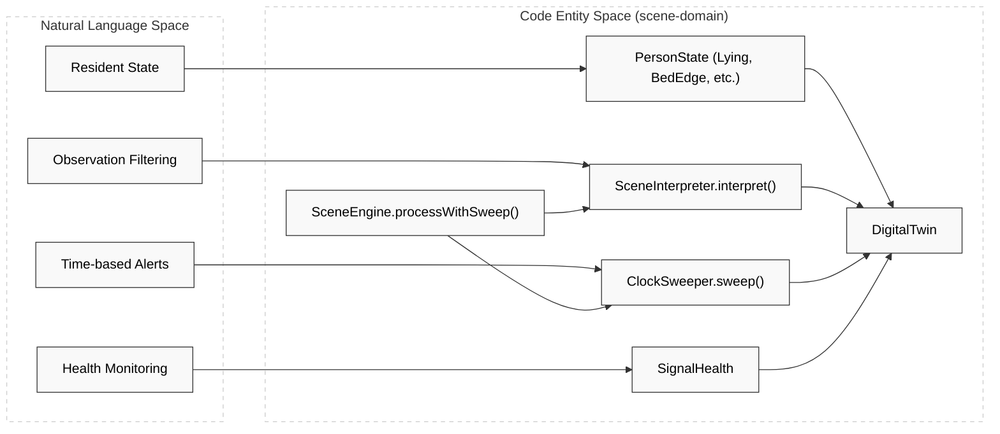
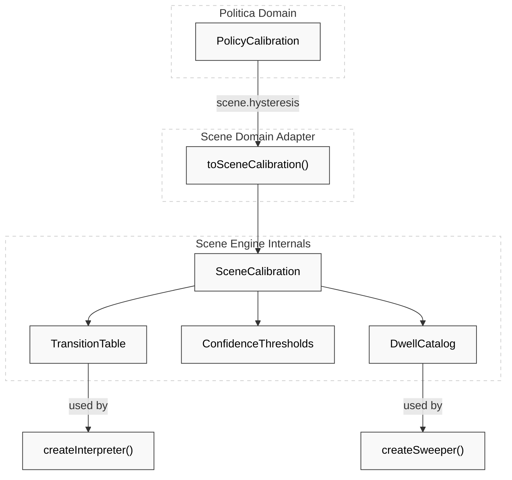

# Scene Engine

Relevant source files

- 
- 
- 
- 
- 
- 
- 
- 

The **Scene Engine** is the first stage of the observation processing pipeline. Its primary responsibility is to maintain a **Digital Twin** of a resident's physical state (e.g., Lying, Bed Edge, Standing) by interpreting raw sensor observations through a configurable transition model. It filters noise using confidence thresholds and hysteresis, and generates time-based events such as dwell warnings or signal loss notifications.

### Architecture Overview

The engine follows the Facade pattern [engines/scene-engine/scene-domain/src/main/kotlin/com/manahive/scene/SceneEngine.kt21](https://github.com/pbaalerta-wq/hisso1/blob/d9fca861/engines/scene-engine/scene-domain/src/main/kotlin/com/manahive/scene/SceneEngine.kt#L21-L21) providing a simplified API to coordinate three internal components:

1. **SceneInterpreter**: Handles the logic for transitioning between states based on incoming observations.
2. **ClockSweeper**: Manages time-dependent events (dwell times and come-back timers) that occur between or at the time of observations.
3. **DigitalTwin**: The state container representing the resident's current status and signal health.

#### Natural Language to Code Entity Space: Scene Engine Components

**Sources:** [engines/scene-engine/scene-domain/src/main/kotlin/com/manahive/scene/SceneEngine.kt31-41](https://github.com/pbaalerta-wq/hisso1/blob/d9fca861/engines/scene-engine/scene-domain/src/main/kotlin/com/manahive/scene/SceneEngine.kt#L31-L41) [engines/scene-engine/scene-domain/src/main/kotlin/com/manahive/scene/core/DigitalTwin.kt1-128](https://github.com/pbaalerta-wq/hisso1/blob/d9fca861/engines/scene-engine/scene-domain/src/main/kotlin/com/manahive/scene/core/DigitalTwin.kt#L1-L128) (assumed context).

---

### DigitalTwin & State Model

The `DigitalTwin` is the source of truth for a specific bed/resident pair. It tracks:

- **State**: The current `PersonState` (e.g., `Lying`, `BedEdge`, `Standing`, `Unknown`) [engines/scene-engine/scene-domain/src/main/kotlin/com/manahive/scene/SceneEngine.kt123-125](https://github.com/pbaalerta-wq/hisso1/blob/d9fca861/engines/scene-engine/scene-domain/src/main/kotlin/com/manahive/scene/SceneEngine.kt#L123-L125)
- **Temporal Context**: `stateSince` records when the current state began, used for dwell calculations [engines/scene-engine/scene-domain/src/main/kotlin/com/manahive/scene/SceneEngine.kt126](https://github.com/pbaalerta-wq/hisso1/blob/d9fca861/engines/scene-engine/scene-domain/src/main/kotlin/com/manahive/scene/SceneEngine.kt#L126-L126)
- **Signal Health**: Tracks the last heartbeat from the monitor and whether the signal is considered lost [engines/scene-engine/scene-domain/src/main/kotlin/com/manahive/scene/SceneEngine.kt127](https://github.com/pbaalerta-wq/hisso1/blob/d9fca861/engines/scene-engine/scene-domain/src/main/kotlin/com/manahive/scene/SceneEngine.kt#L127-L127)
- **Calibration**: The `SceneCalibration` currently applied to this twin, ensuring that transitions and thresholds are resident-specific [engines/scene-engine/scene-domain/src/test/kotlin/com/manahive/scene/core/DigitalTwinWithCalibrationSpec.kt58-62](https://github.com/pbaalerta-wq/hisso1/blob/d9fca861/engines/scene-engine/scene-domain/src/test/kotlin/com/manahive/scene/core/DigitalTwinWithCalibrationSpec.kt#L58-L62)

**Sources:** [engines/scene-engine/scene-domain/src/main/kotlin/com/manahive/scene/SceneEngine.kt119-128](https://github.com/pbaalerta-wq/hisso1/blob/d9fca861/engines/scene-engine/scene-domain/src/main/kotlin/com/manahive/scene/SceneEngine.kt#L119-L128) [engines/scene-engine/scene-domain/src/test/kotlin/com/manahive/scene/core/DigitalTwinWithCalibrationSpec.kt74-91](https://github.com/pbaalerta-wq/hisso1/blob/d9fca861/engines/scene-engine/scene-domain/src/test/kotlin/com/manahive/scene/core/DigitalTwinWithCalibrationSpec.kt#L74-L91)

---

### SceneInterpreter: Observation Interpretation

The `SceneInterpreter` processes a single `Observation` against the current `DigitalTwin`.

#### Logic Flow

1. **Confidence Check**: If the observation's confidence is below the `minConfidence` threshold defined in `SceneCalibration` for that specific state, the observation is discarded with `DiscardCause.CONFIDENCE_TOO_LOW` [engines/scene-engine/scene-domain/src/test/kotlin/com/manahive/scene/adapter/PoliticaToSceneIntegrationSpec.kt125-128](https://github.com/pbaalerta-wq/hisso1/blob/d9fca861/engines/scene-engine/scene-domain/src/test/kotlin/com/manahive/scene/adapter/PoliticaToSceneIntegrationSpec.kt#L125-L128)
2. **Transition Validation**: It consults the `TransitionTable` to determine if the move from the current state to the observed state is legal.
3. **Hysteresis**: Even if a transition is legal, it must persist longer than the configured hysteresis duration (e.g., 1500ms) before the `DigitalTwin` officially transitions [engines/scene-engine/scene-domain/src/test/kotlin/com/manahive/scene/adapter/PoliticaToSceneIntegrationSpec.kt48-51](https://github.com/pbaalerta-wq/hisso1/blob/d9fca861/engines/scene-engine/scene-domain/src/test/kotlin/com/manahive/scene/adapter/PoliticaToSceneIntegrationSpec.kt#L48-L51)

**Sources:** [engines/scene-engine/scene-domain/src/test/kotlin/com/manahive/scene/calibration/SceneCalibrationReceivedSpec.kt73-98](https://github.com/pbaalerta-wq/hisso1/blob/d9fca861/engines/scene-engine/scene-domain/src/test/kotlin/com/manahive/scene/calibration/SceneCalibrationReceivedSpec.kt#L73-L98) [engines/scene-engine/scene-domain/src/test/kotlin/com/manahive/scene/adapter/PoliticaToSceneIntegrationSpec.kt98-143](https://github.com/pbaalerta-wq/hisso1/blob/d9fca861/engines/scene-engine/scene-domain/src/test/kotlin/com/manahive/scene/adapter/PoliticaToSceneIntegrationSpec.kt#L98-L143)

---

### ClockSweeper: Time-Based Events

The `ClockSweeper` generates `SceneEvent` facts based on the passage of time rather than new observations. This is handled in `SceneEngine.processWithSweepInternal` by looping through time increments between observations [engines/scene-engine/scene-domain/src/main/kotlin/com/manahive/scene/SceneEngine.kt96-102](https://github.com/pbaalerta-wq/hisso1/blob/d9fca861/engines/scene-engine/scene-domain/src/main/kotlin/com/manahive/scene/SceneEngine.kt#L96-L102)

|Event Type|Trigger Condition|
|---|---|
|`DwellWarning`|Resident remains in a state (e.g., Standing) longer than the warning threshold.|
|`DwellExceeded`|Resident remains in a state longer than the maximum allowed duration [engines/scene-engine/scene-bdd/src/main/kotlin/com/manahive/scene/bdd/Scenario.kt122-126](https://github.com/pbaalerta-wq/hisso1/blob/d9fca861/engines/scene-engine/scene-bdd/src/main/kotlin/com/manahive/scene/bdd/Scenario.kt#L122-L126)|
|`ComeBackWarning`|Resident has left the bed and hasn't returned within the warning window.|
|`ComeBackExceeded`|Resident failed to return to bed within the safety limit [engines/scene-engine/scene-bdd/src/main/kotlin/com/manahive/scene/bdd/Scenario.kt110-114](https://github.com/pbaalerta-wq/hisso1/blob/d9fca861/engines/scene-engine/scene-bdd/src/main/kotlin/com/manahive/scene/bdd/Scenario.kt#L110-L114)|
|`SignalLost`|No heartbeat received from the monitor within the `heartbeatTimeout` [engines/scene-engine/scene-bdd/src/main/kotlin/com/manahive/scene/bdd/Scenario.kt134-138](https://github.com/pbaalerta-wq/hisso1/blob/d9fca861/engines/scene-engine/scene-bdd/src/main/kotlin/com/manahive/scene/bdd/Scenario.kt#L134-L138)|

**Sources:** [engines/scene-engine/scene-domain/src/main/kotlin/com/manahive/scene/SceneEngine.kt82-117](https://github.com/pbaalerta-wq/hisso1/blob/d9fca861/engines/scene-engine/scene-domain/src/main/kotlin/com/manahive/scene/SceneEngine.kt#L82-L117) [engines/scene-engine/scene-domain/src/main/kotlin/com/manahive/scene/sweeper/DwellMarks.kt1-20](https://github.com/pbaalerta-wq/hisso1/blob/d9fca861/engines/scene-engine/scene-domain/src/main/kotlin/com/manahive/scene/sweeper/DwellMarks.kt#L1-L20) (assumed context).

---

### SceneCalibration & DSL

`SceneCalibration` is the "compiled" configuration used by the engine. It is typically produced by an adapter from the high-level `PolicyCalibration` [engines/scene-engine/scene-domain/src/main/kotlin/com/manahive/scene/adapter/PolicyCalibrationAdapter.kt35-43](https://github.com/pbaalerta-wq/hisso1/blob/d9fca861/engines/scene-engine/scene-domain/src/main/kotlin/com/manahive/scene/adapter/PolicyCalibrationAdapter.kt#L35-L43)

#### Data Mapping: Policy to Scene

|Policy Field (Politica)|Scene Engine Entity|Purpose|
|---|---|---|
|`scene.hysteresis`|`TransitionTable`|Defines valid paths between states and delay requirements [engines/scene-engine/scene-domain/src/main/kotlin/com/manahive/scene/adapter/PolicyCalibrationAdapter.kt38](https://github.com/pbaalerta-wq/hisso1/blob/d9fca861/engines/scene-engine/scene-domain/src/main/kotlin/com/manahive/scene/adapter/PolicyCalibrationAdapter.kt#L38-L38)|
|`scene.confidence`|`ConfidenceThresholds`|Per-state minimum confidence (e.g., BedEdge: 0.9) [engines/scene-engine/scene-domain/src/main/kotlin/com/manahive/scene/adapter/PolicyCalibrationAdapter.kt39](https://github.com/pbaalerta-wq/hisso1/blob/d9fca861/engines/scene-engine/scene-domain/src/main/kotlin/com/manahive/scene/adapter/PolicyCalibrationAdapter.kt#L39-L39)|
|`scene.dwellThresholds`|`DwellCatalog`|Defines Warning/Exceeded durations for specific states [engines/scene-engine/scene-domain/src/main/kotlin/com/manahive/scene/adapter/PolicyCalibrationAdapter.kt41](https://github.com/pbaalerta-wq/hisso1/blob/d9fca861/engines/scene-engine/scene-domain/src/main/kotlin/com/manahive/scene/adapter/PolicyCalibrationAdapter.kt#L41-L41)|
|`scene.heartbeatTimeout`|`SignalHealth` logic|Max duration before `SignalLost` is emitted [engines/scene-engine/scene-domain/src/main/kotlin/com/manahive/scene/adapter/PolicyCalibrationAdapter.kt40](https://github.com/pbaalerta-wq/hisso1/blob/d9fca861/engines/scene-engine/scene-domain/src/main/kotlin/com/manahive/scene/adapter/PolicyCalibrationAdapter.kt#L40-L40)|

#### Entity Mapping: Calibration Flow

**Sources:** [engines/scene-engine/scene-domain/src/main/kotlin/com/manahive/scene/adapter/PolicyCalibrationAdapter.kt9-43](https://github.com/pbaalerta-wq/hisso1/blob/d9fca861/engines/scene-engine/scene-domain/src/main/kotlin/com/manahive/scene/adapter/PolicyCalibrationAdapter.kt#L9-L43) [engines/scene-engine/scene-domain/src/main/kotlin/com/manahive/scene/SceneEngine.kt34-36](https://github.com/pbaalerta-wq/hisso1/blob/d9fca861/engines/scene-engine/scene-domain/src/main/kotlin/com/manahive/scene/SceneEngine.kt#L34-L36)

---

### Data Flow: The Processing Loop

The engine operates in a loop within `processWithSweepInternal`:

1. **Time Advancement**: It checks if the current observation time `now` is significantly later than the `lastTime`.
2. **Intermediate Sweeps**: For every `sweepIntervalSeconds` (default 60s) between `lastTime` and `now`, it calls `sweeper.sweep()` to catch time-based events that happened while no observations were arriving [engines/scene-engine/scene-domain/src/main/kotlin/com/manahive/scene/SceneEngine.kt96-102](https://github.com/pbaalerta-wq/hisso1/blob/d9fca861/engines/scene-engine/scene-domain/src/main/kotlin/com/manahive/scene/SceneEngine.kt#L96-L102)
3. **Observation Interpretation**: The `interpreter` evaluates the observation, potentially updating the `DigitalTwin` state and producing a `TransitionDetected` event [engines/scene-engine/scene-domain/src/main/kotlin/com/manahive/scene/SceneEngine.kt105-107](https://github.com/pbaalerta-wq/hisso1/blob/d9fca861/engines/scene-engine/scene-domain/src/main/kotlin/com/manahive/scene/SceneEngine.kt#L105-L107)
4. **Final Sweep**: A sweep is performed at the exact timestamp of the observation to ensure state-change-related timers are updated immediately [engines/scene-engine/scene-domain/src/main/kotlin/com/manahive/scene/SceneEngine.kt111-113](https://github.com/pbaalerta-wq/hisso1/blob/d9fca861/engines/scene-engine/scene-domain/src/main/kotlin/com/manahive/scene/SceneEngine.kt#L111-L113)

**Sources:** [engines/scene-engine/scene-domain/src/main/kotlin/com/manahive/scene/SceneEngine.kt82-117](https://github.com/pbaalerta-wq/hisso1/blob/d9fca861/engines/scene-engine/scene-domain/src/main/kotlin/com/manahive/scene/SceneEngine.kt#L82-L117)

### On this page

- [Scene Engine](https://deepwiki.com/pbaalerta-wq/hisso1/2.1-scene-engine#scene-engine)
- [Architecture Overview](https://deepwiki.com/pbaalerta-wq/hisso1/2.1-scene-engine#architecture-overview)
- [Natural Language to Code Entity Space: Scene Engine Components](https://deepwiki.com/pbaalerta-wq/hisso1/2.1-scene-engine#natural-language-to-code-entity-space-scene-engine-components)
- [DigitalTwin & State Model](https://deepwiki.com/pbaalerta-wq/hisso1/2.1-scene-engine#digitaltwin-state-model)
- [SceneInterpreter: Observation Interpretation](https://deepwiki.com/pbaalerta-wq/hisso1/2.1-scene-engine#sceneinterpreter-observation-interpretation)
- [Logic Flow](https://deepwiki.com/pbaalerta-wq/hisso1/2.1-scene-engine#logic-flow)
- [ClockSweeper: Time-Based Events](https://deepwiki.com/pbaalerta-wq/hisso1/2.1-scene-engine#clocksweeper-time-based-events)
- [SceneCalibration & DSL](https://deepwiki.com/pbaalerta-wq/hisso1/2.1-scene-engine#scenecalibration-dsl)
- [Data Mapping: Policy to Scene](https://deepwiki.com/pbaalerta-wq/hisso1/2.1-scene-engine#data-mapping-policy-to-scene)
- [Entity Mapping: Calibration Flow](https://deepwiki.com/pbaalerta-wq/hisso1/2.1-scene-engine#entity-mapping-calibration-flow)
- [Data Flow: The Processing Loop](https://deepwiki.com/pbaalerta-wq/hisso1/2.1-scene-engine#data-flow-the-processing-loop)

