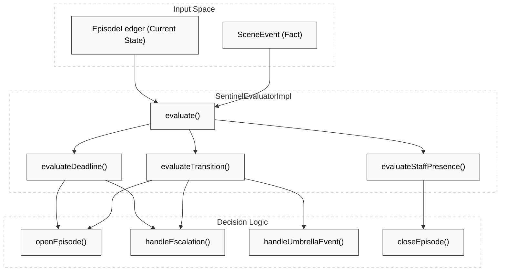
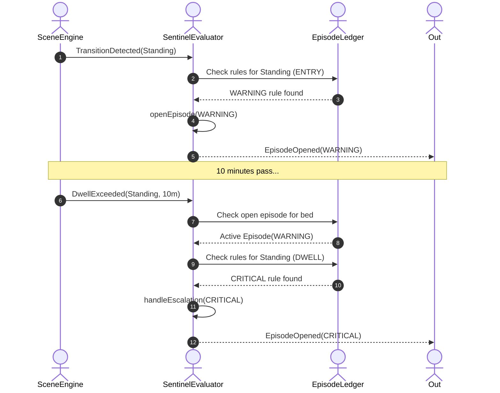

# Sentinel Engine

Relevant source files

- 
- 
- 
- 
- 
- 
- 

The **Sentinel Engine** is the second stage of the resident safety monitoring pipeline. While the Scene Engine interprets raw sensor data into physical facts (e.g., "Resident is standing"), the Sentinel Engine applies clinical judgment to these facts to manage the lifecycle of **Safety Episodes**.

It is a pure domain engine that evaluates `SceneEvent` inputs against a `SentinelCalibration` to produce `SentinelSignal` outputs and update the `EpisodeLedger`.

## Core Logic & Data Flow

The engine follows a "Consume-Evaluate-Publish" pattern. It does not persist state itself; instead, it receives the current `EpisodeLedger` (the state shell) and returns a `SentinelVerdict` containing the new ledger state and a list of signals.

### Logic Mapping: Natural Language to Code

|Clinical Concept|Code Entity|File Reference|
|---|---|---|
|**Safety Episode**|`Episode`|[engines/sentinel/sentinel-domain/src/main/kotlin/com/manahive/sentinel/EpisodeLedger.kt40-58](https://github.com/pbaalerta-wq/hisso1/blob/d9fca861/engines/sentinel/sentinel-domain/src/main/kotlin/com/manahive/sentinel/EpisodeLedger.kt#L40-L58)|
|**Clinical Rules**|`AlertRule`|[engines/sentinel/sentinel-domain/src/main/kotlin/com/manahive/sentinel/SentinelCalibration.kt3-11](https://github.com/pbaalerta-wq/hisso1/blob/d9fca861/engines/sentinel/sentinel-domain/src/main/kotlin/com/manahive/sentinel/SentinelCalibration.kt#L3-L11)|
|**Active Episodes**|`EpisodeLedger`|[engines/sentinel/sentinel-domain/src/main/kotlin/com/manahive/sentinel/EpisodeLedger.kt15-28](https://github.com/pbaalerta-wq/hisso1/blob/d9fca861/engines/sentinel/sentinel-domain/src/main/kotlin/com/manahive/sentinel/EpisodeLedger.kt#L15-L28)|
|**Judgment Engine**|`SentinelEvaluatorImpl`|[engines/sentinel/sentinel-domain/src/main/kotlin/com/manahive/sentinel/SentinelEvaluatorImpl.kt23-25](https://github.com/pbaalerta-wq/hisso1/blob/d9fca861/engines/sentinel/sentinel-domain/src/main/kotlin/com/manahive/sentinel/SentinelEvaluatorImpl.kt#L23-L25)|
|**Evaluation Result**|`SentinelVerdict`|[engines/sentinel/sentinel-domain/src/main/kotlin/com/manahive/sentinel/SentinelEvaluatorImpl.kt100-103](https://github.com/pbaalerta-wq/hisso1/blob/d9fca861/engines/sentinel/sentinel-domain/src/main/kotlin/com/manahive/sentinel/SentinelEvaluatorImpl.kt#L100-L103)|

### Evaluation Flow

The primary entry point is `SentinelEvaluatorImpl.evaluate`.

**Sources:** [engines/sentinel/sentinel-domain/src/main/kotlin/com/manahive/sentinel/SentinelEvaluatorImpl.kt33-104](https://github.com/pbaalerta-wq/hisso1/blob/d9fca861/engines/sentinel/sentinel-domain/src/main/kotlin/com/manahive/sentinel/SentinelEvaluatorImpl.kt#L33-L104)

## Sentinel Calibration

`SentinelCalibration` contains the compiled business rules for a specific resident. It is immutable for the lifetime of the evaluator.

- **Transition Rules:** Triggered by `ENTRY` into a state (e.g., Sitting down). [engines/sentinel/sentinel-domain/src/main/kotlin/com/manahive/sentinel/SentinelCalibration.kt43](https://github.com/pbaalerta-wq/hisso1/blob/d9fca861/engines/sentinel/sentinel-domain/src/main/kotlin/com/manahive/sentinel/SentinelCalibration.kt#L43-L43)
- **Dwell Rules:** Triggered when a resident remains in a state too long (`DWELL`). [engines/sentinel/sentinel-domain/src/main/kotlin/com/manahive/sentinel/SentinelCalibration.kt45](https://github.com/pbaalerta-wq/hisso1/blob/d9fca861/engines/sentinel/sentinel-domain/src/main/kotlin/com/manahive/sentinel/SentinelCalibration.kt#L45-L45)
- **ComeBack Rules:** Triggered when a resident fails to return to a baseline state (e.g., Lying in bed) within a deadline. [engines/sentinel/sentinel-domain/src/main/kotlin/com/manahive/sentinel/SentinelCalibration.kt47](https://github.com/pbaalerta-wq/hisso1/blob/d9fca861/engines/sentinel/sentinel-domain/src/main/kotlin/com/manahive/sentinel/SentinelCalibration.kt#L47-L47)

**Sources:** [engines/sentinel/sentinel-domain/src/main/kotlin/com/manahive/sentinel/SentinelCalibration.kt26-54](https://github.com/pbaalerta-wq/hisso1/blob/d9fca861/engines/sentinel/sentinel-domain/src/main/kotlin/com/manahive/sentinel/SentinelCalibration.kt#L26-L54)

## Episode Lifecycle

The engine manages episodes through specific signal types:

### 1. Episode Opening & Escalation

An episode opens when a `SceneEvent` matches a rule and no episode is currently active for that bed.

- **Severity Ramp:** If a transition occurs while an episode is already open, the engine checks for escalation. A `DWELL` rule (e.g., "Standing for 10 minutes") can escalate an existing `WARNING` episode to `CRITICAL`. [engines/sentinel/sentinel-domain/src/test/kotlin/com/manahive/sentinel/SeverityRampSpec.kt93-107](https://github.com/pbaalerta-wq/hisso1/blob/d9fca861/engines/sentinel/sentinel-domain/src/test/kotlin/com/manahive/sentinel/SeverityRampSpec.kt#L93-L107)

### 2. Umbrella Events

Once an episode is open, subsequent movements that are "watched" but don't cause escalation are emitted as `UmbrellaEvent` signals. This provides context (e.g., "Resident is now in the bathroom") without triggering a new alert. [engines/sentinel/sentinel-domain/src/main/kotlin/com/manahive/sentinel/SentinelEvaluatorImpl.kt156-163](https://github.com/pbaalerta-wq/hisso1/blob/d9fca861/engines/sentinel/sentinel-domain/src/main/kotlin/com/manahive/sentinel/SentinelEvaluatorImpl.kt#L156-L163)

### 3. Auto-Recovery

If a resident returns to a "Safe State" (usually `LYING`) and the rule is marked as `reversible`, the engine emits an `AutoRecovery` signal. This allows UI layers to visually "dim" an alert if the resident is no longer in danger, though the episode may remain open for staff confirmation. [engines/sentinel/sentinel-domain/src/main/kotlin/com/manahive/sentinel/SentinelEvaluatorImpl.kt225-236](https://github.com/pbaalerta-wq/hisso1/blob/d9fca861/engines/sentinel/sentinel-domain/src/main/kotlin/com/manahive/sentinel/SentinelEvaluatorImpl.kt#L225-L236)

### 4. Episode Closure

Episodes are closed via `EpisodeClosed` signals based on `ClosureCondition`:

- **SAFE_ONLY:** Closes automatically when the resident returns to a safe state.
- **STAFF_OR_SAFE:** Closes if staff arrives OR resident returns to safety.
- **STAFF_AND_SAFE:** Requires both staff presence and resident safety to close. [engines/sentinel/sentinel-domain/src/test/kotlin/com/manahive/sentinel/SentinelEvaluatorSpec.kt233-248](https://github.com/pbaalerta-wq/hisso1/blob/d9fca861/engines/sentinel/sentinel-domain/src/test/kotlin/com/manahive/sentinel/SentinelEvaluatorSpec.kt#L233-L248)

## Signal Types Reference

|Signal|Purpose|Implementation|
|---|---|---|
|`EpisodeOpened`|Start of a new safety event or escalation.|[platform/batch-io/src/main/kotlin/com/manahive/batchio/SentinelSignalWriter.kt28-29](https://github.com/pbaalerta-wq/hisso1/blob/d9fca861/platform/batch-io/src/main/kotlin/com/manahive/batchio/SentinelSignalWriter.kt#L28-L29)|
|`EpisodeClosed`|Formal end of an episode.|[platform/batch-io/src/main/kotlin/com/manahive/batchio/SentinelSignalWriter.kt30-31](https://github.com/pbaalerta-wq/hisso1/blob/d9fca861/platform/batch-io/src/main/kotlin/com/manahive/batchio/SentinelSignalWriter.kt#L30-L31)|
|`AutoRecovery`|Resident returned to safety while episode is open.|[platform/batch-io/src/main/kotlin/com/manahive/batchio/SentinelSignalWriter.kt32-33](https://github.com/pbaalerta-wq/hisso1/blob/d9fca861/platform/batch-io/src/main/kotlin/com/manahive/batchio/SentinelSignalWriter.kt#L32-L33)|
|`UmbrellaEvent`|Contextual movement under an active episode.|[platform/batch-io/src/main/kotlin/com/manahive/batchio/SentinelSignalWriter.kt34-35](https://github.com/pbaalerta-wq/hisso1/blob/d9fca861/platform/batch-io/src/main/kotlin/com/manahive/batchio/SentinelSignalWriter.kt#L34-L35)|
|`DwellPreWarning`|Early notification that a dwell limit is approaching.|[platform/batch-io/src/main/kotlin/com/manahive/batchio/SentinelSignalWriter.kt38-39](https://github.com/pbaalerta-wq/hisso1/blob/d9fca861/platform/batch-io/src/main/kotlin/com/manahive/batchio/SentinelSignalWriter.kt#L38-L39)|
|`ComeBackPreWarning`|Early notification that a comeback limit is approaching.|[platform/batch-io/src/main/kotlin/com/manahive/batchio/SentinelSignalWriter.kt40-41](https://github.com/pbaalerta-wq/hisso1/blob/d9fca861/platform/batch-io/src/main/kotlin/com/manahive/batchio/SentinelSignalWriter.kt#L40-L41)|

## ComeBack Judgment Logic

ComeBack logic is distinct because it monitors the **absence** of a state (usually `LYING`).

- **ComeBackPreWarning:** Emitted when the resident has been away from the baseline for a significant portion of the threshold but hasn't reached it yet. [engines/sentinel/sentinel-domain/src/test/kotlin/com/manahive/sentinel/ComeBackJudgmentSpec.kt64-71](https://github.com/pbaalerta-wq/hisso1/blob/d9fca861/engines/sentinel/sentinel-domain/src/test/kotlin/com/manahive/sentinel/ComeBackJudgmentSpec.kt#L64-L71)
- **Umbrella Presence vs Absence:** `UmbrellaEvent` for ComeBack rules are labeled as `awayFrom=STATE`, whereas standard transitions are labeled `state=STATE`. [engines/sentinel/sentinel-domain/src/test/kotlin/com/manahive/sentinel/ComeBackJudgmentSpec.kt116-120](https://github.com/pbaalerta-wq/hisso1/blob/d9fca861/engines/sentinel/sentinel-domain/src/test/kotlin/com/manahive/sentinel/ComeBackJudgmentSpec.kt#L116-L120)

**Sources:** [engines/sentinel/sentinel-domain/src/test/kotlin/com/manahive/sentinel/ComeBackJudgmentSpec.kt21-48](https://github.com/pbaalerta-wq/hisso1/blob/d9fca861/engines/sentinel/sentinel-domain/src/test/kotlin/com/manahive/sentinel/ComeBackJudgmentSpec.kt#L21-L48)

## Implementation Details: Severity Ramp

The Sentinel Engine supports increasing the severity of an existing episode if a more severe rule is triggered.

**Sources:** [engines/sentinel/sentinel-domain/src/test/kotlin/com/manahive/sentinel/SeverityRampSpec.kt75-107](https://github.com/pbaalerta-wq/hisso1/blob/d9fca861/engines/sentinel/sentinel-domain/src/test/kotlin/com/manahive/sentinel/SeverityRampSpec.kt#L75-L107)

### On this page

- [Sentinel Engine](https://deepwiki.com/pbaalerta-wq/hisso1/2.2-sentinel-engine#sentinel-engine)
- [Core Logic & Data Flow](https://deepwiki.com/pbaalerta-wq/hisso1/2.2-sentinel-engine#core-logic-data-flow)
- [Logic Mapping: Natural Language to Code](https://deepwiki.com/pbaalerta-wq/hisso1/2.2-sentinel-engine#logic-mapping-natural-language-to-code)
- [Evaluation Flow](https://deepwiki.com/pbaalerta-wq/hisso1/2.2-sentinel-engine#evaluation-flow)
- [Sentinel Calibration](https://deepwiki.com/pbaalerta-wq/hisso1/2.2-sentinel-engine#sentinel-calibration)
- [Episode Lifecycle](https://deepwiki.com/pbaalerta-wq/hisso1/2.2-sentinel-engine#episode-lifecycle)
- [1. Episode Opening & Escalation](https://deepwiki.com/pbaalerta-wq/hisso1/2.2-sentinel-engine#1-episode-opening-escalation)
- [2. Umbrella Events](https://deepwiki.com/pbaalerta-wq/hisso1/2.2-sentinel-engine#2-umbrella-events)
- [3. Auto-Recovery](https://deepwiki.com/pbaalerta-wq/hisso1/2.2-sentinel-engine#3-auto-recovery)
- [4. Episode Closure](https://deepwiki.com/pbaalerta-wq/hisso1/2.2-sentinel-engine#4-episode-closure)
- [Signal Types Reference](https://deepwiki.com/pbaalerta-wq/hisso1/2.2-sentinel-engine#signal-types-reference)
- [ComeBack Judgment Logic](https://deepwiki.com/pbaalerta-wq/hisso1/2.2-sentinel-engine#comeback-judgment-logic)
- [Implementation Details: Severity Ramp](https://deepwiki.com/pbaalerta-wq/hisso1/2.2-sentinel-engine#implementation-details-severity-ramp)
