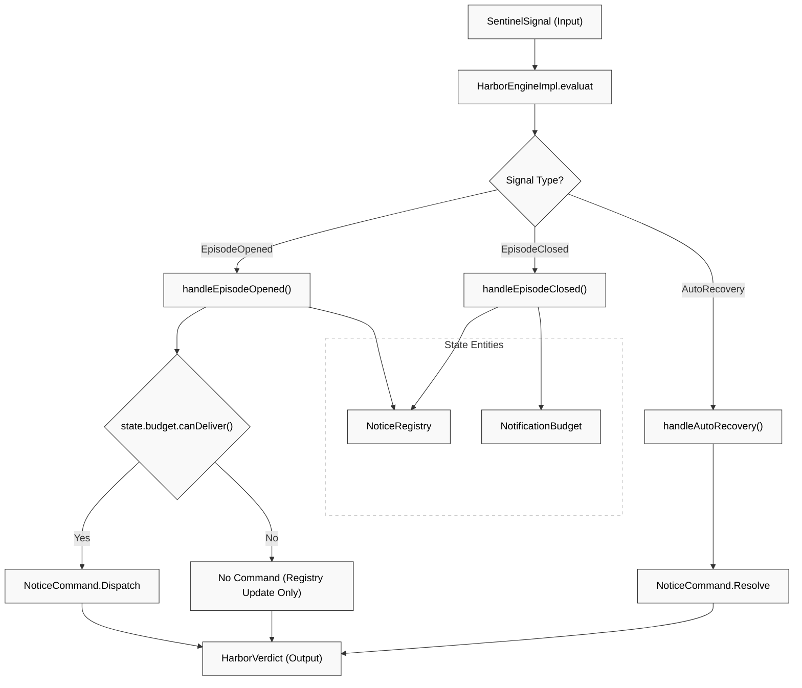
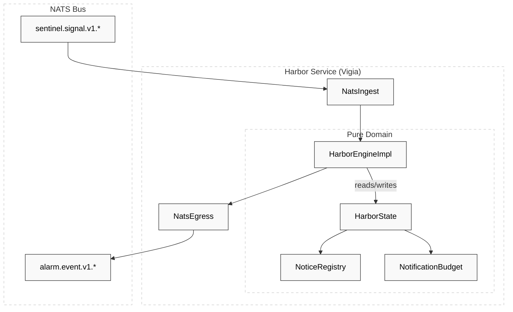

# Harbor Engine

Relevant source files

- 
- 
- 
- 
- 
- 
- 

The **Harbor Engine** (internally referred to as **Vigia**) is the third stage of the resident safety pipeline. Its primary responsibility is to transform clinical findings—represented as `SentinelSignal` objects—into actionable delivery instructions called `NoticeCommand` objects [engines/harbor/harbor-domain/src/main/kotlin/com/manahive/harbor/HarborEngine.kt15-32](https://github.com/pbaalerta-wq/hisso1/blob/d9fca861/engines/harbor/harbor-domain/src/main/kotlin/com/manahive/harbor/HarborEngine.kt#L15-L32)

While the Sentinel Engine focuses on clinical judgment (e.g., "is the resident in danger?"), the Harbor Engine focuses on **delivery logistics and notification fatigue**. It manages the lifecycle of notifications, determines appropriate communication channels based on severity, and enforces notification budgets to prevent staff desensitization [engines/harbor/harbor-domain/src/main/kotlin/com/manahive/harbor/NotificationBudget.kt5-13](https://github.com/pbaalerta-wq/hisso1/blob/d9fca861/engines/harbor/harbor-domain/src/main/kotlin/com/manahive/harbor/NotificationBudget.kt#L5-L13)

## Core Logic & Data Flow

The Harbor Engine follows the "Pure Domain Engine" pattern: it is an immutable evaluator that takes a signal, a state, and a timestamp, returning a verdict containing commands and the next state [engines/harbor/harbor-domain/src/main/kotlin/com/manahive/harbor/HarborEngine.kt34-39](https://github.com/pbaalerta-wq/hisso1/blob/d9fca861/engines/harbor/harbor-domain/src/main/kotlin/com/manahive/harbor/HarborEngine.kt#L34-L39)

### Signal Transformation Map

|Incoming SentinelSignal|Harbor Logic|Resulting NoticeCommand|
|---|---|---|
|`EpisodeOpened`|Checks `NotificationBudget`. If allowed, creates a `Notice` [engines/harbor/harbor-domain/src/main/kotlin/com/manahive/harbor/HarborEngineImpl.kt71-72](https://github.com/pbaalerta-wq/hisso1/blob/d9fca861/engines/harbor/harbor-domain/src/main/kotlin/com/manahive/harbor/HarborEngineImpl.kt#L71-L72)|`NoticeCommand.Dispatch`|
|`EpisodeClosed`|Retrieves `Notice` from `NoticeRegistry` and maps `ClosureCause` to `Resolution` [engines/harbor/harbor-domain/src/main/kotlin/com/manahive/harbor/HarborEngineImpl.kt117-134](https://github.com/pbaalerta-wq/hisso1/blob/d9fca861/engines/harbor/harbor-domain/src/main/kotlin/com/manahive/harbor/HarborEngineImpl.kt#L117-L134)|`NoticeCommand.Resolve`|
|`AutoRecovery`|If reversible, resolves notice. If non-reversible, sends a confirmation alert [engines/harbor/harbor-domain/src/main/kotlin/com/manahive/harbor/HarborEngineImpl.kt162-183](https://github.com/pbaalerta-wq/hisso1/blob/d9fca861/engines/harbor/harbor-domain/src/main/kotlin/com/manahive/harbor/HarborEngineImpl.kt#L162-L183)|`Resolve` or `Dispatch`|
|`DwellPreWarning`|Issues a low-priority console/tablet notice [engines/harbor/harbor-domain/src/main/kotlin/com/manahive/harbor/HarborEngineImpl.kt216-228](https://github.com/pbaalerta-wq/hisso1/blob/d9fca861/engines/harbor/harbor-domain/src/main/kotlin/com/manahive/harbor/HarborEngineImpl.kt#L216-L228)|`NoticeCommand.Dispatch`|

### Code-to-Entity Mapping: Evaluation Flow

The following diagram illustrates how the `HarborEngineImpl` processes signals using its internal handlers.

**Sources:** [engines/harbor/harbor-domain/src/main/kotlin/com/manahive/harbor/HarborEngineImpl.kt30-49](https://github.com/pbaalerta-wq/hisso1/blob/d9fca861/engines/harbor/harbor-domain/src/main/kotlin/com/manahive/harbor/HarborEngineImpl.kt#L30-L49) [engines/harbor/harbor-domain/src/main/kotlin/com/manahive/harbor/HarborEngine.kt63-66](https://github.com/pbaalerta-wq/hisso1/blob/d9fca861/engines/harbor/harbor-domain/src/main/kotlin/com/manahive/harbor/HarborEngine.kt#L63-L66)

## Harbor Calibration & DSL

The behavior of the engine is governed by `HarborCalibration`. This includes channel mapping and escalation timeouts. Calibrations are resident-specific and immutable for the engine's lifetime [engines/harbor/harbor-domain/src/main/kotlin/com/manahive/harbor/HarborEngine.kt81-91](https://github.com/pbaalerta-wq/hisso1/blob/d9fca861/engines/harbor/harbor-domain/src/main/kotlin/com/manahive/harbor/HarborEngine.kt#L81-L91)

### Notice Channels

The system supports several delivery channels defined in the `Channel` enum [engines/harbor/harbor-domain/src/main/kotlin/com/manahive/harbor/HarborEngine.kt3](https://github.com/pbaalerta-wq/hisso1/blob/d9fca861/engines/harbor/harbor-domain/src/main/kotlin/com/manahive/harbor/HarborEngine.kt#L3-L3):

- `CONSOLE`: System logs and monitoring dashboards.
- `PUSH`: Mobile notifications for staff.
- `TABLET`: Dedicated wall-mounted or handheld devices.
- `WARD_BOARD`: Centralized station displays.

### Severity Escalation

The calibration defines `escalationTimeouts` per `Severity`. If a notice is not resolved within this window, the infrastructure (Vigia shell) triggers escalation logic based on these durations [engines/harbor/harbor-domain/src/main/kotlin/com/manahive/harbor/HarborEngine.kt97-98](https://github.com/pbaalerta-wq/hisso1/blob/d9fca861/engines/harbor/harbor-domain/src/main/kotlin/com/manahive/harbor/HarborEngine.kt#L97-L98)

**Sources:** [engines/harbor/harbor-domain/src/main/kotlin/com/manahive/harbor/HarborEngine.kt81-120](https://github.com/pbaalerta-wq/hisso1/blob/d9fca861/engines/harbor/harbor-domain/src/main/kotlin/com/manahive/harbor/HarborEngine.kt#L81-L120) [engines/harbor/harbor-service/src/main/kotlin/com/manahive/harbor/service/VigiaApplication.kt32-46](https://github.com/pbaalerta-wq/hisso1/blob/d9fca861/engines/harbor/harbor-service/src/main/kotlin/com/manahive/harbor/service/VigiaApplication.kt#L32-L46)

## Notification Budget & Fatigue Management

To prevent "alarm fatigue," the Harbor Engine tracks the number of notifications sent per shift via `NotificationBudget` [engines/harbor/harbor-domain/src/main/kotlin/com/manahive/harbor/NotificationBudget.kt14-17](https://github.com/pbaalerta-wq/hisso1/blob/d9fca861/engines/harbor/harbor-domain/src/main/kotlin/com/manahive/harbor/NotificationBudget.kt#L14-L17)

1. **Safety Override**: `Severity.CRITICAL` signals are **never** suppressed by the budget; life-safety always takes precedence [engines/harbor/harbor-domain/src/main/kotlin/com/manahive/harbor/NotificationBudget.kt20](https://github.com/pbaalerta-wq/hisso1/blob/d9fca861/engines/harbor/harbor-domain/src/main/kotlin/com/manahive/harbor/NotificationBudget.kt#L20-L20)
2. **Tracking**: When a notification is dispatched, the `HarborState` is updated using `withFatigueTrack`, which increments the `dispatched` counter for that severity [engines/harbor/harbor-domain/src/main/kotlin/com/manahive/harbor/HarborEngine.kt56-58](https://github.com/pbaalerta-wq/hisso1/blob/d9fca861/engines/harbor/harbor-domain/src/main/kotlin/com/manahive/harbor/HarborEngine.kt#L56-L58)
3. **Suppression**: If the `dispatched` count meets or exceeds `maxPerShift` (defined in calibration), subsequent notifications for that severity are created in the `NoticeRegistry` (for state tracking) but no `Dispatch` command is issued [engines/harbor/harbor-domain/src/main/kotlin/com/manahive/harbor/HarborEngineImpl.kt78-90](https://github.com/pbaalerta-wq/hisso1/blob/d9fca861/engines/harbor/harbor-domain/src/main/kotlin/com/manahive/harbor/HarborEngineImpl.kt#L78-L90)

**Sources:** [engines/harbor/harbor-domain/src/main/kotlin/com/manahive/harbor/NotificationBudget.kt1-56](https://github.com/pbaalerta-wq/hisso1/blob/d9fca861/engines/harbor/harbor-domain/src/main/kotlin/com/manahive/harbor/NotificationBudget.kt#L1-L56) [engines/harbor/harbor-domain/src/main/kotlin/com/manahive/harbor/HarborEngineImpl.kt74-90](https://github.com/pbaalerta-wq/hisso1/blob/d9fca861/engines/harbor/harbor-domain/src/main/kotlin/com/manahive/harbor/HarborEngineImpl.kt#L74-L90)

## State Management

The engine utilizes two primary state containers:

### NoticeRegistry

An immutable value class that stores active notices indexed by `EpisodeId` [engines/harbor/harbor-domain/src/main/kotlin/com/manahive/harbor/HarborEngine.kt129-140](https://github.com/pbaalerta-wq/hisso1/blob/d9fca861/engines/harbor/harbor-domain/src/main/kotlin/com/manahive/harbor/HarborEngine.kt#L129-L140) This allows the engine to correlate closure signals with the original dispatch events.

### NoticeLifecycle (Vigia Application)

While the `HarborEngine` is pure, the `VigiaApplication` (the imperative shell) manages the NATS connectivity. It subscribes to `sentinel.signal.v1.>` and `scene.fact.v1.>`, and publishes to `alarm.event.v1.<severity>` [engines/harbor/harbor-service/src/main/kotlin/com/manahive/harbor/service/VigiaApplication.kt18-26](https://github.com/pbaalerta-wq/hisso1/blob/d9fca861/engines/harbor/harbor-service/src/main/kotlin/com/manahive/harbor/service/VigiaApplication.kt#L18-L26)

**Sources:** [engines/harbor/harbor-service/src/main/kotlin/com/manahive/harbor/service/VigiaApplication.kt18-51](https://github.com/pbaalerta-wq/hisso1/blob/d9fca861/engines/harbor/harbor-service/src/main/kotlin/com/manahive/harbor/service/VigiaApplication.kt#L18-L51) [engines/harbor/harbor-domain/src/main/kotlin/com/manahive/harbor/HarborEngine.kt51-58](https://github.com/pbaalerta-wq/hisso1/blob/d9fca861/engines/harbor/harbor-domain/src/main/kotlin/com/manahive/harbor/HarborEngine.kt#L51-L58)

## Implementation Details

### Resolution Mapping

When an episode is closed, the Harbor Engine maps the `ClosureCause` to a staff-facing `Resolution` [engines/harbor/harbor-domain/src/main/kotlin/com/manahive/harbor/HarborEngineImpl.kt127-134](https://github.com/pbaalerta-wq/hisso1/blob/d9fca861/engines/harbor/harbor-domain/src/main/kotlin/com/manahive/harbor/HarborEngineImpl.kt#L127-L134):

- `STAFF_AND_SAFE` → `Resolution.STAFF_PRESENT`
- `AUTO_RECOVERY` (Reversible) → `Resolution.AUTO_RECOVERY`
- `MANUAL_CLOSE` → `Resolution.MANUAL`

### NATS Serialization

All events flowing through Harbor are serialized using the `NatsObjectMapper`. It specifically configures the `JavaTimeModule` to ensure `Instant` fields (like `occurredAt`) are handled as ISO-8601 strings rather than timestamps, ensuring auditability and cross-service compatibility [platform/messaging/src/main/kotlin/com/manahive/messaging/NatsObjectMapper.kt27-32](https://github.com/pbaalerta-wq/hisso1/blob/d9fca861/platform/messaging/src/main/kotlin/com/manahive/messaging/NatsObjectMapper.kt#L27-L32)

**Sources:** [engines/harbor/harbor-domain/src/main/kotlin/com/manahive/harbor/HarborEngineImpl.kt112-144](https://github.com/pbaalerta-wq/hisso1/blob/d9fca861/engines/harbor/harbor-domain/src/main/kotlin/com/manahive/harbor/HarborEngineImpl.kt#L112-L144) [platform/messaging/src/main/kotlin/com/manahive/messaging/NatsObjectMapper.kt9-32](https://github.com/pbaalerta-wq/hisso1/blob/d9fca861/platform/messaging/src/main/kotlin/com/manahive/messaging/NatsObjectMapper.kt#L9-L32)

### On this page

- [Harbor Engine](https://deepwiki.com/pbaalerta-wq/hisso1/2.3-harbor-engine#harbor-engine)
- [Core Logic & Data Flow](https://deepwiki.com/pbaalerta-wq/hisso1/2.3-harbor-engine#core-logic-data-flow)
- [Signal Transformation Map](https://deepwiki.com/pbaalerta-wq/hisso1/2.3-harbor-engine#signal-transformation-map)
- [Code-to-Entity Mapping: Evaluation Flow](https://deepwiki.com/pbaalerta-wq/hisso1/2.3-harbor-engine#code-to-entity-mapping-evaluation-flow)
- [Harbor Calibration & DSL](https://deepwiki.com/pbaalerta-wq/hisso1/2.3-harbor-engine#harbor-calibration-dsl)
- [Notice Channels](https://deepwiki.com/pbaalerta-wq/hisso1/2.3-harbor-engine#notice-channels)
- [Severity Escalation](https://deepwiki.com/pbaalerta-wq/hisso1/2.3-harbor-engine#severity-escalation)
- [Notification Budget & Fatigue Management](https://deepwiki.com/pbaalerta-wq/hisso1/2.3-harbor-engine#notification-budget-fatigue-management)
- [State Management](https://deepwiki.com/pbaalerta-wq/hisso1/2.3-harbor-engine#state-management)
- [NoticeRegistry](https://deepwiki.com/pbaalerta-wq/hisso1/2.3-harbor-engine#noticeregistry)
- [NoticeLifecycle (Vigia Application)](https://deepwiki.com/pbaalerta-wq/hisso1/2.3-harbor-engine#noticelifecycle-vigia-application)
- [Implementation Details](https://deepwiki.com/pbaalerta-wq/hisso1/2.3-harbor-engine#implementation-details)
- [Resolution Mapping](https://deepwiki.com/pbaalerta-wq/hisso1/2.3-harbor-engine#resolution-mapping)
- [NATS Serialization](https://deepwiki.com/pbaalerta-wq/hisso1/2.3-harbor-engine#nats-serialization)

