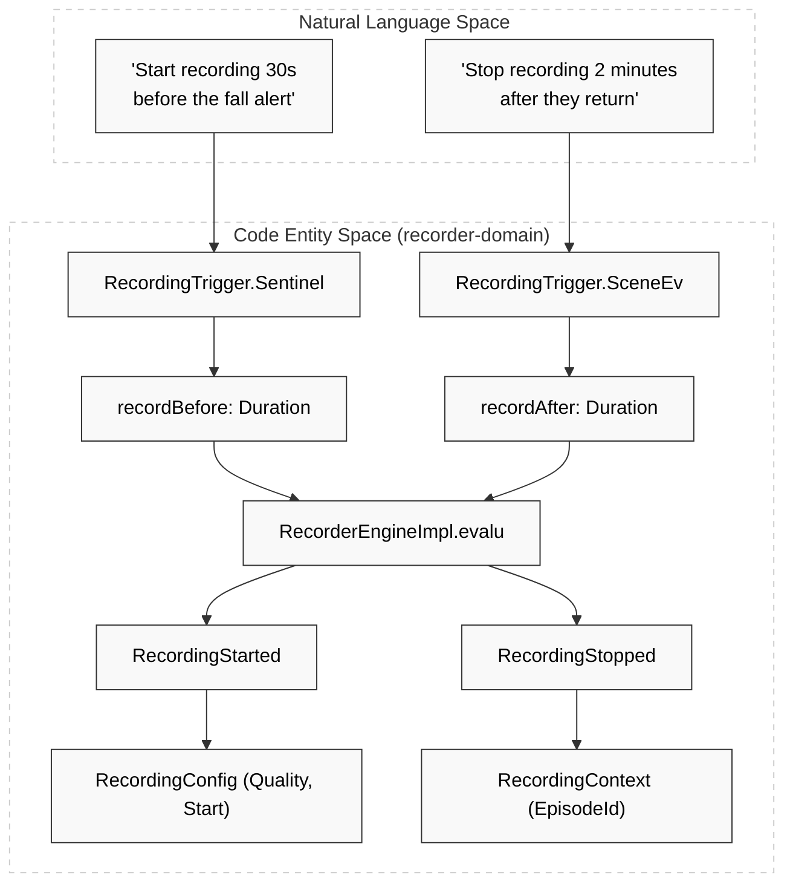
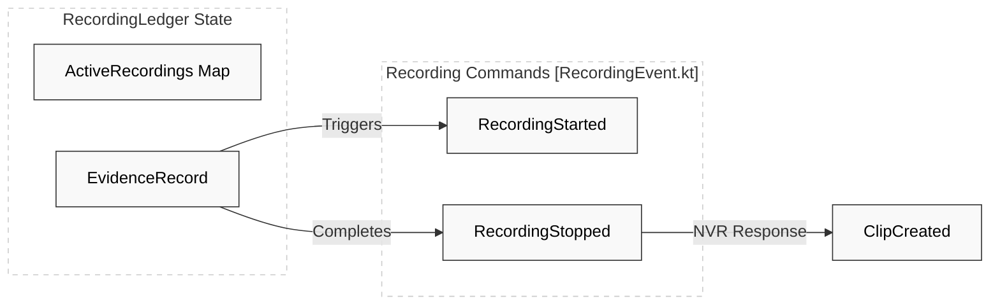

# Recorder Engine

Relevant source files

- 
- 

The **Recorder Engine** is the final stage of the Hisso observation pipeline. Its primary responsibility is to translate domain events (from both the Scene and Sentinel engines) into concrete `RecordingCommand` instructions for the Network Video Recorder (NVR) adapter [engines/recorder/recorder-domain/src/main/kotlin/com/manahive/recorder/RecordingEvent.kt12-19](https://github.com/pbaalerta-wq/hisso1/blob/d9fca861/engines/recorder/recorder-domain/src/main/kotlin/com/manahive/recorder/RecordingEvent.kt#L12-L19) It manages recording windows, including "pre-roll" (recordBefore) and "post-roll" (recordAfter) buffers, ensuring that critical incidents are captured with sufficient context for clinical review [engines/recorder/recorder-domain/src/main/kotlin/com/manahive/recorder/RecordingCalibration.kt60-68](https://github.com/pbaalerta-wq/hisso1/blob/d9fca861/engines/recorder/recorder-domain/src/main/kotlin/com/manahive/recorder/RecordingCalibration.kt#L60-L68)

### Engine Implementation & Data Flow

The engine is implemented in `RecorderEngineImpl`, following the pure-domain "Evaluate" pattern. It maintains a `RecordingLedger` to track active recording sessions and ensures that overlapping triggers for the same bed/monitor are merged or extended appropriately.

#### Core Logic Flow

The engine reacts to two types of inputs: `SceneEvent` (e.g., a resident leaving the bed) and `SentinelSignal` (e.g., a high-severity alert).

1. **Ingest**: Receives a `SceneEvent` or `SentinelSignal`.
2. **Trigger Matching**: Checks `RecordingCalibration` to see if the incoming event matches any defined `RecordingTrigger` [engines/recorder/recorder-domain/src/main/kotlin/com/manahive/recorder/RecordingCalibration.kt70-79](https://github.com/pbaalerta-wq/hisso1/blob/d9fca861/engines/recorder/recorder-domain/src/main/kotlin/com/manahive/recorder/RecordingCalibration.kt#L70-L79)
3. **Window Calculation**: Applies the `recordBefore` and `recordAfter` durations to the event timestamp to determine the target video segment [engines/recorder/recorder-domain/src/main/kotlin/com/manahive/recorder/RecordingCalibration.kt60-68](https://github.com/pbaalerta-wq/hisso1/blob/d9fca861/engines/recorder/recorder-domain/src/main/kotlin/com/manahive/recorder/RecordingCalibration.kt#L60-L68)
4. **Ledger Update**: Updates the `RecordingLedger` to track the state of the recording (STARTING, RECORDING, STOPPING).
5. **Command Emission**: Produces `RecordingStarted` or `RecordingStopped` commands [engines/recorder/recorder-domain/src/main/kotlin/com/manahive/recorder/RecordingEvent.kt43-95](https://github.com/pbaalerta-wq/hisso1/blob/d9fca861/engines/recorder/recorder-domain/src/main/kotlin/com/manahive/recorder/RecordingEvent.kt#L43-L95)

**Natural Language to Code Entity Space: Recorder Pipeline**

Sources: [engines/recorder/recorder-domain/src/main/kotlin/com/manahive/recorder/RecordingCalibration.kt60-95](https://github.com/pbaalerta-wq/hisso1/blob/d9fca861/engines/recorder/recorder-domain/src/main/kotlin/com/manahive/recorder/RecordingCalibration.kt#L60-L95) [engines/recorder/recorder-domain/src/main/kotlin/com/manahive/recorder/RecordingEvent.kt43-116](https://github.com/pbaalerta-wq/hisso1/blob/d9fca861/engines/recorder/recorder-domain/src/main/kotlin/com/manahive/recorder/RecordingEvent.kt#L43-L116)

### Recording Calibration DSL

The behavior of the engine is governed by `RecordingCalibration`. This DSL allows administrators to define exactly which events should trigger the NVR.

|Trigger Type|Description|Code Entity|
|---|---|---|
|**Scene Event**|Triggers based on physical state changes (e.g., `TransitionDetected`).|`SceneEventTrigger`|
|**Sentinel Signal**|Triggers based on logical alerts (e.g., `AlertRaised`).|`SentinelSignalTrigger`|

Each trigger specifies:

- **recordBefore**: How much footage to include _prior_ to the event (pre-roll) [engines/recorder/recorder-domain/src/main/kotlin/com/manahive/recorder/RecordingCalibration.kt63](https://github.com/pbaalerta-wq/hisso1/blob/d9fca861/engines/recorder/recorder-domain/src/main/kotlin/com/manahive/recorder/RecordingCalibration.kt#L63-L63)
- **recordAfter**: How long to continue recording _after_ the event (post-roll) [engines/recorder/recorder-domain/src/main/kotlin/com/manahive/recorder/RecordingCalibration.kt65](https://github.com/pbaalerta-wq/hisso1/blob/d9fca861/engines/recorder/recorder-domain/src/main/kotlin/com/manahive/recorder/RecordingCalibration.kt#L65-L65)
- **quality**: The resolution and bitrate (SD, HD, or FULL) [engines/recorder/recorder-domain/src/main/kotlin/com/manahive/recorder/RecordingEvent.kt183-218](https://github.com/pbaalerta-wq/hisso1/blob/d9fca861/engines/recorder/recorder-domain/src/main/kotlin/com/manahive/recorder/RecordingEvent.kt#L183-L218)

Sources: [engines/recorder/recorder-domain/src/main/kotlin/com/manahive/recorder/RecordingCalibration.kt15-80](https://github.com/pbaalerta-wq/hisso1/blob/d9fca861/engines/recorder/recorder-domain/src/main/kotlin/com/manahive/recorder/RecordingCalibration.kt#L15-L80) [engines/recorder/recorder-domain/src/main/kotlin/com/manahive/recorder/RecordingEvent.kt195-218](https://github.com/pbaalerta-wq/hisso1/blob/d9fca861/engines/recorder/recorder-domain/src/main/kotlin/com/manahive/recorder/RecordingEvent.kt#L195-L218)

### The Recording Ledger

The `RecordingLedger` acts as the state machine for the engine. It prevents redundant commands and manages the lifecycle of `EvidenceRecord` objects.

**Entity Mapping: Ledger and Commands**

Sources: [engines/recorder/recorder-domain/src/main/kotlin/com/manahive/recorder/RecordingEvent.kt43-137](https://github.com/pbaalerta-wq/hisso1/blob/d9fca861/engines/recorder/recorder-domain/src/main/kotlin/com/manahive/recorder/RecordingEvent.kt#L43-L137)

### Key Classes and Functions

#### RecordingCommand

The engine emits sealed interface `RecordingCommand` variants [engines/recorder/recorder-domain/src/main/kotlin/com/manahive/recorder/RecordingEvent.kt20-33](https://github.com/pbaalerta-wq/hisso1/blob/d9fca861/engines/recorder/recorder-domain/src/main/kotlin/com/manahive/recorder/RecordingEvent.kt#L20-L33):

- **`RecordingStarted`**: Includes `RecordingTarget` (Bed + Monitor), `RecordingConfig` (Start time + Quality), and `RecordingContext` (Standalone or `TiedToEpisode`) [engines/recorder/recorder-domain/src/main/kotlin/com/manahive/recorder/RecordingEvent.kt43-80](https://github.com/pbaalerta-wq/hisso1/blob/d9fca861/engines/recorder/recorder-domain/src/main/kotlin/com/manahive/recorder/RecordingEvent.kt#L43-L80)
- **`RecordingStopped`**: Signal to the NVR to finalize the stream at a specific `Instant` [engines/recorder/recorder-domain/src/main/kotlin/com/manahive/recorder/RecordingEvent.kt90-116](https://github.com/pbaalerta-wq/hisso1/blob/d9fca861/engines/recorder/recorder-domain/src/main/kotlin/com/manahive/recorder/RecordingEvent.kt#L90-L116)
- **`ClipCreated`**: An acknowledgment from the NVR adapter that a file has been persisted, providing the `ClipPath` and `FileSize` [engines/recorder/recorder-domain/src/main/kotlin/com/manahive/recorder/RecordingEvent.kt129-159](https://github.com/pbaalerta-wq/hisso1/blob/d9fca861/engines/recorder/recorder-domain/src/main/kotlin/com/manahive/recorder/RecordingEvent.kt#L129-L159)

#### Quality and Resolution

Recording quality is not a simple string but a structured `Quality` value object [engines/recorder/recorder-domain/src/main/kotlin/com/manahive/recorder/RecordingEvent.kt183-188](https://github.com/pbaalerta-wq/hisso1/blob/d9fca861/engines/recorder/recorder-domain/src/main/kotlin/com/manahive/recorder/RecordingEvent.kt#L183-L188):

- **SD**: 640x480 @ 15fps, 1Mbps [engines/recorder/recorder-domain/src/main/kotlin/com/manahive/recorder/RecordingEvent.kt197-202](https://github.com/pbaalerta-wq/hisso1/blob/d9fca861/engines/recorder/recorder-domain/src/main/kotlin/com/manahive/recorder/RecordingEvent.kt#L197-L202)
- **HD**: 1280x720 @ 30fps, 5Mbps [engines/recorder/recorder-domain/src/main/kotlin/com/manahive/recorder/RecordingEvent.kt205-210](https://github.com/pbaalerta-wq/hisso1/blob/d9fca861/engines/recorder/recorder-domain/src/main/kotlin/com/manahive/recorder/RecordingEvent.kt#L205-L210)
- **FULL**: 1920x1080 @ 30fps, 10Mbps [engines/recorder/recorder-domain/src/main/kotlin/com/manahive/recorder/RecordingEvent.kt213-218](https://github.com/pbaalerta-wq/hisso1/blob/d9fca861/engines/recorder/recorder-domain/src/main/kotlin/com/manahive/recorder/RecordingEvent.kt#L213-L218)

### Batch Processing and Parsing

For offline analysis and replay, the `SignalParser` utility in the `recorder-batch` module allows the engine to ingest historical data from JSONL files [engines/recorder/recorder-batch/src/main/kotlin/com/manahive/recorder/batch/SignalParser.kt30-43](https://github.com/pbaalerta-wq/hisso1/blob/d9fca861/engines/recorder/recorder-batch/src/main/kotlin/com/manahive/recorder/batch/SignalParser.kt#L30-L43) It supports parsing all `SceneEvent` types (e.g., `NightOpened`, `TransitionDetected`, `DwellWarning`) to simulate how the Recorder Engine would have reacted to real-time events [engines/recorder/recorder-batch/src/main/kotlin/com/manahive/recorder/batch/SignalParser.kt53-64](https://github.com/pbaalerta-wq/hisso1/blob/d9fca861/engines/recorder/recorder-batch/src/main/kotlin/com/manahive/recorder/batch/SignalParser.kt#L53-L64)

Sources: [engines/recorder/recorder-batch/src/main/kotlin/com/manahive/recorder/batch/SignalParser.kt30-159](https://github.com/pbaalerta-wq/hisso1/blob/d9fca861/engines/recorder/recorder-batch/src/main/kotlin/com/manahive/recorder/batch/SignalParser.kt#L30-L159)

### On this page

- [Recorder Engine](https://deepwiki.com/pbaalerta-wq/hisso1/2.4-recorder-engine#recorder-engine)
- [Engine Implementation & Data Flow](https://deepwiki.com/pbaalerta-wq/hisso1/2.4-recorder-engine#engine-implementation-data-flow)
- [Core Logic Flow](https://deepwiki.com/pbaalerta-wq/hisso1/2.4-recorder-engine#core-logic-flow)
- [Recording Calibration DSL](https://deepwiki.com/pbaalerta-wq/hisso1/2.4-recorder-engine#recording-calibration-dsl)
- [The Recording Ledger](https://deepwiki.com/pbaalerta-wq/hisso1/2.4-recorder-engine#the-recording-ledger)
- [Key Classes and Functions](https://deepwiki.com/pbaalerta-wq/hisso1/2.4-recorder-engine#key-classes-and-functions)
- [RecordingCommand](https://deepwiki.com/pbaalerta-wq/hisso1/2.4-recorder-engine#recordingcommand)
- [Quality and Resolution](https://deepwiki.com/pbaalerta-wq/hisso1/2.4-recorder-engine#quality-and-resolution)
- [Batch Processing and Parsing](https://deepwiki.com/pbaalerta-wq/hisso1/2.4-recorder-engine#batch-processing-and-parsing)
