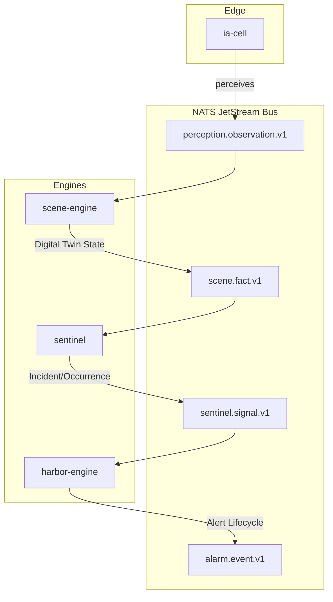

# Engines

Relevant source files

- 
- 
- 
- 

The **Engines** in `mana-hive` are the core processing units that transform raw sensor data into actionable care insights. Each engine is designed as a specialized filter in a pipe-and-filter architecture, connected by a high-performance NATS JetStream event bus.

The system follows a strict **Pure Domain** pattern: all business logic is isolated in side-effect-free modules, wrapped by a thin Spring Boot shell for infrastructure (NATS, persistence) and a CLI tool for offline batch processing.

### The Engine Pipeline

The engines chain together to process the lifecycle of a resident's safety, from initial perception to the final resolution of an alert.

|Engine|Role|Input|Output|
|---|---|---|---|
|**Scene Engine**|Digital Twin|`Observation`|`SceneFact`|
|**Sentinel**|Policy Judgment|`SceneFact`|`SentinelSignal`|
|**Harbor (Vigia)**|Alert Delivery|`SentinelSignal`|`AlarmEvent`|
|**Politica**|Policy Translation|`PolicyChange`|`CalibrationChanged`|
|**Recorder**|Evidence Capture|`RecordingTrigger`|`RecordingCommand`|

### Architectural Pattern

Every engine in the `mana-hive` ecosystem adheres to a three-tier structure enforced by Gradle convention plugins:

1. **Pure Domain (`manahive.pure-domain`)**: Contains the core logic (e.g., `Decider`, `Engine`). It has zero external dependencies, ensuring that clinical logic is deterministic and easily testable [README.md68-70](https://github.com/kerrvisiona-sudo/hive2/blob/f8142c8f/README.md?plain=1#L68-L70)
2. **Spring Service (`manahive.spring-service`)**: A thin infrastructure wrapper that handles NATS JetStream subscriptions, JSON serialization, and database persistence [README.md70](https://github.com/kerrvisiona-sudo/hive2/blob/f8142c8f/README.md?plain=1#L70-L70)
3. **Batch Tool**: A CLI utility (e.g., `scene-batch`) used for "Golden Replay" testing, allowing developers to run the engine logic against historical data without a running NATS cluster.

### System Data Flow

The following diagram illustrates how the engines interact via the NATS JetStream bus to process a care event.

**Figure 1: Engine Chaining via NATS Bus**

**Sources:** [README.md13-33](https://github.com/kerrvisiona-sudo/hive2/blob/f8142c8f/README.md?plain=1#L13-L33) [README.md35-43](https://github.com/kerrvisiona-sudo/hive2/blob/f8142c8f/README.md?plain=1#L35-L43)

---

### Scene Engine

The **Scene Engine** maintains a "Digital Twin" of every bed. It consumes raw observations (e.g., "movement detected") and produces high-level facts (e.g., "Resident has been out of bed for 5 minutes"). It handles complex temporal logic like hysteresis and dwell times.

For details, see [Scene Engine](https://deepwiki.com/kerrvisiona-sudo/hive2/3.1-scene-engine). **Sources:** [engines/scene-engine/scene-domain/build.gradle.kts10-14](https://github.com/kerrvisiona-sudo/hive2/blob/f8142c8f/engines/scene-engine/scene-domain/build.gradle.kts#L10-L14) [README.md60-61](https://github.com/kerrvisiona-sudo/hive2/blob/f8142c8f/README.md?plain=1#L60-L61)

### Sentinel Engine

The **Sentinel Engine** acts as the judge. It compares the `SceneFact` emitted by the Scene Engine against the specific clinical policies assigned to a resident. It manages the `EpisodeLedger` to track ongoing incidents and calculates the `FatigueBudget` to prevent overwhelming staff with redundant alerts.

For details, see [Sentinel Engine](https://deepwiki.com/kerrvisiona-sudo/hive2/3.2-sentinel-engine). **Sources:** [engines/sentinel/sentinel-domain/build.gradle.kts3-7](https://github.com/kerrvisiona-sudo/hive2/blob/f8142c8f/engines/sentinel/sentinel-domain/build.gradle.kts#L3-L7) [README.md62-63](https://github.com/kerrvisiona-sudo/hive2/blob/f8142c8f/README.md?plain=1#L62-L63)

### Harbor Engine (Alert Delivery)

The **Harbor Engine** (referred to in code as `vigia`) manages the human-facing side of the system. It translates a `SentinelSignal` into a `NoticeCommand`, determining which staff members should receive an alert on which device (Tablet, Ward Board, or Mobile) and managing the escalation if the alert is not acknowledged.

For details, see [Harbor Engine (Alert Delivery)](https://deepwiki.com/kerrvisiona-sudo/hive2/3.3-harbor-engine-\(alert-delivery\)). **Sources:** [README.md19](https://github.com/kerrvisiona-sudo/hive2/blob/f8142c8f/README.md?plain=1#L19-L19) [README.md64-65](https://github.com/kerrvisiona-sudo/hive2/blob/f8142c8f/README.md?plain=1#L64-L65)

### Politica Engine (Policy Translation)

The **Politica Engine** serves as the bridge between the administrative **Hub** and the real-time engines. When a clinical policy is updated in the Hub (e.g., "Change Bed Exit dwell time to 30s"), Politica translates these high-level policies into the specific `SceneCalibration` DSL used by the engines.

For details, see [Politica Engine (Policy Translation)](https://deepwiki.com/kerrvisiona-sudo/hive2/3.4-politica-engine-\(policy-translation\)).

### Recorder Engine (Evidence & NVR)

The **Recorder Engine** manages the lifecycle of evidence capture. It listens for triggers from the Sentinel or Scene engines to start and stop video recordings, ensuring that every significant incident is backed by visual evidence for clinical review in the Moviola.

For details, see [Recorder Engine (Evidence & NVR)](https://deepwiki.com/kerrvisiona-sudo/hive2/3.5-recorder-engine-\(evidence-and-nvr\)).

---

### Determinism and Reproducibility

A key requirement for all engines is that **any decision must be machine-reproducible**. Engines include `DecisionRecord` metadata in their outputs, citing the specific fingerprints of the rules, the engine version, and the input state used to reach a verdict [README.md47-49](https://github.com/kerrvisiona-sudo/hive2/blob/f8142c8f/README.md?plain=1#L47-L49) This allows the **Hub** to serve as the system of record for audit and "Golden Replay" scenarios.

**Sources:** [README.md45-49](https://github.com/kerrvisiona-sudo/hive2/blob/f8142c8f/README.md?plain=1#L45-L49)

### On this page

- [Engines](https://deepwiki.com/kerrvisiona-sudo/hive2/3-engines#engines)
- [The Engine Pipeline](https://deepwiki.com/kerrvisiona-sudo/hive2/3-engines#the-engine-pipeline)
- [Architectural Pattern](https://deepwiki.com/kerrvisiona-sudo/hive2/3-engines#architectural-pattern)
- [System Data Flow](https://deepwiki.com/kerrvisiona-sudo/hive2/3-engines#system-data-flow)
- [Scene Engine](https://deepwiki.com/kerrvisiona-sudo/hive2/3-engines#scene-engine)
- [Sentinel Engine](https://deepwiki.com/kerrvisiona-sudo/hive2/3-engines#sentinel-engine)
- [Harbor Engine (Alert Delivery)](https://deepwiki.com/kerrvisiona-sudo/hive2/3-engines#harbor-engine-alert-delivery)
- [Politica Engine (Policy Translation)](https://deepwiki.com/kerrvisiona-sudo/hive2/3-engines#politica-engine-policy-translation)
- [Recorder Engine (Evidence & NVR)](https://deepwiki.com/kerrvisiona-sudo/hive2/3-engines#recorder-engine-evidence-nvr)
- [Determinism and Reproducibility](https://deepwiki.com/kerrvisiona-sudo/hive2/3-engines#determinism-and-reproducibility)

