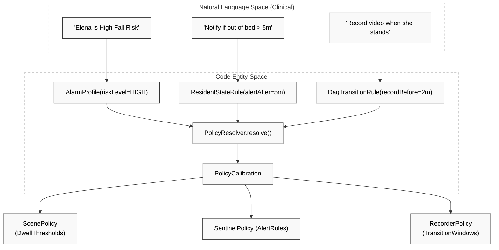
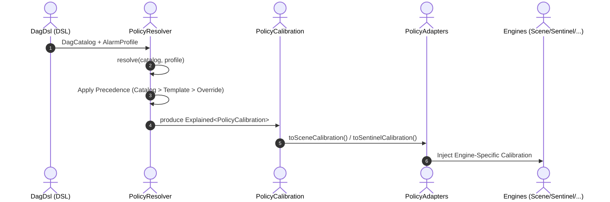

# Policy Engine (Politica)

Relevant source files

- 
- 
- 
- 
- 

The **Politica Engine** serves as the system's "translator." It bridges the gap between high-level clinical requirements (e.g., "Elena is a high-fall-risk resident") and the low-level technical calibrations required by the four processing engines. It ensures that clinical intent is consistently applied across the [Scene Engine](https://deepwiki.com/pbaalerta-wq/hisso1/2.1-scene-engine), [Sentinel Engine](https://deepwiki.com/pbaalerta-wq/hisso1/2.2-sentinel-engine), [Harbor Engine](https://deepwiki.com/pbaalerta-wq/hisso1/2.3-harbor-engine), and [Recorder Engine](https://deepwiki.com/pbaalerta-wq/hisso1/2.4-recorder-engine) engines.

### Purpose and Scope

Politica is a pure-domain engine [engines/politica-engine/politica-domain/src/main/kotlin/com/manahive/politica/PolicyResolver.kt33-41](https://github.com/pbaalerta-wq/hisso1/blob/d9fca861/engines/politica-engine/politica-domain/src/main/kotlin/com/manahive/politica/PolicyResolver.kt#L33-L41) that takes a `DagCatalog` (the global ruleset) and an `AlarmProfile` (resident-specific settings) to produce a `PolicyCalibration` [platform/contracts/src/main/kotlin/com/manahive/contracts/policy/PolicyCalibration.kt20-39](https://github.com/pbaalerta-wq/hisso1/blob/d9fca861/platform/contracts/src/main/kotlin/com/manahive/contracts/policy/PolicyCalibration.kt#L20-L39) This calibration contains the specific timeouts, severity levels, and recording windows that drive the monitoring pipeline.

### Conceptual Mapping

The following diagram illustrates how clinical concepts defined in the DSL map to the internal code entities that govern engine behavior.

**Diagram: Clinical Intent to Code Entity Mapping**

**Sources:** [platform/contracts/src/main/kotlin/com/manahive/contracts/policy/DagDsl.kt142-156](https://github.com/pbaalerta-wq/hisso1/blob/d9fca861/platform/contracts/src/main/kotlin/com/manahive/contracts/policy/DagDsl.kt#L142-L156) [engines/politica-engine/politica-domain/src/main/kotlin/com/manahive/politica/PolicyResolver.kt53-85](https://github.com/pbaalerta-wq/hisso1/blob/d9fca861/engines/politica-engine/politica-domain/src/main/kotlin/com/manahive/politica/PolicyResolver.kt#L53-L85) [platform/contracts/src/main/kotlin/com/manahive/contracts/policy/PolicyCalibration.kt20-39](https://github.com/pbaalerta-wq/hisso1/blob/d9fca861/platform/contracts/src/main/kotlin/com/manahive/contracts/policy/PolicyCalibration.kt#L20-L39)

---

### Key Components

#### 1. DagCatalog & Policy DSL

The system uses a Type-Safe DSL to define monitoring behaviors. The `DagCatalog` represents a Directed Acyclic Graph of states (Lying, Sitting, etc.) and the transitions between them. It defines the "laws of physics" for the facility, such as how long a resident can stay in a bathroom before an alert is triggered.

- **State Rules:** Defined via `ResidentStateRule`, specifying `warningAfter`, `alertAfter`, or `alertOnEntry` [platform/contracts/src/main/kotlin/com/manahive/contracts/policy/DagDsl.kt89-140](https://github.com/pbaalerta-wq/hisso1/blob/d9fca861/platform/contracts/src/main/kotlin/com/manahive/contracts/policy/DagDsl.kt#L89-L140)
- **ComeBack Rules:** Logic for "Si sale de X y no vuelve en Y minutos, avísenme" (Return to baseline monitoring) [platform/contracts/src/main/kotlin/com/manahive/contracts/policy/DagDsl.kt79-85](https://github.com/pbaalerta-wq/hisso1/blob/d9fca861/platform/contracts/src/main/kotlin/com/manahive/contracts/policy/DagDsl.kt#L79-L85)
- **Details:** For more information on the DSL and StateKind rules, see [DagCatalog & Policy DSL (#3.1)](https://github.com/pbaalerta-wq/hisso1/blob/d9fca861/DagCatalog%20&%20Policy%20DSL%20\(#3.1\))

#### 2. Policy Resolution & Fingerprinting

The `PolicyResolver` is a pure function that implements a three-layer precedence model: **Catalog → Template → Override** [engines/politica-engine/politica-domain/src/main/kotlin/com/manahive/politica/PolicyResolver.kt33-41](https://github.com/pbaalerta-wq/hisso1/blob/d9fca861/engines/politica-engine/politica-domain/src/main/kotlin/com/manahive/politica/PolicyResolver.kt#L33-L41)

- **Resolution:** It derives `DwellThresholds` (defaulting warnings to 50% of the alert time if not specified) and `AlertRules` [engines/politica-engine/politica-domain/src/main/kotlin/com/manahive/politica/PolicyResolver.kt147-160](https://github.com/pbaalerta-wq/hisso1/blob/d9fca861/engines/politica-engine/politica-domain/src/main/kotlin/com/manahive/politica/PolicyResolver.kt#L147-L160)
- **Audit Trail:** Every resolution produces an `Explained<PolicyCalibration>`, which includes an audit trail of which layer (Template or Override) provided specific values [engines/politica-engine/politica-domain/src/main/kotlin/com/manahive/politica/PolicyResolver.kt106-129](https://github.com/pbaalerta-wq/hisso1/blob/d9fca861/engines/politica-engine/politica-domain/src/main/kotlin/com/manahive/politica/PolicyResolver.kt#L106-L129)
- **Fingerprinting:** Generates a unique `Fingerprint` based on the catalog version and resident settings to ensure reproducibility [engines/politica-engine/politica-domain/src/main/kotlin/com/manahive/politica/PolicyResolver.kt95-103](https://github.com/pbaalerta-wq/hisso1/blob/d9fca861/engines/politica-engine/politica-domain/src/main/kotlin/com/manahive/politica/PolicyResolver.kt#L95-L103)
- **Details:** For resolution logic and precedence rules, see [Policy Resolution & Fingerprinting (#3.2)](https://github.com/pbaalerta-wq/hisso1/blob/d9fca861/Policy%20Resolution%20&%20Fingerprinting%20\(#3.2\))

#### 3. Policy Adapters

Once a `PolicyCalibration` is produced, it must be projected into the specific configuration formats required by each engine.

- **Projections:** `PolicyAdapters` convert the unified calibration into `SceneCalibration`, `SentinelCalibration`, etc [engines/scene-engine/scene-domain/src/main/kotlin/com/manahive/scene/calibration/SceneCalibration.kt16-30](https://github.com/pbaalerta-wq/hisso1/blob/d9fca861/engines/scene-engine/scene-domain/src/main/kotlin/com/manahive/scene/calibration/SceneCalibration.kt#L16-L30)
- **Offline Tools:** The `politica-batch` CLI allows developers to test policy resolution against large datasets without running the full runtime.
- **Details:** For adapter implementations and batch tools, see [Policy Adapters (#3.3)](https://github.com/pbaalerta-wq/hisso1/blob/d9fca861/Policy%20Adapters%20\(#3.3\))

---

### Policy Flow Architecture

The following diagram demonstrates how a policy change moves from the high-level DSL through the resolver and into the engines.

**Diagram: Policy Resolution Flow**

**Sources:** [engines/politica-engine/politica-domain/src/main/kotlin/com/manahive/politica/PolicyResolver.kt53-85](https://github.com/pbaalerta-wq/hisso1/blob/d9fca861/engines/politica-engine/politica-domain/src/main/kotlin/com/manahive/politica/PolicyResolver.kt#L53-L85) [platform/contracts/src/main/kotlin/com/manahive/contracts/policy/PolicyCalibration.kt20-39](https://github.com/pbaalerta-wq/hisso1/blob/d9fca861/platform/contracts/src/main/kotlin/com/manahive/contracts/policy/PolicyCalibration.kt#L20-L39) [engines/scene-engine/scene-domain/src/main/kotlin/com/manahive/scene/calibration/SceneCalibration.kt78-79](https://github.com/pbaalerta-wq/hisso1/blob/d9fca861/engines/scene-engine/scene-domain/src/main/kotlin/com/manahive/scene/calibration/SceneCalibration.kt#L78-L79)

### Summary of Data Contracts

|Entity|Role|Source|
|---|---|---|
|`DagCatalog`|Global definition of states and thresholds.|[DagDsl.kt11](https://github.com/pbaalerta-wq/hisso1/blob/d9fca861/DagDsl.kt#L11-L11)|
|`AlarmProfile`|Resident-specific risk levels and overrides.|[AlarmProfile.kt](https://github.com/pbaalerta-wq/hisso1/blob/d9fca861/AlarmProfile.kt)|
|`PolicyCalibration`|The unified contract consumed by all engines.|[PolicyCalibration.kt20](https://github.com/pbaalerta-wq/hisso1/blob/d9fca861/PolicyCalibration.kt#L20-L20)|
|`DwellThreshold`|Specific warning/exceeded durations for a state.|[PolicyCalibration.kt137](https://github.com/pbaalerta-wq/hisso1/blob/d9fca861/PolicyCalibration.kt#L137-L137)|
|`TransitionKey`|Identifies a state change (e.g., LYING → STANDING).|[PolicyCalibration.kt125](https://github.com/pbaalerta-wq/hisso1/blob/d9fca861/PolicyCalibration.kt#L125-L125)|

**Sources:** [platform/contracts/src/main/kotlin/com/manahive/contracts/policy/DagDsl.kt11-12](https://github.com/pbaalerta-wq/hisso1/blob/d9fca861/platform/contracts/src/main/kotlin/com/manahive/contracts/policy/DagDsl.kt#L11-L12) [platform/contracts/src/main/kotlin/com/manahive/contracts/policy/PolicyCalibration.kt20-137](https://github.com/pbaalerta-wq/hisso1/blob/d9fca861/platform/contracts/src/main/kotlin/com/manahive/contracts/policy/PolicyCalibration.kt#L20-L137)
.

### On this page

- [Policy Engine (Politica)](https://deepwiki.com/pbaalerta-wq/hisso1/3-policy-engine-\(politica\)#policy-engine-politica)
- [Purpose and Scope](https://deepwiki.com/pbaalerta-wq/hisso1/3-policy-engine-\(politica\)#purpose-and-scope)
- [Conceptual Mapping](https://deepwiki.com/pbaalerta-wq/hisso1/3-policy-engine-\(politica\)#conceptual-mapping)
- [Key Components](https://deepwiki.com/pbaalerta-wq/hisso1/3-policy-engine-\(politica\)#key-components)
- [1. DagCatalog & Policy DSL](https://deepwiki.com/pbaalerta-wq/hisso1/3-policy-engine-\(politica\)#1-dagcatalog-policy-dsl)
- [2. Policy Resolution & Fingerprinting](https://deepwiki.com/pbaalerta-wq/hisso1/3-policy-engine-\(politica\)#2-policy-resolution-fingerprinting)
- [3. Policy Adapters](https://deepwiki.com/pbaalerta-wq/hisso1/3-policy-engine-\(politica\)#3-policy-adapters)
- [Policy Flow Architecture](https://deepwiki.com/pbaalerta-wq/hisso1/3-policy-engine-\(politica\)#policy-flow-architecture)
- [Summary of Data Contracts](https://deepwiki.com/pbaalerta-wq/hisso1/3-policy-engine-\(politica\)#summary-of-data-contracts)

