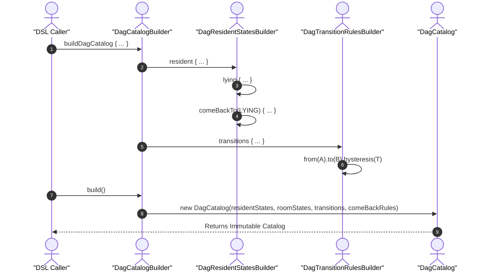

# DagCatalog & Policy DSL

Relevant source files

- [](https://github.com/pbaalerta-wq/hisso1/blob/d9fca861/platform/contracts/src/main/kotlin/com/manahive/contracts/policy/DagDsl.kt)
- [](https://github.com/pbaalerta-wq/hisso1/blob/d9fca861/platform/contracts/src/main/kotlin/com/manahive/contracts/policy/PolicyCatalog.kt)
- [](https://github.com/pbaalerta-wq/hisso1/blob/d9fca861/platform/contracts/src/main/kotlin/com/manahive/contracts/policy/PolicyOverride.kt)

The **DagCatalog** and its associated **Policy DSL** constitute the domain-specific language used to define safety policies within the Hisso platform. This system translates high-level resident care requirements (e.g., "Alert if the resident sits on the bed edge for more than 2 minutes") into technical configurations for the Scene, Sentinel, Harbor, and Recorder engines.

The DSL is designed around a Directed Acyclic Graph (DAG) model where nodes represent resident or room states, and edges represent transitions.

### 1. The DagCatalog Structure

The `DagCatalog` is the central repository of rules. It defines how the system should behave for different resident states, room states, and the transitions between them.

|Component|Description|Code Entity|
|---|---|---|
|**Resident States**|Rules for states like `LYING`, `SITTING`, `BED_EDGE`.|`residentStates` [platform/contracts/src/main/kotlin/com/manahive/contracts/policy/DagDsl.kt20](https://github.com/pbaalerta-wq/hisso1/blob/d9fca861/platform/contracts/src/main/kotlin/com/manahive/contracts/policy/DagDsl.kt#L20-L20)|
|**Room States**|Rules for environmental states (e.g., lights, doors).|`roomStates` [platform/contracts/src/main/kotlin/com/manahive/contracts/policy/DagDsl.kt21](https://github.com/pbaalerta-wq/hisso1/blob/d9fca861/platform/contracts/src/main/kotlin/com/manahive/contracts/policy/DagDsl.kt#L21-L21)|
|**Transitions**|Rules for the movement between states (hysteresis).|`transitions` [platform/contracts/src/main/kotlin/com/manahive/contracts/policy/DagDsl.kt22](https://github.com/pbaalerta-wq/hisso1/blob/d9fca861/platform/contracts/src/main/kotlin/com/manahive/contracts/policy/DagDsl.kt#L22-L22)|
|**ComeBack Rules**|Rules for returning to a baseline state.|`comeBackRules` [platform/contracts/src/main/kotlin/com/manahive/contracts/policy/DagDsl.kt23](https://github.com/pbaalerta-wq/hisso1/blob/d9fca861/platform/contracts/src/main/kotlin/com/manahive/contracts/policy/DagDsl.kt#L23-L23)|

**Sources:** [platform/contracts/src/main/kotlin/com/manahive/contracts/policy/DagDsl.kt18-48](https://github.com/pbaalerta-wq/hisso1/blob/d9fca861/platform/contracts/src/main/kotlin/com/manahive/contracts/policy/DagDsl.kt#L18-L48)

---

### 2. Resident State Rules & StateKind

The DSL provides a fluent API for defining behavior per `StateKind`. A `ResidentStateRule` determines if a state is purely for observation or if it should trigger alerts based on time spent (Dwell) or the moment of entry.

#### State Monitoring Constraints

A critical rule enforced by the builder is the **exclusionary Entry-vs-Dwell constraint**: a state can be monitored either by the duration spent in it (`alertAfter`) or by the instant of entry (`alertOnEntry`), but never both simultaneously.

**DSL Example: Resident States**

```
buildDagCatalog {
    resident {
        lying {
            // Pure observation, no alerts
        }
        bedEdge {
            severity(Severity.CRITICAL)
            alertOnEntry() // Trigger immediately on transition
            closure(ClosureCondition.STAFF_ONLY)
        }
        sitting {
            warningAfter(Duration.ofMinutes(5))
            alertAfter(Duration.ofMinutes(10)) // Trigger after 10 mins
        }
    }
}
```

**Sources:** [platform/contracts/src/main/kotlin/com/manahive/contracts/policy/DagDsl.kt51-140](https://github.com/pbaalerta-wq/hisso1/blob/d9fca861/platform/contracts/src/main/kotlin/com/manahive/contracts/policy/DagDsl.kt#L51-L140)

---

### 3. ComeBack Rules (Return to Baseline)

`ComeBackRules` address scenarios where a resident leaves a safe "baseline" state (e.g., `LYING`) and must return within a specific timeframe. If the resident fails to return, an alert is triggered. This is conceptually an "inverse dwell" rule.

- **Baseline**: The `StateKind` the resident is expected to return to [platform/contracts/src/main/kotlin/com/manahive/contracts/policy/DagDsl.kt162](https://github.com/pbaalerta-wq/hisso1/blob/d9fca861/platform/contracts/src/main/kotlin/com/manahive/contracts/policy/DagDsl.kt#L162-L162)
- **Warning/Alert**: Time-based thresholds for the failure to return [platform/contracts/src/main/kotlin/com/manahive/contracts/policy/DagDsl.kt169-176](https://github.com/pbaalerta-wq/hisso1/blob/d9fca861/platform/contracts/src/main/kotlin/com/manahive/contracts/policy/DagDsl.kt#L169-L176)

**Sources:** [platform/contracts/src/main/kotlin/com/manahive/contracts/policy/DagDsl.kt161-193](https://github.com/pbaalerta-wq/hisso1/blob/d9fca861/platform/contracts/src/main/kotlin/com/manahive/contracts/policy/DagDsl.kt#L161-L193)

---

### 4. Transitions and Hysteresis

To prevent "flapping" (rapidly switching between states due to sensor noise), the DSL allows defining **hysteresis** for transitions. A transition from State A to State B is only confirmed if the resident remains in State B for the duration specified in the `DagTransitionRule`.

**DSL Example: Transitions**


```
transitions {
    // Resident must be SITTING for 2 seconds before leaving LYING
    from(StateKind.LYING).to(StateKind.SITTING_IN_BED).hysteresis(Duration.ofSeconds(2))
}
```

**Sources:** [platform/contracts/src/main/kotlin/com/manahive/contracts/policy/DagDsl.kt205-242](https://github.com/pbaalerta-wq/hisso1/blob/d9fca861/platform/contracts/src/main/kotlin/com/manahive/contracts/policy/DagDsl.kt#L205-L242)

---

### 5. Policy Overrides

While the `DagCatalog` defines the template rules, individual resident needs are handled via `PolicyOverride`. These allow fine-tuning thresholds without modifying the global catalog.

- **HysteresisOverride**: Adjusts transition timing [platform/contracts/src/main/kotlin/com/manahive/contracts/policy/PolicyOverride.kt22-26](https://github.com/pbaalerta-wq/hisso1/blob/d9fca861/platform/contracts/src/main/kotlin/com/manahive/contracts/policy/PolicyOverride.kt#L22-L26)
- **DwellOverride**: Adjusts how long a resident can stay in a state [platform/contracts/src/main/kotlin/com/manahive/contracts/policy/PolicyOverride.kt29-33](https://github.com/pbaalerta-wq/hisso1/blob/d9fca861/platform/contracts/src/main/kotlin/com/manahive/contracts/policy/PolicyOverride.kt#L29-L33)
- **ComeBackOverride**: Adjusts the return-to-baseline window [platform/contracts/src/main/kotlin/com/manahive/contracts/policy/PolicyOverride.kt43-49](https://github.com/pbaalerta-wq/hisso1/blob/d9fca861/platform/contracts/src/main/kotlin/com/manahive/contracts/policy/PolicyOverride.kt#L43-L49)

**Sources:** [platform/contracts/src/main/kotlin/com/manahive/contracts/policy/PolicyOverride.kt1-50](https://github.com/pbaalerta-wq/hisso1/blob/d9fca861/platform/contracts/src/main/kotlin/com/manahive/contracts/policy/PolicyOverride.kt#L1-L50)

---

### 6. Resident Profile Builder

The `buildResidentProfile` function allows composing a specific resident's configuration by selecting a `WatchLevel` (which maps to a catalog) and applying specific adjustments like `MobilityAid` or custom recording windows.

**DSL Entity Mapping** The following diagram bridges the Natural Language requirements to the specific Code Entities in the DSL.

**Title: DSL Domain Mapping**

**Sources:** [platform/contracts/src/main/kotlin/com/manahive/contracts/policy/ResidentProfileDsl.kt1-150](https://github.com/pbaalerta-wq/hisso1/blob/d9fca861/platform/contracts/src/main/kotlin/com/manahive/contracts/policy/ResidentProfileDsl.kt#L1-L150) [platform/contracts/src/main/kotlin/com/manahive/contracts/policy/DwellThreshold.kt1-20](https://github.com/pbaalerta-wq/hisso1/blob/d9fca861/platform/contracts/src/main/kotlin/com/manahive/contracts/policy/DwellThreshold.kt#L1-L20)

---

### 7. Data Flow: From DSL to Catalog

The `DagCatalogBuilder` orchestrates the creation of the immutable `DagCatalog`.

**Title: Catalog Construction Flow**



**Sources:** [platform/contracts/src/main/kotlin/com/manahive/contracts/policy/DagDsl.kt11-48](https://github.com/pbaalerta-wq/hisso1/blob/d9fca861/platform/contracts/src/main/kotlin/com/manahive/contracts/policy/DagDsl.kt#L11-L48)

### 8. Key Configuration Enums

- **Severity**: `CRITICAL`, `HIGH`, `WARNING`, `INFO` [platform/contracts/src/main/kotlin/com/manahive/contracts/policy/Severity.kt3-8](https://github.com/pbaalerta-wq/hisso1/blob/d9fca861/platform/contracts/src/main/kotlin/com/manahive/contracts/policy/Severity.kt#L3-L8)
- **ClosureCondition**: Determines how an episode ends.
    - `SAFE_ONLY`: Closes when the resident returns to a safe state.
    - `STAFF_ONLY`: Requires manual staff intervention.
    - `STAFF_OR_SAFE`: Either condition satisfies closure. [platform/contracts/src/main/kotlin/com/manahive/contracts/policy/ClosureCondition.kt3-7](https://github.com/pbaalerta-wq/hisso1/blob/d9fca861/platform/contracts/src/main/kotlin/com/manahive/contracts/policy/ClosureCondition.kt#L3-L7)
- **MobilityAid**: Defines physical aids like `WHEELCHAIR`, `WALKER`, or `NONE` [platform/contracts/src/main/kotlin/com/manahive/contracts/policy/MobilityAid.kt3-8](https://github.com/pbaalerta-wq/hisso1/blob/d9fca861/platform/contracts/src/main/kotlin/com/manahive/contracts/policy/MobilityAid.kt#L3-L8)

**Sources:** [platform/contracts/src/main/kotlin/com/manahive/contracts/policy/Severity.kt1-10](https://github.com/pbaalerta-wq/hisso1/blob/d9fca861/platform/contracts/src/main/kotlin/com/manahive/contracts/policy/Severity.kt#L1-L10) [platform/contracts/src/main/kotlin/com/manahive/contracts/policy/ClosureCondition.kt1-10](https://github.com/pbaalerta-wq/hisso1/blob/d9fca861/platform/contracts/src/main/kotlin/com/manahive/contracts/policy/ClosureCondition.kt#L1-L10) [platform/contracts/src/main/kotlin/com/manahive/contracts/policy/MobilityAid.kt1-10](https://github.com/pbaalerta-wq/hisso1/blob/d9fca861/platform/contracts/src/main/kotlin/com/manahive/contracts/policy/MobilityAid.kt#L1-L10)


### On this page

- [DagCatalog & Policy DSL](https://deepwiki.com/pbaalerta-wq/hisso1/3.1-dagcatalog-and-policy-dsl#dagcatalog-policy-dsl)
- [1. The DagCatalog Structure](https://deepwiki.com/pbaalerta-wq/hisso1/3.1-dagcatalog-and-policy-dsl#1-the-dagcatalog-structure)
- [2. Resident State Rules & StateKind](https://deepwiki.com/pbaalerta-wq/hisso1/3.1-dagcatalog-and-policy-dsl#2-resident-state-rules-statekind)
- [State Monitoring Constraints](https://deepwiki.com/pbaalerta-wq/hisso1/3.1-dagcatalog-and-policy-dsl#state-monitoring-constraints)
- [3. ComeBack Rules (Return to Baseline)](https://deepwiki.com/pbaalerta-wq/hisso1/3.1-dagcatalog-and-policy-dsl#3-comeback-rules-return-to-baseline)
- [4. Transitions and Hysteresis](https://deepwiki.com/pbaalerta-wq/hisso1/3.1-dagcatalog-and-policy-dsl#4-transitions-and-hysteresis)
- [5. Policy Overrides](https://deepwiki.com/pbaalerta-wq/hisso1/3.1-dagcatalog-and-policy-dsl#5-policy-overrides)
- [6. Resident Profile Builder](https://deepwiki.com/pbaalerta-wq/hisso1/3.1-dagcatalog-and-policy-dsl#6-resident-profile-builder)
- [7. Data Flow: From DSL to Catalog](https://deepwiki.com/pbaalerta-wq/hisso1/3.1-dagcatalog-and-policy-dsl#7-data-flow-from-dsl-to-catalog)
- [8. Key Configuration Enums](https://deepwiki.com/pbaalerta-wq/hisso1/3.1-dagcatalog-and-policy-dsl#8-key-configuration-enums)

