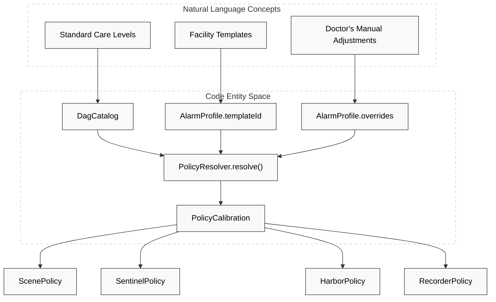
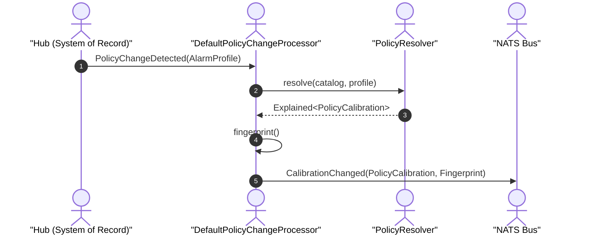

# Policy Resolution & Fingerprinting

Relevant source files

- 
- 
- 
- 
- 
- 
- 

The Policy Engine (**Politica**) is responsible for translating high-level resident care requirements into concrete engine calibrations. The core of this logic resides in `PolicyResolver.resolve()`, which implements a multi-layer precedence model to produce a `PolicyCalibration` object used by all downstream engines (Scene, Sentinel, Harbor, and Recorder).

## Policy Resolution Flow

The `PolicyResolver` is a pure function that takes a `DagCatalog` and an `AlarmProfile` to produce a `PolicyCalibration` [engines/politica-engine/politica-domain/src/main/kotlin/com/manahive/politica/PolicyResolver.kt42-53](https://github.com/pbaalerta-wq/hisso1/blob/d9fca861/engines/politica-engine/politica-domain/src/main/kotlin/com/manahive/politica/PolicyResolver.kt#L42-L53) It follows a three-layer precedence model:

1. **Catalog (Base):** Standard rules defined in the system catalog (e.g., `STANDARD_CATALOG`, `FALL_RISK_CATALOG`).
2. **Template:** A specific level template assigned to a resident (e.g., "Night Wandering").
3. **Override:** Per-resident manual adjustments that take absolute precedence over the catalog and template [engines/politica-engine/politica-domain/src/main/kotlin/com/manahive/politica/PolicyResolver.kt106-128](https://github.com/pbaalerta-wq/hisso1/blob/d9fca861/engines/politica-engine/politica-domain/src/main/kotlin/com/manahive/politica/PolicyResolver.kt#L106-L128)

### Precedence Diagram: Natural Language to Code Entities

The following diagram maps the conceptual layers of policy to the internal resolution logic and data structures.

Title: Policy Resolution Precedence

Sources: [engines/politica-engine/politica-domain/src/main/kotlin/com/manahive/politica/PolicyResolver.kt42-85](https://github.com/pbaalerta-wq/hisso1/blob/d9fca861/engines/politica-engine/politica-domain/src/main/kotlin/com/manahive/politica/PolicyResolver.kt#L42-L85) [platform/contracts/src/main/kotlin/com/manahive/contracts/policy/PolicyCalibration.kt20-39](https://github.com/pbaalerta-wq/hisso1/blob/d9fca861/platform/contracts/src/main/kotlin/com/manahive/contracts/policy/PolicyCalibration.kt#L20-L39)

## Key Resolution Logic

### Dwell & ComeBack Thresholds

The resolver derives thresholds for both "time in state" (**Dwell**) and "time away from baseline" (**ComeBack**).

- **Default Warning Derivation:** If a director provides only a deadline (e.g., "alert after 10 minutes"), the system automatically derives a pre-warning at 50% of that duration (5 minutes) [platform/contracts/src/main/kotlin/com/manahive/contracts/policy/PolicyCalibration.kt147-162](https://github.com/pbaalerta-wq/hisso1/blob/d9fca861/platform/contracts/src/main/kotlin/com/manahive/contracts/policy/PolicyCalibration.kt#L147-L162)
- **ComeBack Rule Naming:** To avoid collisions with dwell rules for the same state, ComeBack rules are assigned unique IDs using `comeBackRuleId` and carry the `TriggerOn.COME_BACK` family [engines/politica-engine/politica-domain/src/test/kotlin/com/manahive/politica/ComeBackResolutionSpec.kt62-74](https://github.com/pbaalerta-wq/hisso1/blob/d9fca861/engines/politica-engine/politica-domain/src/test/kotlin/com/manahive/politica/ComeBackResolutionSpec.kt#L62-L74)

### Alert Rule Derivation

`AlertRule` objects are derived from the catalog's `ResidentStateRule`. If a state has an `alertAfter` duration defined in either the catalog or an override, an `AlertRule` is generated for the `Sentinel` engine [engines/politica-engine/politica-domain/src/main/kotlin/com/manahive/politica/PolicyResolver.kt159-170](https://github.com/pbaalerta-wq/hisso1/blob/d9fca861/engines/politica-engine/politica-domain/src/main/kotlin/com/manahive/politica/PolicyResolver.kt#L159-L170)

### Fingerprint Generation

Every `PolicyCalibration` includes a `Fingerprint`. This is a cryptographic-like hash of the inputs (catalog version, resident ID, template, and specific overrides) [engines/politica-engine/politica-domain/src/main/kotlin/com/manahive/politica/PolicyResolver.kt95-103](https://github.com/pbaalerta-wq/hisso1/blob/d9fca861/engines/politica-engine/politica-domain/src/main/kotlin/com/manahive/politica/PolicyResolver.kt#L95-L103)

- **Stability:** The same inputs always produce the same fingerprint to ensure replayability [engines/politica-engine/politica-domain/src/test/kotlin/com/manahive/politica/FingerprintSpec.kt59-66](https://github.com/pbaalerta-wq/hisso1/blob/d9fca861/engines/politica-engine/politica-domain/src/test/kotlin/com/manahive/politica/FingerprintSpec.kt#L59-L66)
- **Version Sensitivity:** Two catalogs with identical rules but different versions will produce different fingerprints, allowing auditors to identify exactly which version of the policy was in effect [engines/politica-engine/politica-domain/src/test/kotlin/com/manahive/politica/FingerprintSpec.kt45-57](https://github.com/pbaalerta-wq/hisso1/blob/d9fca861/engines/politica-engine/politica-domain/src/test/kotlin/com/manahive/politica/FingerprintSpec.kt#L45-L57)

## Data Flow: Policy Change to Calibration

The `DefaultPolicyChangeProcessor` orchestrates the flow from a system-of-record change to a broadcastable calibration event.

Title: Policy Change Processing Flow

Sources: [engines/politica-engine/politica-domain/src/main/kotlin/com/manahive/politica/DefaultPolicyChangeProcessor.kt25-51](https://github.com/pbaalerta-wq/hisso1/blob/d9fca861/engines/politica-engine/politica-domain/src/main/kotlin/com/manahive/politica/DefaultPolicyChangeProcessor.kt#L25-L51) [engines/politica-engine/politica-domain/src/main/kotlin/com/manahive/politica/PolicyResolver.kt53-85](https://github.com/pbaalerta-wq/hisso1/blob/d9fca861/engines/politica-engine/politica-domain/src/main/kotlin/com/manahive/politica/PolicyResolver.kt#L53-L85)

## Audit Trail: Explained

The `PolicyResolver` returns an `Explained<PolicyCalibration>` wrapper. This contains the resolved calibration and a list of `ExplanationStep` objects [engines/politica-engine/politica-domain/src/main/kotlin/com/manahive/politica/PolicyResolver.kt84](https://github.com/pbaalerta-wq/hisso1/blob/d9fca861/engines/politica-engine/politica-domain/src/main/kotlin/com/manahive/politica/PolicyResolver.kt#L84-L84)

|Layer|Purpose|Code Reference|
|---|---|---|
|**Catalog**|Base rules for the resident's state|`ExplanationStep("catalog", ...)`|
|**Template**|Rules applied from a level template|`ExplanationStep("template", ...)`|
|**Override**|Per-resident overrides that won the resolution|`ExplanationStep("override", ...)`|

Sources: [engines/politica-engine/politica-domain/src/main/kotlin/com/manahive/politica/PolicyResolver.kt106-129](https://github.com/pbaalerta-wq/hisso1/blob/d9fca861/engines/politica-engine/politica-domain/src/main/kotlin/com/manahive/politica/PolicyResolver.kt#L106-L129)

## Implementation Details

### Scene Calibration Structure

The `SceneCalibration` object, built via a DSL, encapsulates the transition table and thresholds required by the Scene Engine.

- **Hysteresis:** Defined per transition (e.g., `LYING` to `STANDING`) to prevent alert bouncing [engines/scene-engine/scene-domain/src/main/kotlin/com/manahive/scene/calibration/SceneCalibration.kt27-35](https://github.com/pbaalerta-wq/hisso1/blob/d9fca861/engines/scene-engine/scene-domain/src/main/kotlin/com/manahive/scene/calibration/SceneCalibration.kt#L27-L35)
- **Confidence:** Minimum confidence levels per `StateKind` or `ObservationKind` [engines/scene-engine/scene-domain/src/main/kotlin/com/manahive/scene/calibration/SceneCalibration.kt44-48](https://github.com/pbaalerta-wq/hisso1/blob/d9fca861/engines/scene-engine/scene-domain/src/main/kotlin/com/manahive/scene/calibration/SceneCalibration.kt#L44-L48)

### Sentinel Policy Structure

The `SentinelPolicy` contains maps for `alertRules` (dwell-based) and `comeBackRules` (inverse-dwell) [platform/contracts/src/main/kotlin/com/manahive/contracts/policy/PolicyCalibration.kt57-60](https://github.com/pbaalerta-wq/hisso1/blob/d9fca861/platform/contracts/src/main/kotlin/com/manahive/contracts/policy/PolicyCalibration.kt#L57-L60) Each `AlertRule` includes:

- `severity`: INFO, WARNING, or CRITICAL.
- `closureCondition`: Logic for when an episode is considered resolved (e.g., `SAFE_ONLY`, `STAFF_OR_SAFE`) [engines/politica-engine/politica-domain/src/test/kotlin/com/manahive/politica/ComeBackResolutionSpec.kt39-50](https://github.com/pbaalerta-wq/hisso1/blob/d9fca861/engines/politica-engine/politica-domain/src/test/kotlin/com/manahive/politica/ComeBackResolutionSpec.kt#L39-L50)

Sources: [platform/contracts/src/main/kotlin/com/manahive/contracts/policy/PolicyCalibration.kt45-82](https://github.com/pbaalerta-wq/hisso1/blob/d9fca861/platform/contracts/src/main/kotlin/com/manahive/contracts/policy/PolicyCalibration.kt#L45-L82) [engines/scene-engine/scene-domain/src/main/kotlin/com/manahive/scene/calibration/SceneCalibration.kt16-30](https://github.com/pbaalerta-wq/hisso1/blob/d9fca861/engines/scene-engine/scene-domain/src/main/kotlin/com/manahive/scene/calibration/SceneCalibration.kt#L16-L30)

### On this page

- [Policy Resolution & Fingerprinting](https://deepwiki.com/pbaalerta-wq/hisso1/3.2-policy-resolution-and-fingerprinting#policy-resolution-fingerprinting)
- [Policy Resolution Flow](https://deepwiki.com/pbaalerta-wq/hisso1/3.2-policy-resolution-and-fingerprinting#policy-resolution-flow)
- [Precedence Diagram: Natural Language to Code Entities](https://deepwiki.com/pbaalerta-wq/hisso1/3.2-policy-resolution-and-fingerprinting#precedence-diagram-natural-language-to-code-entities)
- [Key Resolution Logic](https://deepwiki.com/pbaalerta-wq/hisso1/3.2-policy-resolution-and-fingerprinting#key-resolution-logic)
- [Dwell & ComeBack Thresholds](https://deepwiki.com/pbaalerta-wq/hisso1/3.2-policy-resolution-and-fingerprinting#dwell-comeback-thresholds)
- [Alert Rule Derivation](https://deepwiki.com/pbaalerta-wq/hisso1/3.2-policy-resolution-and-fingerprinting#alert-rule-derivation)
- [Fingerprint Generation](https://deepwiki.com/pbaalerta-wq/hisso1/3.2-policy-resolution-and-fingerprinting#fingerprint-generation)
- [Data Flow: Policy Change to Calibration](https://deepwiki.com/pbaalerta-wq/hisso1/3.2-policy-resolution-and-fingerprinting#data-flow-policy-change-to-calibration)
- [Audit Trail: Explained(https://deepwiki.com/pbaalerta-wq/hisso1/3.2-policy-resolution-and-fingerprinting#audit-trail-explainedt)
- [Implementation Details](https://deepwiki.com/pbaalerta-wq/hisso1/3.2-policy-resolution-and-fingerprinting#implementation-details)
- [Scene Calibration Structure](https://deepwiki.com/pbaalerta-wq/hisso1/3.2-policy-resolution-and-fingerprinting#scene-calibration-structure)
- [Sentinel Policy Structure](https://deepwiki.com/pbaalerta-wq/hisso1/3.2-policy-resolution-and-fingerprinting#sentinel-policy-structure)
