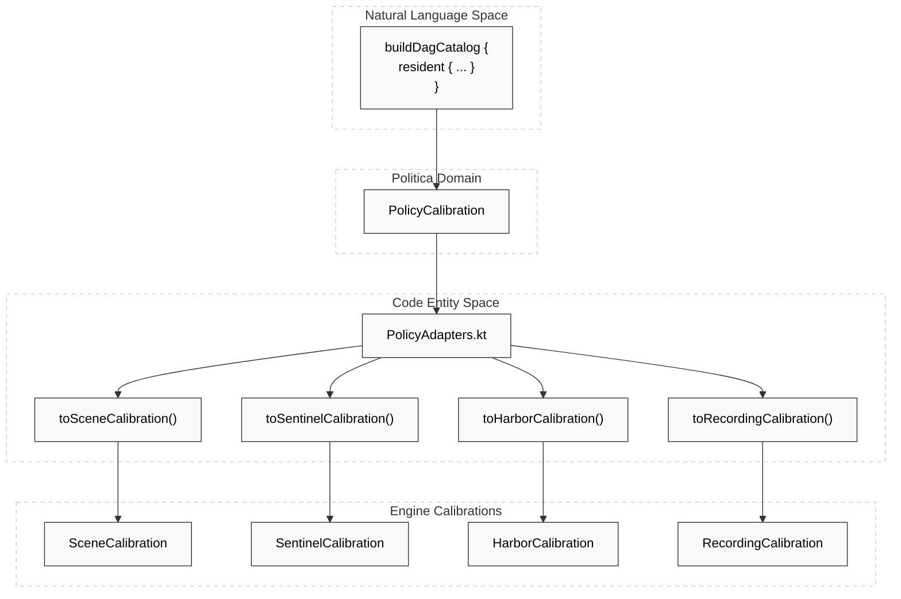
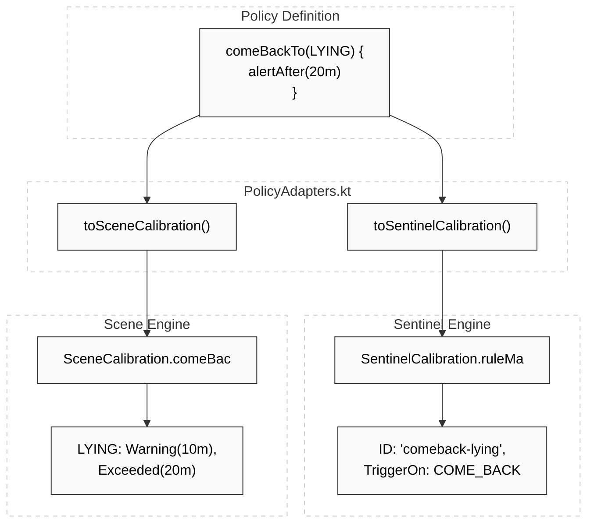

# Policy Adapters

Relevant source files

- 
- 
- 

The `politica-adapters` module serves as the **Anti-Corruption Layer (ACL)** between the high-level Resident Policy definitions and the specific technical configurations required by the four core engines (Scene, Sentinel, Harbor, and Recorder). It implements the Adapter pattern to project a unified `PolicyCalibration` into engine-specific domain objects.

### Overview of Projection Flow

The Politica Engine produces a `PolicyCalibration` object which contains the resolved intent for a resident. The adapters extract relevant subsets of this data to build immutable calibration objects for each engine.

1. **Scene Adapter**: Projects state transition thresholds and hysteresis.
2. **Sentinel Adapter**: Projects alert rules, severity levels, and closure conditions.
3. **Harbor Adapter**: Projects notification channels and escalation timeouts.
4. **Recorder Adapter**: Projects NVR recording windows and triggers.

### PolicyAdapters Implementation

The `PolicyAdapters.kt` file provides extension functions on `PolicyCalibration` to perform these transformations using engine-specific DSLs.

#### Scene Projection

The Scene adapter delegates to the `toSceneCalibrationFromPolicy` function. This ensures that `scene.hysteresis` and transition-specific tunings defined in the Policy DSL are correctly mapped to the `SceneCalibration` object used by the `SceneInterpreter` [engines/politica-engine/politica-adapters/src/main/kotlin/com/manahive/politica/adapters/PolicyAdapters.kt47-48](https://github.com/pbaalerta-wq/hisso1/blob/d9fca861/engines/politica-engine/politica-adapters/src/main/kotlin/com/manahive/politica/adapters/PolicyAdapters.kt#L47-L48)

#### Sentinel Projection

The `toSentinelCalibration` function maps both standard `alertRules` (Dwell-based) and `comeBackRules` into the `SentinelCalibration` [engines/politica-engine/politica-adapters/src/main/kotlin/com/manahive/politica/adapters/PolicyAdapters.kt55-82](https://github.com/pbaalerta-wq/hisso1/blob/d9fca861/engines/politica-engine/politica-adapters/src/main/kotlin/com/manahive/politica/adapters/PolicyAdapters.kt#L55-L82)

Key mappings include:

- **Trigger Mapping**: `rule.trigger` and `rule.triggerOn` (DWELL vs COME_BACK) [engines/politica-engine/politica-adapters/src/main/kotlin/com/manahive/politica/adapters/PolicyAdapters.kt59-73](https://github.com/pbaalerta-wq/hisso1/blob/d9fca861/engines/politica-engine/politica-adapters/src/main/kotlin/com/manahive/politica/adapters/PolicyAdapters.kt#L59-L73)
- **Umbrella Events**: Propagates linked events that can be grouped under a single alert [engines/politica-engine/politica-adapters/src/main/kotlin/com/manahive/politica/adapters/PolicyAdapters.kt66-68](https://github.com/pbaalerta-wq/hisso1/blob/d9fca861/engines/politica-engine/politica-adapters/src/main/kotlin/com/manahive/politica/adapters/PolicyAdapters.kt#L66-L68)
- **Confirmation Logic**: Maps `requiresConfirmation` and `confirmationWindow` for human-in-the-loop verification [engines/politica-engine/politica-adapters/src/main/kotlin/com/manahive/politica/adapters/PolicyAdapters.kt63-65](https://github.com/pbaalerta-wq/hisso1/blob/d9fca861/engines/politica-engine/politica-adapters/src/main/kotlin/com/manahive/politica/adapters/PolicyAdapters.kt#L63-L65)

#### Harbor Projection

The Harbor adapter translates `HarborPolicy` into `HarborCalibration`. If specific channels are not configured in the policy, it applies system defaults based on `Severity` [engines/politica-engine/politica-adapters/src/main/kotlin/com/manahive/politica/adapters/PolicyAdapters.kt91-106](https://github.com/pbaalerta-wq/hisso1/blob/d9fca861/engines/politica-engine/politica-adapters/src/main/kotlin/com/manahive/politica/adapters/PolicyAdapters.kt#L91-L106)

|Severity|Default Channels|Default Escalation Timeout|
|---|---|---|
|**INFO**|`CONSOLE`|30 Minutes|
|**WARNING**|`PUSH`, `TABLET`|5 Minutes|
|**CRITICAL**|`PUSH`, `TABLET`, `WARD_BOARD`, `CONSOLE`|0 (Immediate)|

#### Recorder Projection

The `toRecordingCalibration` function generates two types of recording rules [engines/politica-engine/politica-adapters/src/main/kotlin/com/manahive/politica/adapters/PolicyAdapters.kt133-167](https://github.com/pbaalerta-wq/hisso1/blob/d9fca861/engines/politica-engine/politica-adapters/src/main/kotlin/com/manahive/politica/adapters/PolicyAdapters.kt#L133-L167):

1. **Episode-Opened Rules**: Automatically triggers a recording when a Sentinel alert of a certain severity is opened.
2. **Transition Rules**: Triggers recordings based on specific `PersonState` changes (e.g., Bed to Standing) using windows defined in `transitionWindows`.

**Sources:**

- [engines/politica-engine/politica-adapters/src/main/kotlin/com/manahive/politica/adapters/PolicyAdapters.kt1-185](https://github.com/pbaalerta-wq/hisso1/blob/d9fca861/engines/politica-engine/politica-adapters/src/main/kotlin/com/manahive/politica/adapters/PolicyAdapters.kt#L1-L185)
- [engines/politica-engine/politica-adapters/build.gradle.kts1-17](https://github.com/pbaalerta-wq/hisso1/blob/d9fca861/engines/politica-engine/politica-adapters/build.gradle.kts#L1-L17)

---

### Data Flow: Policy to Engine Calibration

The following diagram illustrates how the `PolicyResolver` output is partitioned by the adapters into the specific configurations required by the runtime engines.

**Policy Projection Map**

**Sources:**

- [engines/politica-engine/politica-adapters/src/main/kotlin/com/manahive/politica/adapters/PolicyAdapters.kt47-167](https://github.com/pbaalerta-wq/hisso1/blob/d9fca861/engines/politica-engine/politica-adapters/src/main/kotlin/com/manahive/politica/adapters/PolicyAdapters.kt#L47-L167)

---

### ComeBack Logic Adaptation

The `ComeBackAdapter` ensures that "Come Back" rules (monitoring the absence of a state, like "not in bed") are correctly distinguished from "Dwell" rules (monitoring the presence of a state, like "lying in bed too long").

As verified in `ComeBackAdapterSpec.kt`:

- **ID Collision Prevention**: Dwell and ComeBack rules for the same state (e.g., `LYING`) must coexist without overwriting each other in the `SentinelCalibration` rule map [engines/politica-engine/politica-adapters/src/test/kotlin/com/manahive/politica/adapters/ComeBackAdapterSpec.kt54-68](https://github.com/pbaalerta-wq/hisso1/blob/d9fca861/engines/politica-engine/politica-adapters/src/test/kotlin/com/manahive/politica/adapters/ComeBackAdapterSpec.kt#L54-L68)
- **Threshold Derivation**: If a `comeBackTo` rule is defined without an explicit warning, the adapter (via the resolver) defaults the warning threshold to **50%** of the alert deadline [engines/politica-engine/politica-adapters/src/test/kotlin/com/manahive/politica/adapters/ComeBackAdapterSpec.kt95-103](https://github.com/pbaalerta-wq/hisso1/blob/d9fca861/engines/politica-engine/politica-adapters/src/test/kotlin/com/manahive/politica/adapters/ComeBackAdapterSpec.kt#L95-L103)
- **State Isolation**: Defining a ComeBack rule for `LYING` (which monitors when the resident is _not_ lying) does not automatically make `LYING` a "watched state" for dwell purposes unless explicitly configured [engines/politica-engine/politica-adapters/src/test/kotlin/com/manahive/politica/adapters/ComeBackAdapterSpec.kt70-75](https://github.com/pbaalerta-wq/hisso1/blob/d9fca861/engines/politica-engine/politica-adapters/src/test/kotlin/com/manahive/politica/adapters/ComeBackAdapterSpec.kt#L70-L75)

**ComeBack Adaptation Logic**

**Sources:**

- [engines/politica-engine/politica-adapters/src/test/kotlin/com/manahive/politica/adapters/ComeBackAdapterSpec.kt32-105](https://github.com/pbaalerta-wq/hisso1/blob/d9fca861/engines/politica-engine/politica-adapters/src/test/kotlin/com/manahive/politica/adapters/ComeBackAdapterSpec.kt#L32-L105)

---

### Offline Policy Resolution (politica-batch)

The module supports offline testing and validation through the `politica-batch` CLI (implemented in related batch modules). This allows developers to:

1. Load a `DagCatalog` and `ResidentProfile`.
2. Run the `PolicyResolver`.
3. Apply `PolicyAdapters` to see the final engine configurations.
4. Verify that changes in the high-level DSL result in the expected low-level engine parameters without running the full NATS infrastructure.

**Sources:**

- [engines/politica-engine/politica-adapters/src/main/kotlin/com/manahive/politica/adapters/PolicyAdapters.kt27-33](https://github.com/pbaalerta-wq/hisso1/blob/d9fca861/engines/politica-engine/politica-adapters/src/main/kotlin/com/manahive/politica/adapters/PolicyAdapters.kt#L27-L33)

### On this page

- [Policy Adapters](https://deepwiki.com/pbaalerta-wq/hisso1/3.3-policy-adapters#policy-adapters)
- [Overview of Projection Flow](https://deepwiki.com/pbaalerta-wq/hisso1/3.3-policy-adapters#overview-of-projection-flow)
- [PolicyAdapters Implementation](https://deepwiki.com/pbaalerta-wq/hisso1/3.3-policy-adapters#policyadapters-implementation)
- [Scene Projection](https://deepwiki.com/pbaalerta-wq/hisso1/3.3-policy-adapters#scene-projection)
- [Sentinel Projection](https://deepwiki.com/pbaalerta-wq/hisso1/3.3-policy-adapters#sentinel-projection)
- [Harbor Projection](https://deepwiki.com/pbaalerta-wq/hisso1/3.3-policy-adapters#harbor-projection)
- [Recorder Projection](https://deepwiki.com/pbaalerta-wq/hisso1/3.3-policy-adapters#recorder-projection)
- [Data Flow: Policy to Engine Calibration](https://deepwiki.com/pbaalerta-wq/hisso1/3.3-policy-adapters#data-flow-policy-to-engine-calibration)
- [ComeBack Logic Adaptation](https://deepwiki.com/pbaalerta-wq/hisso1/3.3-policy-adapters#comeback-logic-adaptation)
- [Offline Policy Resolution (politica-batch)](https://deepwiki.com/pbaalerta-wq/hisso1/3.3-policy-adapters#offline-policy-resolution-politica-batch)
