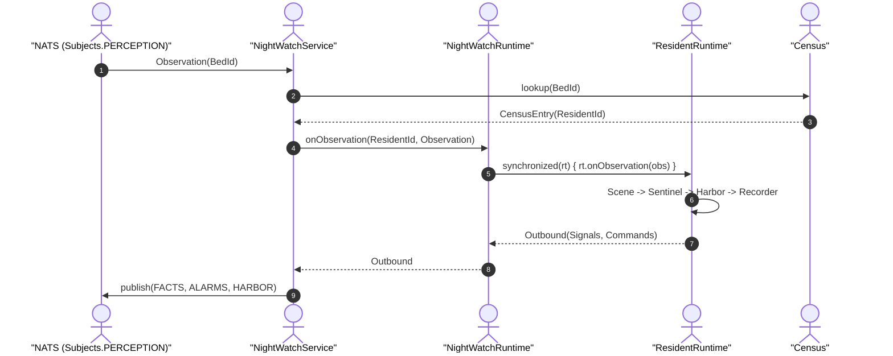

# Night-Watch Runtime

Relevant source files

- 
- 
- 
- 
- 

The **Night-Watch Runtime** is the production service responsible for orchestrating the four-engine monitoring pipeline for multiple residents simultaneously within a single process. It acts as the bridge between the asynchronous messaging infrastructure (NATS) and the synchronous, pure-domain logic of the monitoring engines.

The runtime manages the lifecycle of residents, maps incoming sensor data from beds to specific individuals via a **Census**, and ensures that policy updates from the **Hub** are immediately reflected in the active monitoring logic.

### System Architecture

The runtime follows a registry pattern where a central `NightWatchRuntime` manages multiple `ResidentRuntime` instances. Each `ResidentRuntime` encapsulates the full stateful pipeline (Scene → Sentinel → Harbor → Recorder) for one resident.

#### Code-to-Entity Mapping: Runtime Registry

This diagram illustrates how the runtime components defined in the codebase interact to process data.

**Sources:** [engines/night-watch-runtime/src/main/kotlin/com/manahive/runtime/NightWatchRuntime.kt22-25](https://github.com/pbaalerta-wq/hisso1/blob/d9fca861/engines/night-watch-runtime/src/main/kotlin/com/manahive/runtime/NightWatchRuntime.kt#L22-L25) [engines/night-watch-runtime/src/main/kotlin/com/manahive/runtime/NightWatchService.kt45-50](https://github.com/pbaalerta-wq/hisso1/blob/d9fca861/engines/night-watch-runtime/src/main/kotlin/com/manahive/runtime/NightWatchService.kt#L45-L50) [engines/night-watch-runtime/src/main/kotlin/com/manahive/runtime/ResidentRuntime.kt26-37](https://github.com/pbaalerta-wq/hisso1/blob/d9fca861/engines/night-watch-runtime/src/main/kotlin/com/manahive/runtime/ResidentRuntime.kt#L26-L37)

---

### Key Components

#### NightWatchRuntime Registry

The `NightWatchRuntime` class serves as a thread-safe registry for all active `ResidentRuntime` instances. It uses a `ConcurrentHashMap` to store runtimes indexed by `ResidentId` [engines/night-watch-runtime/src/main/kotlin/com/manahive/runtime/NightWatchRuntime.kt24](https://github.com/pbaalerta-wq/hisso1/blob/d9fca861/engines/night-watch-runtime/src/main/kotlin/com/manahive/runtime/NightWatchRuntime.kt#L24-L24) It provides methods to `register`, `unregister`, and `recalibrate` residents [engines/night-watch-runtime/src/main/kotlin/com/manahive/runtime/NightWatchRuntime.kt28-86](https://github.com/pbaalerta-wq/hisso1/blob/d9fca861/engines/night-watch-runtime/src/main/kotlin/com/manahive/runtime/NightWatchRuntime.kt#L28-L86)

#### Census (Bed-to-Resident Mapping)

The `Census` is the single source of truth for the mapping between physical beds and residents. Since sensor observations arrive identified by a `BedId`, the `NightWatchService` uses the `Census` to determine which `ResidentId` (and thus which `ResidentRuntime`) should process the data [engines/night-watch-runtime/src/main/kotlin/com/manahive/runtime/Census.kt18-52](https://github.com/pbaalerta-wq/hisso1/blob/d9fca861/engines/night-watch-runtime/src/main/kotlin/com/manahive/runtime/Census.kt#L18-L52)

#### EngineCalibrations

Monitoring behavior is governed by `EngineCalibrations`, a container class that holds the specific configurations for all four engines [engines/night-watch-runtime/src/main/kotlin/com/manahive/runtime/EngineCalibrations.kt19-24](https://github.com/pbaalerta-wq/hisso1/blob/d9fca861/engines/night-watch-runtime/src/main/kotlin/com/manahive/runtime/EngineCalibrations.kt#L19-L24) These are derived from a high-level `PolicyCalibration` using adapters [engines/night-watch-runtime/src/main/kotlin/com/manahive/runtime/EngineCalibrations.kt26-35](https://github.com/pbaalerta-wq/hisso1/blob/d9fca861/engines/night-watch-runtime/src/main/kotlin/com/manahive/runtime/EngineCalibrations.kt#L26-L35)

#### NightWatchService & NATS Wiring

The `NightWatchService` is the Spring-managed entry point. It handles:

- **Ingestion:** Subscribes to `PERCEPTION_WILDCARD` to receive observations [engines/night-watch-runtime/src/main/kotlin/com/manahive/runtime/NightWatchService.kt131-144](https://github.com/pbaalerta-wq/hisso1/blob/d9fca861/engines/night-watch-runtime/src/main/kotlin/com/manahive/runtime/NightWatchService.kt#L131-L144)
- **Policy Updates:** Subscribes to `POLICY_CHANGE_DETECTED` to trigger `recalibrate()` on active runtimes [engines/night-watch-runtime/src/main/kotlin/com/manahive/runtime/NightWatchService.kt162-178](https://github.com/pbaalerta-wq/hisso1/blob/d9fca861/engines/night-watch-runtime/src/main/kotlin/com/manahive/runtime/NightWatchService.kt#L162-L178)
- **Scheduled Sweeps:** Executes a `sweep()` every 30 seconds to trigger time-based events like "Dwell Exceeded" or "Signal Lost" across all residents [engines/night-watch-runtime/src/main/kotlin/com/manahive/runtime/NightWatchService.kt115-129](https://github.com/pbaalerta-wq/hisso1/blob/d9fca861/engines/night-watch-runtime/src/main/kotlin/com/manahive/runtime/NightWatchService.kt#L115-L129)

---

### Data Flow: From Observation to Notice

The runtime transforms raw sensor `Observation` data into actionable `NoticeCommand` events.

#### Code-to-Entity Mapping: Observation Pipeline

This diagram maps the natural language "processing" to the specific code methods and data structures used in the pipeline.

**Sources:** [engines/night-watch-runtime/src/main/kotlin/com/manahive/runtime/NightWatchService.kt146-160](https://github.com/pbaalerta-wq/hisso1/blob/d9fca861/engines/night-watch-runtime/src/main/kotlin/com/manahive/runtime/NightWatchService.kt#L146-L160) [engines/night-watch-runtime/src/main/kotlin/com/manahive/runtime/NightWatchRuntime.kt55-62](https://github.com/pbaalerta-wq/hisso1/blob/d9fca861/engines/night-watch-runtime/src/main/kotlin/com/manahive/runtime/NightWatchRuntime.kt#L55-L62) [engines/night-watch-runtime/src/main/kotlin/com/manahive/runtime/ResidentRuntime.kt70-98](https://github.com/pbaalerta-wq/hisso1/blob/d9fca861/engines/night-watch-runtime/src/main/kotlin/com/manahive/runtime/ResidentRuntime.kt#L70-L98)

---

### Child Pages

For detailed technical documentation on specific runtime subsystems, see the following pages:

- **[Resident Runtime & Observation Pipeline](https://deepwiki.com/pbaalerta-wq/hisso1/4.1-resident-runtime-and-observation-pipeline)** Deep dive into the `ResidentRuntime` internal pipeline, the `Outbound` data class, and the thread-safety model using per-resident synchronization.
- **[Runtime Health, Status & Bus Connectivity](https://deepwiki.com/pbaalerta-wq/hisso1/4.2-runtime-health-status-and-bus-connectivity)** Details on `RuntimeStatus`, NATS connectivity resilience via `BusConnector`, and the lifecycle of stream subscriptions.

---

**Sources:**

- `engines/night-watch-runtime/src/main/kotlin/com/manahive/runtime/NightWatchRuntime.kt`
- `engines/night-watch-runtime/src/main/kotlin/com/manahive/runtime/NightWatchService.kt`
- `engines/night-watch-runtime/src/main/kotlin/com/manahive/runtime/Census.kt`
- `engines/night-watch-runtime/src/main/kotlin/com/manahive/runtime/EngineCalibrations.kt`
- `engines/night-watch-runtime/src/main/kotlin/com/manahive/runtime/ResidentRuntime.kt`

### On this page

- [Night-Watch Runtime](https://deepwiki.com/pbaalerta-wq/hisso1/4-night-watch-runtime#night-watch-runtime)
- [System Architecture](https://deepwiki.com/pbaalerta-wq/hisso1/4-night-watch-runtime#system-architecture)
- [Code-to-Entity Mapping: Runtime Registry](https://deepwiki.com/pbaalerta-wq/hisso1/4-night-watch-runtime#code-to-entity-mapping-runtime-registry)
- [Key Components](https://deepwiki.com/pbaalerta-wq/hisso1/4-night-watch-runtime#key-components)
- [NightWatchRuntime Registry](https://deepwiki.com/pbaalerta-wq/hisso1/4-night-watch-runtime#nightwatchruntime-registry)
- [Census (Bed-to-Resident Mapping)](https://deepwiki.com/pbaalerta-wq/hisso1/4-night-watch-runtime#census-bed-to-resident-mapping)
- [EngineCalibrations](https://deepwiki.com/pbaalerta-wq/hisso1/4-night-watch-runtime#enginecalibrations)
- [NightWatchService & NATS Wiring](https://deepwiki.com/pbaalerta-wq/hisso1/4-night-watch-runtime#nightwatchservice-nats-wiring)
- [Data Flow: From Observation to Notice](https://deepwiki.com/pbaalerta-wq/hisso1/4-night-watch-runtime#data-flow-from-observation-to-notice)
- [Code-to-Entity Mapping: Observation Pipeline](https://deepwiki.com/pbaalerta-wq/hisso1/4-night-watch-runtime#code-to-entity-mapping-observation-pipeline)
- [Child Pages](https://deepwiki.com/pbaalerta-wq/hisso1/4-night-watch-runtime#child-pages)

