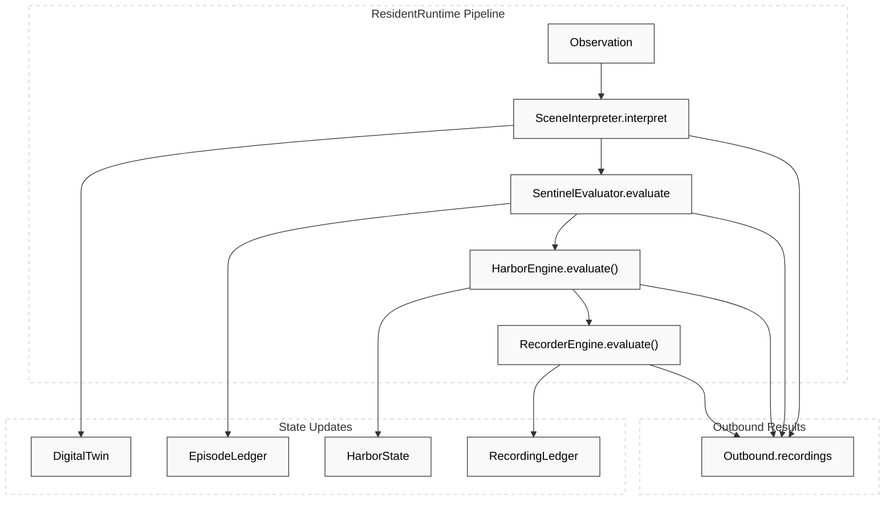
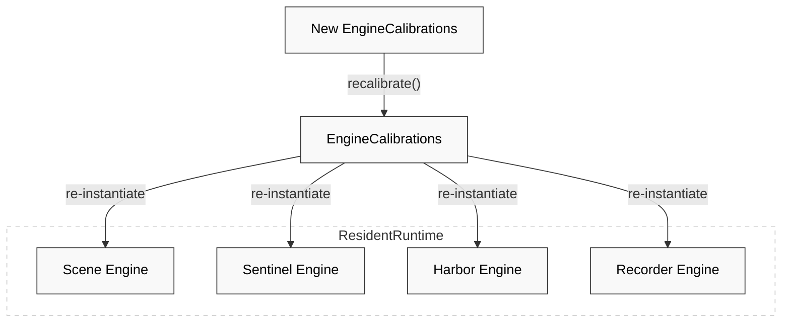

# Resident Runtime & Observation Pipeline

Relevant source files

- 
- 

The `ResidentRuntime` is the primary execution unit of the Night-Watch system. It encapsulates the state and processing logic for a single resident within a single process, orchestrating the four-stage engine pipeline (Scene → Sentinel → Harbor → Recorder) without the overhead of network messaging or serialization between stages [engines/night-watch-runtime/src/main/kotlin/com/manahive/runtime/ResidentRuntime.kt37-45](https://github.com/pbaalerta-wq/hisso1/blob/d9fca861/engines/night-watch-runtime/src/main/kotlin/com/manahive/runtime/ResidentRuntime.kt#L37-L45)

## Pipeline Overview

The runtime implements a "Consume-Evaluate-Publish" pattern where an incoming `Observation` triggers a sequential flow through four pure-domain engines. Each engine receives the output of the previous stage, updates its internal state, and produces domain events or commands [engines/night-watch-runtime/src/main/kotlin/com/manahive/runtime/ResidentRuntime.kt82-86](https://github.com/pbaalerta-wq/hisso1/blob/d9fca861/engines/night-watch-runtime/src/main/kotlin/com/manahive/runtime/ResidentRuntime.kt#L82-L86)

### The Four-Stage Pipeline

|Stage|Engine|Input|Responsibility|
|---|---|---|---|
|**1**|**Scene**|`Observation`|Updates the `DigitalTwin` and detects transitions (e.g., Bed → Chair).|
|**2**|**Sentinel**|`SceneEvent`|Evaluates clinical rules and manages the `EpisodeLedger`.|
|**3**|**Harbor**|`SentinelSignal`|Routes signals to notification channels (Push, Console, etc.).|
|**4**|**Recorder**|`SceneEvent` / `Signal`|Triggers NVR recordings based on clinical importance.|

### Data Flow Diagram

The following diagram illustrates how an observation flows through the code entities of the `ResidentRuntime`.

**Observation Pipeline Flow**

**Sources:** [engines/night-watch-runtime/src/main/kotlin/com/manahive/runtime/ResidentRuntime.kt116-166](https://github.com/pbaalerta-wq/hisso1/blob/d9fca861/engines/night-watch-runtime/src/main/kotlin/com/manahive/runtime/ResidentRuntime.kt#L116-L166)

---

## Core Methods

### onObservation()

This method is the entry point for real-time data. It ensures strict temporal ordering: observations arriving with a timestamp earlier than the `lastObservedAt` are discarded to prevent "clock corruption" in the `DigitalTwin` [engines/night-watch-runtime/src/main/kotlin/com/manahive/runtime/ResidentRuntime.kt116-125](https://github.com/pbaalerta-wq/hisso1/blob/d9fca861/engines/night-watch-runtime/src/main/kotlin/com/manahive/runtime/ResidentRuntime.kt#L116-L125)

1. **Scene Stage**: Updates the `DigitalTwin` and produces `SceneFacts` [engines/night-watch-runtime/src/main/kotlin/com/manahive/runtime/ResidentRuntime.kt130-132](https://github.com/pbaalerta-wq/hisso1/blob/d9fca861/engines/night-watch-runtime/src/main/kotlin/com/manahive/runtime/ResidentRuntime.kt#L130-L132)
2. **Sentinel Stage**: Processes each fact to update the `EpisodeLedger` and generate `SentinelSignals` [engines/night-watch-runtime/src/main/kotlin/com/manahive/runtime/ResidentRuntime.kt136-140](https://github.com/pbaalerta-wq/hisso1/blob/d9fca861/engines/night-watch-runtime/src/main/kotlin/com/manahive/runtime/ResidentRuntime.kt#L136-L140)
3. **Harbor Stage**: Converts signals into `NoticeFor` pairings (Signal + NoticeCommand) [engines/night-watch-runtime/src/main/kotlin/com/manahive/runtime/ResidentRuntime.kt144-148](https://github.com/pbaalerta-wq/hisso1/blob/d9fca861/engines/night-watch-runtime/src/main/kotlin/com/manahive/runtime/ResidentRuntime.kt#L144-L148)
4. **Recorder Stage**: Evaluates both facts and signals to generate `RecordingCommands` [engines/night-watch-runtime/src/main/kotlin/com/manahive/runtime/ResidentRuntime.kt152-163](https://github.com/pbaalerta-wq/hisso1/blob/d9fca861/engines/night-watch-runtime/src/main/kotlin/com/manahive/runtime/ResidentRuntime.kt#L152-L163)

### onTick()

While `onObservation` is driven by external events, `onTick` is driven by the system's wall clock. It handles time-based logic that doesn't require a new sensor reading, such as Dwell time limits (e.g., sitting for too long) or Signal Lost detection [engines/night-watch-runtime/src/main/kotlin/com/manahive/runtime/ResidentRuntime.kt168-173](https://github.com/pbaalerta-wq/hisso1/blob/d9fca861/engines/night-watch-runtime/src/main/kotlin/com/manahive/runtime/ResidentRuntime.kt#L168-L173)

**Sources:** [engines/night-watch-runtime/src/main/kotlin/com/manahive/runtime/ResidentRuntime.kt116-166](https://github.com/pbaalerta-wq/hisso1/blob/d9fca861/engines/night-watch-runtime/src/main/kotlin/com/manahive/runtime/ResidentRuntime.kt#L116-L166) [engines/night-watch-runtime/src/test/kotlin/com/manahive/runtime/ResidentRuntimeSpec.kt74-81](https://github.com/pbaalerta-wq/hisso1/blob/d9fca861/engines/night-watch-runtime/src/test/kotlin/com/manahive/runtime/ResidentRuntimeSpec.kt#L74-L81)

---

## Data Structures

### Outbound

The `Outbound` data class acts as the container for all side effects produced during a single pipeline execution. It collects:

- `sceneFacts`: Changes in physical state.
- `signals`: Clinical events (Alerts, Recoveries).
- `notices`: Paired `NoticeFor` objects containing the signal and its dispatch command.
- `recordings`: Instructions for the NVR.

### NoticeFor

A specialized container used within the runtime to pair a `SentinelSignal` with its resulting `NoticeCommand`. This ensures that downstream consumers (like NATS adapters) have the full context of _why_ a notification was sent [engines/night-watch-runtime/src/main/kotlin/com/manahive/runtime/ResidentRuntime.kt147](https://github.com/pbaalerta-wq/hisso1/blob/d9fca861/engines/night-watch-runtime/src/main/kotlin/com/manahive/runtime/ResidentRuntime.kt#L147-L147)

---

## Dynamic Recalibration

The runtime supports hot-swapping clinical policies via the `recalibrate(EngineCalibrations)` method. When a resident's `WatchLevel` or specific thresholds change in the Hub, the `ResidentRuntime` replaces its internal engine instances with new ones configured with the updated calibrations [engines/night-watch-runtime/src/main/kotlin/com/manahive/runtime/ResidentRuntime.kt208-216](https://github.com/pbaalerta-wq/hisso1/blob/d9fca861/engines/night-watch-runtime/src/main/kotlin/com/manahive/runtime/ResidentRuntime.kt#L208-L216)

**Recalibration Logic**

**Sources:** [engines/night-watch-runtime/src/main/kotlin/com/manahive/runtime/ResidentRuntime.kt208-216](https://github.com/pbaalerta-wq/hisso1/blob/d9fca861/engines/night-watch-runtime/src/main/kotlin/com/manahive/runtime/ResidentRuntime.kt#L208-L216) [engines/night-watch-runtime/src/test/kotlin/com/manahive/runtime/ResidentRuntimeSpec.kt122-131](https://github.com/pbaalerta-wq/hisso1/blob/d9fca861/engines/night-watch-runtime/src/test/kotlin/com/manahive/runtime/ResidentRuntimeSpec.kt#L122-L131)

---

## Thread Safety & State Isolation

The `ResidentRuntime` is designed for **single-threaded execution per resident**.

- **Volatile Calibrations**: The `calibrations` field is marked `@Volatile` to ensure that policy updates are immediately visible across threads [engines/night-watch-runtime/src/main/kotlin/com/manahive/runtime/ResidentRuntime.kt77-79](https://github.com/pbaalerta-wq/hisso1/blob/d9fca861/engines/night-watch-runtime/src/main/kotlin/com/manahive/runtime/ResidentRuntime.kt#L77-L79)
- **Encapsulated State**: All engine states (`DigitalTwin`, `EpisodeLedger`, `HarborState`, `RecordingLedger`) are private variables, ensuring that no external entity can modify the resident's state outside the pipeline [engines/night-watch-runtime/src/main/kotlin/com/manahive/runtime/ResidentRuntime.kt59-75](https://github.com/pbaalerta-wq/hisso1/blob/d9fca861/engines/night-watch-runtime/src/main/kotlin/com/manahive/runtime/ResidentRuntime.kt#L59-L75)
- **State Separation**: The runtime provides read-only views (e.g., `openEpisodeCount`) primarily for testing and verification, ensuring that state from one resident never leaks into another [engines/night-watch-runtime/src/main/kotlin/com/manahive/runtime/ResidentRuntime.kt88-94](https://github.com/pbaalerta-wq/hisso1/blob/d9fca861/engines/night-watch-runtime/src/main/kotlin/com/manahive/runtime/ResidentRuntime.kt#L88-L94)

**Sources:** [engines/night-watch-runtime/src/main/kotlin/com/manahive/runtime/ResidentRuntime.kt46-79](https://github.com/pbaalerta-wq/hisso1/blob/d9fca861/engines/night-watch-runtime/src/main/kotlin/com/manahive/runtime/ResidentRuntime.kt#L46-L79) [engines/night-watch-runtime/src/test/kotlin/com/manahive/runtime/ResidentRuntimeSpec.kt100-119](https://github.com/pbaalerta-wq/hisso1/blob/d9fca861/engines/night-watch-runtime/src/test/kotlin/com/manahive/runtime/ResidentRuntimeSpec.kt#L100-L119)

### On this page

- [Resident Runtime & Observation Pipeline](https://deepwiki.com/pbaalerta-wq/hisso1/4.1-resident-runtime-and-observation-pipeline#resident-runtime-observation-pipeline)
- [Pipeline Overview](https://deepwiki.com/pbaalerta-wq/hisso1/4.1-resident-runtime-and-observation-pipeline#pipeline-overview)
- [The Four-Stage Pipeline](https://deepwiki.com/pbaalerta-wq/hisso1/4.1-resident-runtime-and-observation-pipeline#the-four-stage-pipeline)
- [Data Flow Diagram](https://deepwiki.com/pbaalerta-wq/hisso1/4.1-resident-runtime-and-observation-pipeline#data-flow-diagram)
- [Core Methods](https://deepwiki.com/pbaalerta-wq/hisso1/4.1-resident-runtime-and-observation-pipeline#core-methods)
- [onObservation()](https://deepwiki.com/pbaalerta-wq/hisso1/4.1-resident-runtime-and-observation-pipeline#onobservation)
- [onTick()](https://deepwiki.com/pbaalerta-wq/hisso1/4.1-resident-runtime-and-observation-pipeline#ontick)
- [Data Structures](https://deepwiki.com/pbaalerta-wq/hisso1/4.1-resident-runtime-and-observation-pipeline#data-structures)
- [Outbound](https://deepwiki.com/pbaalerta-wq/hisso1/4.1-resident-runtime-and-observation-pipeline#outbound)
- [NoticeFor](https://deepwiki.com/pbaalerta-wq/hisso1/4.1-resident-runtime-and-observation-pipeline#noticefor)
- [Dynamic Recalibration](https://deepwiki.com/pbaalerta-wq/hisso1/4.1-resident-runtime-and-observation-pipeline#dynamic-recalibration)
- [Thread Safety & State Isolation](https://deepwiki.com/pbaalerta-wq/hisso1/4.1-resident-runtime-and-observation-pipeline#thread-safety-state-isolation)

