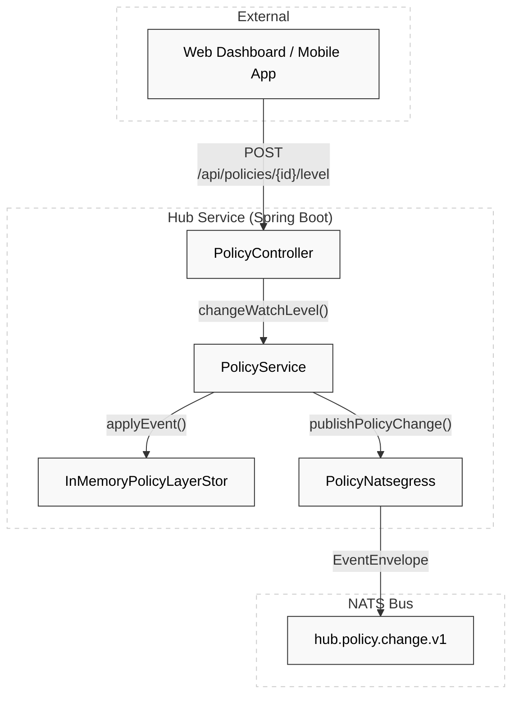
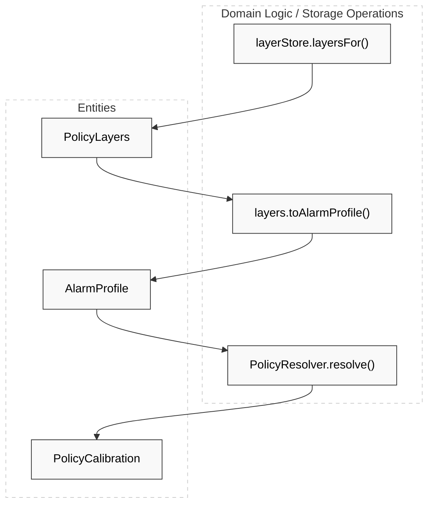

# Hub Service

Relevant source files

- 
- 
- 
- 
- 

The Hub Service acts as the **System of Record (SoR)** for the entire platform. Its primary responsibility is managing resident policy layers and maintaining the census. It provides the source of truth for "what" should be monitored for a specific resident at any given time, projecting these requirements into a format that the downstream engines can consume.

### Core Responsibilities

- **Policy Layer Management**: Stores the history of policy changes (Watch Levels, manual adjustments, and time windows) for every resident.
- **Policy Resolution & Projection**: Folds multiple policy layers into a single `AlarmProfile` and delegates resolution to the Politica engine logic to produce a `PolicyCalibration` [hub/hub-service/src/main/kotlin/com/manahive/hub/policy/PolicyService.kt61-72](https://github.com/pbaalerta-wq/hisso1/blob/d9fca861/hub/hub-service/src/main/kotlin/com/manahive/hub/policy/PolicyService.kt#L61-L72)
- **NATS Egress**: Publishes policy changes to the messaging backbone so that the **Night-Watch Runtime** and other engines can update their local calibrations in real-time [hub/hub-service/src/main/kotlin/com/manahive/hub/nats/PolicyNatsEgress.kt57-83](https://github.com/pbaalerta-wq/hisso1/blob/d9fca861/hub/hub-service/src/main/kotlin/com/manahive/hub/nats/PolicyNatsEgress.kt#L57-L83)
- **System of Record for Census**: Serves as the authoritative source for resident-to-bed mappings and active monitoring status.

---

### High-Level Architecture

The Hub follows a hexagonal architecture pattern where the core domain (`PolicyService`) is decoupled from infrastructure concerns like NATS or REST controllers.

#### Hub Component Interaction

This diagram illustrates how the Hub receives commands via REST, persists them as events, and projects them into the NATS bus for the rest of the system.

**Sources:** [hub/hub-service/src/main/kotlin/com/manahive/hub/policy/PolicyService.kt98-112](https://github.com/pbaalerta-wq/hisso1/blob/d9fca861/hub/hub-service/src/main/kotlin/com/manahive/hub/policy/PolicyService.kt#L98-L112) [hub/hub-service/src/main/kotlin/com/manahive/hub/nats/PolicyNatsEgress.kt30-34](https://github.com/pbaalerta-wq/hisso1/blob/d9fca861/hub/hub-service/src/main/kotlin/com/manahive/hub/nats/PolicyNatsEgress.kt#L30-L34)

---

### Infrastructure & Persistence

The Hub is configured via `HubInfrastructureConfiguration`, which initializes the necessary ports and adapters. While the current implementation uses in-memory stores, the architecture is designed to swap these for persistent databases without changing the domain logic [hub/hub-service/src/main/kotlin/com/manahive/hub/config/HubInfrastructureConfiguration.kt28-30](https://github.com/pbaalerta-wq/hisso1/blob/d9fca861/hub/hub-service/src/main/kotlin/com/manahive/hub/config/HubInfrastructureConfiguration.kt#L28-L30)

Key infrastructure components include:

- **Policy Stores**: Interfaces like `PolicyLayerStore`, `RawPolicyStore`, and `SemanticBucketStore` manage the storage of policy definitions and resident-specific overrides [hub/hub-service/src/main/kotlin/com/manahive/hub/config/HubInfrastructureConfiguration.kt74-84](https://github.com/pbaalerta-wq/hisso1/blob/d9fca861/hub/hub-service/src/main/kotlin/com/manahive/hub/config/HubInfrastructureConfiguration.kt#L74-L84)
- **Ledger**: Manages the `EventStore` and `StreamCatalog`, providing a history of system events [hub/hub-service/src/main/kotlin/com/manahive/hub/config/HubInfrastructureConfiguration.kt57-70](https://github.com/pbaalerta-wq/hisso1/blob/d9fca861/hub/hub-service/src/main/kotlin/com/manahive/hub/config/HubInfrastructureConfiguration.kt#L57-L70)
- **Shared Serialization**: The Hub uses a centralized `NatsObjectMapper` to ensure that `Instant` and other Java 8 time types are serialized consistently as ISO-8601 strings across the platform [platform/messaging/src/main/kotlin/com/manahive/messaging/NatsObjectMapper.kt27-32](https://github.com/pbaalerta-wq/hisso1/blob/d9fca861/platform/messaging/src/main/kotlin/com/manahive/messaging/NatsObjectMapper.kt#L27-L32)

**Sources:** [hub/hub-service/src/main/kotlin/com/manahive/hub/config/HubInfrastructureConfiguration.kt38-85](https://github.com/pbaalerta-wq/hisso1/blob/d9fca861/hub/hub-service/src/main/kotlin/com/manahive/hub/config/HubInfrastructureConfiguration.kt#L38-L85)

---

### Policy Flow: From Layers to Calibration

The Hub does not resolve engine-specific logic itself; it manages the **provenance** (who decided what) and delegates the **precedence** (which rule wins) to the `PolicyResolver`.

#### Code Entity Mapping: Policy Resolution

This diagram maps the logical flow of policy resolution to the specific classes and functions in the codebase.

**Sources:** [hub/hub-service/src/main/kotlin/com/manahive/hub/policy/PolicyService.kt61-72](https://github.com/pbaalerta-wq/hisso1/blob/d9fca861/hub/hub-service/src/main/kotlin/com/manahive/hub/policy/PolicyService.kt#L61-L72)

---

### Child Pages

For detailed documentation on specific Hub subsystems, refer to the following pages:

- **[Hub REST API](https://deepwiki.com/pbaalerta-wq/hisso1/5.1-hub-rest-api)**: Detailed documentation of the HTTP interface, including `PolicyController` for managing resident levels, `LedgerController` for auditing, and the `PolicyWriteDto` structure used for updates.
- **[Hub Domain & Policy Layer Model](https://deepwiki.com/pbaalerta-wq/hisso1/5.2-hub-domain-and-policy-layer-model)**: Deep dive into the `PolicyLayer` architecture, the `PolicyEvent` hierarchy (e.g., `WatchLevelAssigned`, `ManualAdjustmentAdded`), and the `PolicyLayerFold` logic that aggregates history into current state.

### On this page

- [Hub Service](https://deepwiki.com/pbaalerta-wq/hisso1/5-hub-service#hub-service)
- [Core Responsibilities](https://deepwiki.com/pbaalerta-wq/hisso1/5-hub-service#core-responsibilities)
- [High-Level Architecture](https://deepwiki.com/pbaalerta-wq/hisso1/5-hub-service#high-level-architecture)
- [Hub Component Interaction](https://deepwiki.com/pbaalerta-wq/hisso1/5-hub-service#hub-component-interaction)
- [Infrastructure & Persistence](https://deepwiki.com/pbaalerta-wq/hisso1/5-hub-service#infrastructure-persistence)
- [Policy Flow: From Layers to Calibration](https://deepwiki.com/pbaalerta-wq/hisso1/5-hub-service#policy-flow-from-layers-to-calibration)
- [Code Entity Mapping: Policy Resolution](https://deepwiki.com/pbaalerta-wq/hisso1/5-hub-service#code-entity-mapping-policy-resolution)
- [Child Pages](https://deepwiki.com/pbaalerta-wq/hisso1/5-hub-service#child-pages)
