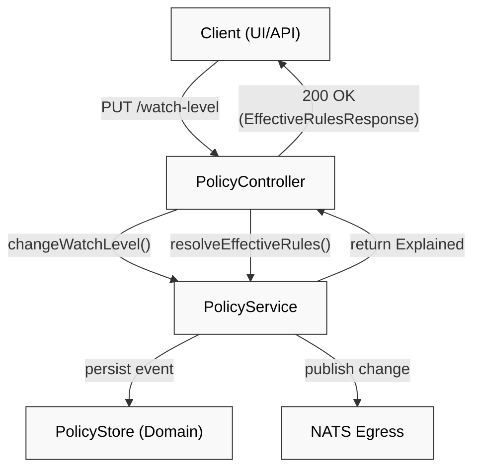
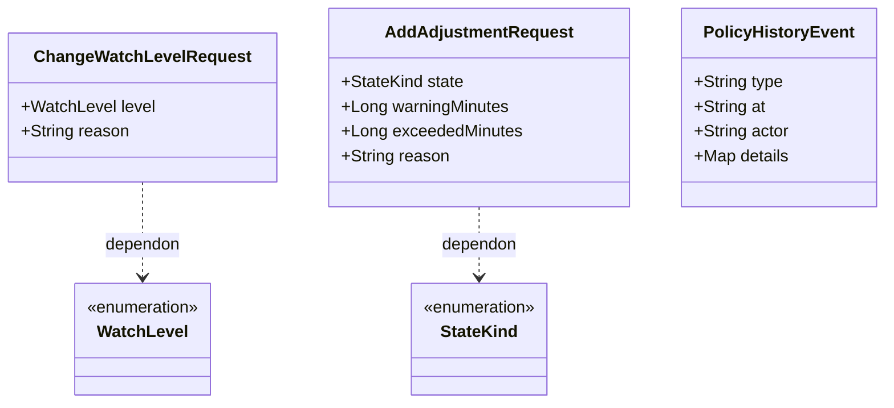

# Hub REST API

Relevant source files

- 
- 
- 
- 
- 

The Hub REST API serves as the primary interface for managing resident policies and querying the system's policy catalog. It acts as a **Driving Adapter** in the hexagonal architecture, translating HTTP requests into calls to the `PolicyService` and various policy store ports [hub/hub-service/src/main/kotlin/com/manahive/hub/api/PolicyCatalogController.kt28-29](https://github.com/pbaalerta-wq/hisso1/blob/d9fca861/hub/hub-service/src/main/kotlin/com/manahive/hub/api/PolicyCatalogController.kt#L28-L29)

## Policy Management (PolicyController)

The `PolicyController` is the consolidated endpoint for managing the lifecycle of resident policies. It supports querying effective rules at specific points in time, modifying watch levels, and adding manual adjustments.

### Endpoint Overview

|Method|Path|Description|
|---|---|---|
|`GET`|`/api/policies/{residentId}`|Returns the effective rules and their derivation explanation.|
|`GET`|`/api/policies/{residentId}/history`|Returns the audit trail of policy changes for a resident.|
|`PUT`|`/api/policies/{residentId}/watch-level`|Updates the resident's `WatchLevel` (e.g., FALL_RISK).|
|`POST`|`/api/policies/{residentId}/adjustments`|Adds a manual override for specific state thresholds.|
|`DELETE`|`/api/policies/{residentId}/adjustments/{adjId}`|Revokes a previously applied manual adjustment.|

### Implementation Details

- **Temporal Queries**: The `getEffectiveRules` method accepts an optional `at` parameter (ISO-8601 `Instant`). If provided, it resolves the policy as it existed at that moment; otherwise, it defaults to `Instant.now()` [hub/hub-service/src/main/kotlin/com/manahive/hub/api/PolicyController.kt34-37](https://github.com/pbaalerta-wq/hisso1/blob/d9fca861/hub/hub-service/src/main/kotlin/com/manahive/hub/api/PolicyController.kt#L34-L37)
- **Mandatory Reasons**: Both `ChangeWatchLevelRequest` and `AddAdjustmentRequest` require a `reason` string to ensure accountability for policy changes [hub/hub-service/src/main/kotlin/com/manahive/hub/api/PolicyWriteDto.kt12-30](https://github.com/pbaalerta-wq/hisso1/blob/d9fca861/hub/hub-service/src/main/kotlin/com/manahive/hub/api/PolicyWriteDto.kt#L12-L30)
- **Audit Trail**: The history endpoint maps internal `PolicyEvent` objects (like `WatchLevelAssigned` or `ManualAdjustmentAdded`) into a unified `PolicyHistoryResponse` [hub/hub-service/src/main/kotlin/com/manahive/hub/api/PolicyController.kt68-73](https://github.com/pbaalerta-wq/hisso1/blob/d9fca861/hub/hub-service/src/main/kotlin/com/manahive/hub/api/PolicyController.kt#L68-L73)

### Data Flow: Policy Update

This diagram illustrates how a REST request triggers a policy change and subsequent resolution.

**Sources:** [hub/hub-service/src/main/kotlin/com/manahive/hub/api/PolicyController.kt77-101](https://github.com/pbaalerta-wq/hisso1/blob/d9fca861/hub/hub-service/src/main/kotlin/com/manahive/hub/api/PolicyController.kt#L77-L101) [hub/hub-service/src/main/kotlin/com/manahive/hub/api/PolicyWriteDto.kt15-18](https://github.com/pbaalerta-wq/hisso1/blob/d9fca861/hub/hub-service/src/main/kotlin/com/manahive/hub/api/PolicyWriteDto.kt#L15-L18)

---

## Policy Catalog (PolicyCatalogController)

While the `PolicyController` manages _resident-specific_ data, the `PolicyCatalogController` provides metadata about the policy language itself. It exposes the available event types and dimensions that can be used to construct policies.

### Catalog Structure

The catalog is organized by `PolicyCategory` (e.g., calibration, response, escalation, recording) [hub/hub-service/src/main/kotlin/com/manahive/hub/api/PolicyCatalogController.kt47-53](https://github.com/pbaalerta-wq/hisso1/blob/d9fca861/hub/hub-service/src/main/kotlin/com/manahive/hub/api/PolicyCatalogController.kt#L47-L53)

- **Events**: Described by `EventDescriptorResponse`, including the `eventClass` and `group` [hub/hub-service/src/main/kotlin/com/manahive/hub/api/PolicyCatalogController.kt168-175](https://github.com/pbaalerta-wq/hisso1/blob/d9fca861/hub/hub-service/src/main/kotlin/com/manahive/hub/api/PolicyCatalogController.kt#L168-L175)
- **Dimensions**: Described by `DimensionDescriptorResponse`, including `allowedValues`, `min/max` constraints, and `unit` [hub/hub-service/src/main/kotlin/com/manahive/hub/api/PolicyCatalogController.kt180-192](https://github.com/pbaalerta-wq/hisso1/blob/d9fca861/hub/hub-service/src/main/kotlin/com/manahive/hub/api/PolicyCatalogController.kt#L180-L192)

### Key Endpoints

- `GET /api/catalog`: Summary of event and dimension counts per category [hub/hub-service/src/main/kotlin/com/manahive/hub/api/PolicyCatalogController.kt42-62](https://github.com/pbaalerta-wq/hisso1/blob/d9fca861/hub/hub-service/src/main/kotlin/com/manahive/hub/api/PolicyCatalogController.kt#L42-L62)
- `GET /api/catalog/events/category/{category}`: Filtered list of available events [hub/hub-service/src/main/kotlin/com/manahive/hub/api/PolicyCatalogController.kt96-105](https://github.com/pbaalerta-wq/hisso1/blob/d9fca861/hub/hub-service/src/main/kotlin/com/manahive/hub/api/PolicyCatalogController.kt#L96-L105)
- `GET /api/catalog/dimensions/{dimensionId}`: Specific metadata for a configuration dimension [hub/hub-service/src/main/kotlin/com/manahive/hub/api/PolicyCatalogController.kt138-145](https://github.com/pbaalerta-wq/hisso1/blob/d9fca861/hub/hub-service/src/main/kotlin/com/manahive/hub/api/PolicyCatalogController.kt#L138-L145)

**Sources:** [hub/hub-service/src/main/kotlin/com/manahive/hub/api/PolicyCatalogController.kt31-163](https://github.com/pbaalerta-wq/hisso1/blob/d9fca861/hub/hub-service/src/main/kotlin/com/manahive/hub/api/PolicyCatalogController.kt#L31-L163)

---

## Legacy Controllers (Raw & Semantic)

Two controllers are marked as `@Deprecated` following architectural updates (SPEC-02). They are maintained for backward compatibility with legacy consumers.

1. **RawPolicyController**: Provides access to the underlying master policy documents via `RawPolicyStore` [hub/hub-service/src/main/kotlin/com/manahive/hub/api/RawPolicyController.kt20-25](https://github.com/pbaalerta-wq/hisso1/blob/d9fca861/hub/hub-service/src/main/kotlin/com/manahive/hub/api/RawPolicyController.kt#L20-L25)
2. **SemanticBucketController**: Exposes "buckets" of policy data categorized by their functional intent (e.g., recording vs. escalation) via `SemanticBucketStore` [hub/hub-service/src/main/kotlin/com/manahive/hub/api/SemanticBucketController.kt20-25](https://github.com/pbaalerta-wq/hisso1/blob/d9fca861/hub/hub-service/src/main/kotlin/com/manahive/hub/api/SemanticBucketController.kt#L20-L25)

---

## Error Handling and DTOs

The API uses Spring's `@ExceptionHandler` to translate domain exceptions into standard HTTP responses.

### Common Exceptions

- **NoPolicyForResident**: Returns `404 Not Found` when a resident ID has no associated policy history [hub/hub-service/src/main/kotlin/com/manahive/hub/api/PolicyController.kt159-163](https://github.com/pbaalerta-wq/hisso1/blob/d9fca861/hub/hub-service/src/main/kotlin/com/manahive/hub/api/PolicyController.kt#L159-L163)
- **MissingMotivo**: Returns `404 Bad Request` when a write operation is attempted without a mandatory reason [hub/hub-service/src/main/kotlin/com/manahive/hub/api/PolicyController.kt165-169](https://github.com/pbaalerta-wq/hisso1/blob/d9fca861/hub/hub-service/src/main/kotlin/com/manahive/hub/api/PolicyController.kt#L165-L169)

### DTO Mapping: PolicyWriteDto

The system uses specialized DTOs for write operations to enforce the domain contract.

**Sources:** [hub/hub-service/src/main/kotlin/com/manahive/hub/api/PolicyWriteDto.kt1-56](https://github.com/pbaalerta-wq/hisso1/blob/d9fca861/hub/hub-service/src/main/kotlin/com/manahive/hub/api/PolicyWriteDto.kt#L1-L56)

### Effective Rules Response

When querying `/api/policies/{residentId}`, the Hub returns an `EffectiveRulesResponse` which includes:

- **rules**: A list of resolved `PolicyRule` objects [hub/hub-service/src/main/kotlin/com/manahive/hub/api/PolicyController.kt43](https://github.com/pbaalerta-wq/hisso1/blob/d9fca861/hub/hub-service/src/main/kotlin/com/manahive/hub/api/PolicyController.kt#L43-L43)
- **fingerprint**: A hash representing the specific version of the resolved policy [hub/hub-service/src/main/kotlin/com/manahive/hub/api/PolicyController.kt44](https://github.com/pbaalerta-wq/hisso1/blob/d9fca861/hub/hub-service/src/main/kotlin/com/manahive/hub/api/PolicyController.kt#L44-L44)
- **explanation**: A step-by-step audit of how the resolver reached the final result (e.g., which template was used, which overrides were applied) [hub/hub-service/src/main/kotlin/com/manahive/hub/api/PolicyController.kt45](https://github.com/pbaalerta-wq/hisso1/blob/d9fca861/hub/hub-service/src/main/kotlin/com/manahive/hub/api/PolicyController.kt#L45-L45)

**Sources:** [hub/hub-service/src/main/kotlin/com/manahive/hub/api/PolicyController.kt31-47](https://github.com/pbaalerta-wq/hisso1/blob/d9fca861/hub/hub-service/src/main/kotlin/com/manahive/hub/api/PolicyController.kt#L31-L47)

### On this page

- [Hub REST API](https://deepwiki.com/pbaalerta-wq/hisso1/5.1-hub-rest-api#hub-rest-api)
- [Policy Management (PolicyController)](https://deepwiki.com/pbaalerta-wq/hisso1/5.1-hub-rest-api#policy-management-policycontroller)
- [Endpoint Overview](https://deepwiki.com/pbaalerta-wq/hisso1/5.1-hub-rest-api#endpoint-overview)
- [Implementation Details](https://deepwiki.com/pbaalerta-wq/hisso1/5.1-hub-rest-api#implementation-details)
- [Data Flow: Policy Update](https://deepwiki.com/pbaalerta-wq/hisso1/5.1-hub-rest-api#data-flow-policy-update)
- [Policy Catalog (PolicyCatalogController)](https://deepwiki.com/pbaalerta-wq/hisso1/5.1-hub-rest-api#policy-catalog-policycatalogcontroller)
- [Catalog Structure](https://deepwiki.com/pbaalerta-wq/hisso1/5.1-hub-rest-api#catalog-structure)
- [Key Endpoints](https://deepwiki.com/pbaalerta-wq/hisso1/5.1-hub-rest-api#key-endpoints)
- [Legacy Controllers (Raw & Semantic)](https://deepwiki.com/pbaalerta-wq/hisso1/5.1-hub-rest-api#legacy-controllers-raw-semantic)
- [Error Handling and DTOs](https://deepwiki.com/pbaalerta-wq/hisso1/5.1-hub-rest-api#error-handling-and-dtos)
- [Common Exceptions](https://deepwiki.com/pbaalerta-wq/hisso1/5.1-hub-rest-api#common-exceptions)
- [DTO Mapping: PolicyWriteDto](https://deepwiki.com/pbaalerta-wq/hisso1/5.1-hub-rest-api#dto-mapping-policywritedto)
- [Effective Rules Response](https://deepwiki.com/pbaalerta-wq/hisso1/5.1-hub-rest-api#effective-rules-response)
