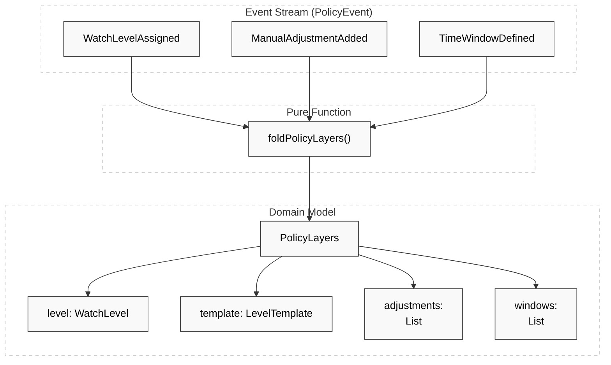
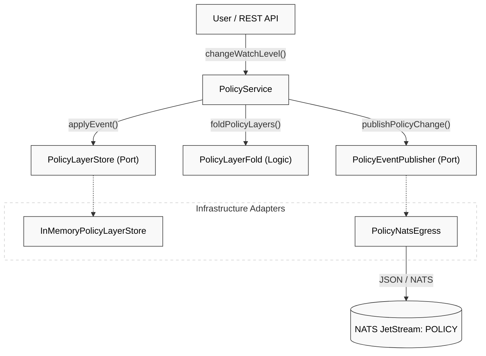

# Hub Domain & Policy Layer Model

Relevant source files

- 
- 
- 
- 
- 
- 
- 

The Hub domain represents the **System of Record** for resident monitoring policies. Unlike the stateless engines in the processing pipeline, the Hub manages the lifecycle of a resident's monitoring configuration over time. It utilizes an event-sourced approach to policy management, where the current state is reconstructed from a history of clinical and operational decisions.

## Policy Layer Model

The policy for a resident is not a single flat record but a composition of four layers. This layered approach allows for high-level standardization via templates while permitting granular, time-bound, or state-specific overrides.

### Core Data Entities

|Entity|Description|Code Reference|
|---|---|---|
|`PolicyLayers`|The aggregate containing the four layers: Level, Template, Manual Adjustments, and Time Windows.|[hub/hub-domain/src/main/kotlin/com/manahive/hub/policy/PolicyLayers.kt](https://github.com/pbaalerta-wq/hisso1/blob/d9fca861/hub/hub-domain/src/main/kotlin/com/manahive/hub/policy/PolicyLayers.kt)|
|`WatchLevel`|The primary clinical classification (e.g., `FALL_RISK`, `CRITICAL`). Determines the base rule catalog.|[hub/hub-domain/src/main/kotlin/com/manahive/hub/policy/PolicyEvents.kt27](https://github.com/pbaalerta-wq/hisso1/blob/d9fca861/hub/hub-domain/src/main/kotlin/com/manahive/hub/policy/PolicyEvents.kt#L27-L27)|
|`LevelTemplate`|A named set of default thresholds associated with a `WatchLevel`.|[hub/hub-domain/src/main/kotlin/com/manahive/hub/policy/PolicyEvents.kt111](https://github.com/pbaalerta-wq/hisso1/blob/d9fca861/hub/hub-domain/src/main/kotlin/com/manahive/hub/policy/PolicyEvents.kt#L111-L111)|
|`ManualAdjustment`|A specific override for a `StateKind` (e.g., "Sitting in bed") with a custom `DwellThreshold`.|[hub/hub-domain/src/main/kotlin/com/manahive/hub/policy/PolicyEvents.kt124-131](https://github.com/pbaalerta-wq/hisso1/blob/d9fca861/hub/hub-domain/src/main/kotlin/com/manahive/hub/policy/PolicyEvents.kt#L124-L131)|
|`TimeWindow`|A schedule-based adjustment that applies only during specific hours (e.g., Night shift).|[hub/hub-domain/src/main/kotlin/com/manahive/hub/policy/PolicyEvents.kt140-145](https://github.com/pbaalerta-wq/hisso1/blob/d9fca861/hub/hub-domain/src/main/kotlin/com/manahive/hub/policy/PolicyEvents.kt#L140-L145)|

**Sources:** [hub/hub-domain/src/main/kotlin/com/manahive/hub/policy/PolicyEvents.kt19-93](https://github.com/pbaalerta-wq/hisso1/blob/d9fca861/hub/hub-domain/src/main/kotlin/com/manahive/hub/policy/PolicyEvents.kt#L19-L93)

---

## Policy Events & Event Sourcing

The Hub follows the principle that every policy change is part of a resident's clinical history. Consequently, the state is never updated via destructive `UPDATE` operations. Instead, four domain events represent all possible changes to a resident's policy.

### Event Types

- **`WatchLevelAssigned`**: Triggered when a clinician changes the overall monitoring intensity. This is the most impactful event as it switches the underlying `Interpreter` logic [hub/hub-domain/src/main/kotlin/com/manahive/hub/policy/PolicyEvents.kt25-37](https://github.com/pbaalerta-wq/hisso1/blob/d9fca861/hub/hub-domain/src/main/kotlin/com/manahive/hub/policy/PolicyEvents.kt#L25-L37)
- **`ManualAdjustmentAdded`**: Adds a specific threshold override for a single state (e.g., "For José, notify at 15 minutes when sitting") [hub/hub-domain/src/main/kotlin/com/manahive/hub/policy/PolicyEvents.kt47-61](https://github.com/pbaalerta-wq/hisso1/blob/d9fca861/hub/hub-domain/src/main/kotlin/com/manahive/hub/policy/PolicyEvents.kt#L47-L61)
- **`ManualAdjustmentRevoked`**: Removes a previously defined manual adjustment, restoring the template default [hub/hub-domain/src/main/kotlin/com/manahive/hub/policy/PolicyEvents.kt70-75](https://github.com/pbaalerta-wq/hisso1/blob/d9fca861/hub/hub-domain/src/main/kotlin/com/manahive/hub/policy/PolicyEvents.kt#L70-L75)
- **`TimeWindowDefined`**: Sets or replaces a time-bound set of adjustments, typically used for nocturnal monitoring [hub/hub-domain/src/main/kotlin/com/manahive/hub/policy/PolicyEvents.kt84-92](https://github.com/pbaalerta-wq/hisso1/blob/d9fca861/hub/hub-domain/src/main/kotlin/com/manahive/hub/policy/PolicyEvents.kt#L84-L92)

### The Policy Fold (`foldPolicyLayers`)

The `foldPolicyLayers` function is a pure, idempotent function that reconstructs the `PolicyLayers` aggregate from a list of events ordered by time.

- **Logic**: It iterates through the event stream, where the "last event wins" for the same `adjustmentId` or `windowId` [hub/hub-domain/src/main/kotlin/com/manahive/hub/policy/PolicyEvents.kt109-156](https://github.com/pbaalerta-wq/hisso1/blob/d9fca861/hub/hub-domain/src/main/kotlin/com/manahive/hub/policy/PolicyEvents.kt#L109-L156)
- **Default State**: If the stream is empty, it defaults to `WatchLevel.STANDARD` [hub/hub-domain/src/main/kotlin/com/manahive/hub/policy/PolicyEvents.kt110-111](https://github.com/pbaalerta-wq/hisso1/blob/d9fca861/hub/hub-domain/src/main/kotlin/com/manahive/hub/policy/PolicyEvents.kt#L110-L111)

**Sources:** [hub/hub-domain/src/main/kotlin/com/manahive/hub/policy/PolicyEvents.kt11-162](https://github.com/pbaalerta-wq/hisso1/blob/d9fca861/hub/hub-domain/src/main/kotlin/com/manahive/hub/policy/PolicyEvents.kt#L11-L162) [hub/hub-domain/src/test/kotlin/com/manahive/hub/policy/PolicyLayerFoldSpec.kt22-180](https://github.com/pbaalerta-wq/hisso1/blob/d9fca861/hub/hub-domain/src/test/kotlin/com/manahive/hub/policy/PolicyLayerFoldSpec.kt#L22-L180)

---

## Domain to Code Mapping

The following diagrams bridge the natural language requirements to the specific code entities in the Hub.

### Policy Aggregate Construction

This diagram shows how the `foldPolicyLayers` function transforms the event stream into the live `PolicyLayers` model.

**Sources:** [hub/hub-domain/src/main/kotlin/com/manahive/hub/policy/PolicyEvents.kt109-156](https://github.com/pbaalerta-wq/hisso1/blob/d9fca861/hub/hub-domain/src/main/kotlin/com/manahive/hub/policy/PolicyEvents.kt#L109-L156)

### Policy Change Propagation

This diagram illustrates the flow from a User Action to the NATS bus, identifying the key service and port interfaces.

**Sources:** [hub/hub-service/src/main/kotlin/com/manahive/hub/policy/PolicyService.kt](https://github.com/pbaalerta-wq/hisso1/blob/d9fca861/hub/hub-service/src/main/kotlin/com/manahive/hub/policy/PolicyService.kt) [hub/hub-service/src/main/kotlin/com/manahive/hub/policy/PolicyEventPublisher.kt17-23](https://github.com/pbaalerta-wq/hisso1/blob/d9fca861/hub/hub-service/src/main/kotlin/com/manahive/hub/policy/PolicyEventPublisher.kt#L17-L23) [hub/hub-service/src/main/kotlin/com/manahive/hub/policy/InMemoryPolicyLayerStore.kt18-49](https://github.com/pbaalerta-wq/hisso1/blob/d9fca861/hub/hub-service/src/main/kotlin/com/manahive/hub/policy/InMemoryPolicyLayerStore.kt#L18-L49)

---

## Infrastructure & Storage

### InMemoryPolicyLayerStore

A thread-safe, in-memory implementation of the `PolicyLayerStore` port. It uses a `ConcurrentHashMap` of `ResidentId` to a `CopyOnWriteArrayList` of `PolicyEvent` [hub/hub-service/src/main/kotlin/com/manahive/hub/policy/InMemoryPolicyLayerStore.kt20](https://github.com/pbaalerta-wq/hisso1/blob/d9fca861/hub/hub-service/src/main/kotlin/com/manahive/hub/policy/InMemoryPolicyLayerStore.kt#L20-L20)

- **`layersFor(residentId, at)`**: Filters events up to the requested timestamp and applies the fold [hub/hub-service/src/main/kotlin/com/manahive/hub/policy/InMemoryPolicyLayerStore.kt22-26](https://github.com/pbaalerta-wq/hisso1/blob/d9fca861/hub/hub-service/src/main/kotlin/com/manahive/hub/policy/InMemoryPolicyLayerStore.kt#L22-L26)

### PolicyEventPublisher & Egress

The `PolicyEventPublisher` is a functional interface (driven port) used by the Hub to notify the rest of the system about policy changes [hub/hub-service/src/main/kotlin/com/manahive/hub/policy/PolicyEventPublisher.kt17-23](https://github.com/pbaalerta-wq/hisso1/blob/d9fca861/hub/hub-service/src/main/kotlin/com/manahive/hub/policy/PolicyEventPublisher.kt#L17-L23)

- **`PolicyNatsEgress`**: The production implementation that serializes the `AlarmProfile` into an `EventEnvelope` and publishes it to the `POLICY` stream in NATS JetStream [hub/hub-service/src/test/kotlin/com/manahive/hub/PolicyBusIntegrationSpec.kt88-95](https://github.com/pbaalerta-wq/hisso1/blob/d9fca861/hub/hub-service/src/test/kotlin/com/manahive/hub/PolicyBusIntegrationSpec.kt#L88-L95)
- **Snapshot Requirement**: The published event contains the **new** state (the result of the fold) to ensure downstream engines (like Politica) calibrate against the most recent clinical decision [hub/hub-service/src/test/kotlin/com/manahive/hub/PolicyPublishSpec.kt81-92](https://github.com/pbaalerta-wq/hisso1/blob/d9fca861/hub/hub-service/src/test/kotlin/com/manahive/hub/PolicyPublishSpec.kt#L81-L92)

**Sources:** [hub/hub-service/src/main/kotlin/com/manahive/hub/policy/InMemoryPolicyLayerStore.kt1-49](https://github.com/pbaalerta-wq/hisso1/blob/d9fca861/hub/hub-service/src/main/kotlin/com/manahive/hub/policy/InMemoryPolicyLayerStore.kt#L1-L49) [hub/hub-service/src/main/kotlin/com/manahive/hub/policy/PolicyEventPublisher.kt1-23](https://github.com/pbaalerta-wq/hisso1/blob/d9fca861/hub/hub-service/src/main/kotlin/com/manahive/hub/policy/PolicyEventPublisher.kt#L1-L23) [hub/hub-service/src/test/kotlin/com/manahive/hub/PolicyBusIntegrationSpec.kt71-138](https://github.com/pbaalerta-wq/hisso1/blob/d9fca861/hub/hub-service/src/test/kotlin/com/manahive/hub/PolicyBusIntegrationSpec.kt#L71-L138)

---

## Data Flow Summary

1. **Ingestion**: A request arrives via `PolicyController`.
2. **Validation**: The Hub ensures human-provided reasons (`motivo`) are present for level changes and adjustments [hub/hub-domain/src/main/kotlin/com/manahive/hub/policy/PolicyEvents.kt33-35](https://github.com/pbaalerta-wq/hisso1/blob/d9fca861/hub/hub-domain/src/main/kotlin/com/manahive/hub/policy/PolicyEvents.kt#L33-L35)
3. **Persistence**: The event is appended to the `PolicyLayerStore` [hub/hub-service/src/main/kotlin/com/manahive/hub/policy/InMemoryPolicyLayerStore.kt31-34](https://github.com/pbaalerta-wq/hisso1/blob/d9fca861/hub/hub-service/src/main/kotlin/com/manahive/hub/policy/InMemoryPolicyLayerStore.kt#L31-L34)
4. **Projection**: The `foldPolicyLayers` function creates a current `PolicyLayers` snapshot.
5. **Resolution**: The snapshot is converted into an `AlarmProfile`.
6. **Egress**: `PolicyNatsEgress` wraps the profile in a `PolicyChangeDetected` event and sends it to the NATS subject defined in `Subjects.policyChangeDetected()` [hub/hub-service/src/test/kotlin/com/manahive/hub/PolicyBusIntegrationSpec.kt112-119](https://github.com/pbaalerta-wq/hisso1/blob/d9fca861/hub/hub-service/src/test/kotlin/com/manahive/hub/PolicyBusIntegrationSpec.kt#L112-L119)

**Sources:** [hub/hub-service/src/main/kotlin/com/manahive/hub/policy/PolicyService.kt](https://github.com/pbaalerta-wq/hisso1/blob/d9fca861/hub/hub-service/src/main/kotlin/com/manahive/hub/policy/PolicyService.kt) [hub/hub-service/src/test/kotlin/com/manahive/hub/PolicyApiSpec.kt83-144](https://github.com/pbaalerta-wq/hisso1/blob/d9fca861/hub/hub-service/src/test/kotlin/com/manahive/hub/PolicyApiSpec.kt#L83-L144) [hub/hub-service/src/test/kotlin/com/manahive/hub/PolicyPublishSpec.kt68-107](https://github.com/pbaalerta-wq/hisso1/blob/d9fca861/hub/hub-service/src/test/kotlin/com/manahive/hub/PolicyPublishSpec.kt#L68-L107)

### On this page

- [Hub Domain & Policy Layer Model](https://deepwiki.com/pbaalerta-wq/hisso1/5.2-hub-domain-and-policy-layer-model#hub-domain-policy-layer-model)
- [Policy Layer Model](https://deepwiki.com/pbaalerta-wq/hisso1/5.2-hub-domain-and-policy-layer-model#policy-layer-model)
- [Core Data Entities](https://deepwiki.com/pbaalerta-wq/hisso1/5.2-hub-domain-and-policy-layer-model#core-data-entities)
- [Policy Events & Event Sourcing](https://deepwiki.com/pbaalerta-wq/hisso1/5.2-hub-domain-and-policy-layer-model#policy-events-event-sourcing)
- [Event Types](https://deepwiki.com/pbaalerta-wq/hisso1/5.2-hub-domain-and-policy-layer-model#event-types)
- [The Policy Fold (`foldPolicyLayers`)](https://deepwiki.com/pbaalerta-wq/hisso1/5.2-hub-domain-and-policy-layer-model#the-policy-fold-foldpolicylayers)
- [Domain to Code Mapping](https://deepwiki.com/pbaalerta-wq/hisso1/5.2-hub-domain-and-policy-layer-model#domain-to-code-mapping)
- [Policy Aggregate Construction](https://deepwiki.com/pbaalerta-wq/hisso1/5.2-hub-domain-and-policy-layer-model#policy-aggregate-construction)
- [Policy Change Propagation](https://deepwiki.com/pbaalerta-wq/hisso1/5.2-hub-domain-and-policy-layer-model#policy-change-propagation)
- [Infrastructure & Storage](https://deepwiki.com/pbaalerta-wq/hisso1/5.2-hub-domain-and-policy-layer-model#infrastructure-storage)
- [InMemoryPolicyLayerStore](https://deepwiki.com/pbaalerta-wq/hisso1/5.2-hub-domain-and-policy-layer-model#inmemorypolicylayerstore)
- [PolicyEventPublisher & Egress](https://deepwiki.com/pbaalerta-wq/hisso1/5.2-hub-domain-and-policy-layer-model#policyeventpublisher-egress)
- [Data Flow Summary](https://deepwiki.com/pbaalerta-wq/hisso1/5.2-hub-domain-and-policy-layer-model#data-flow-summary)
