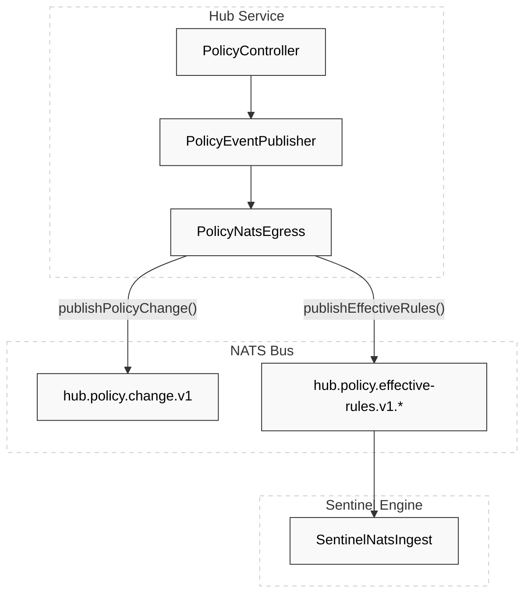
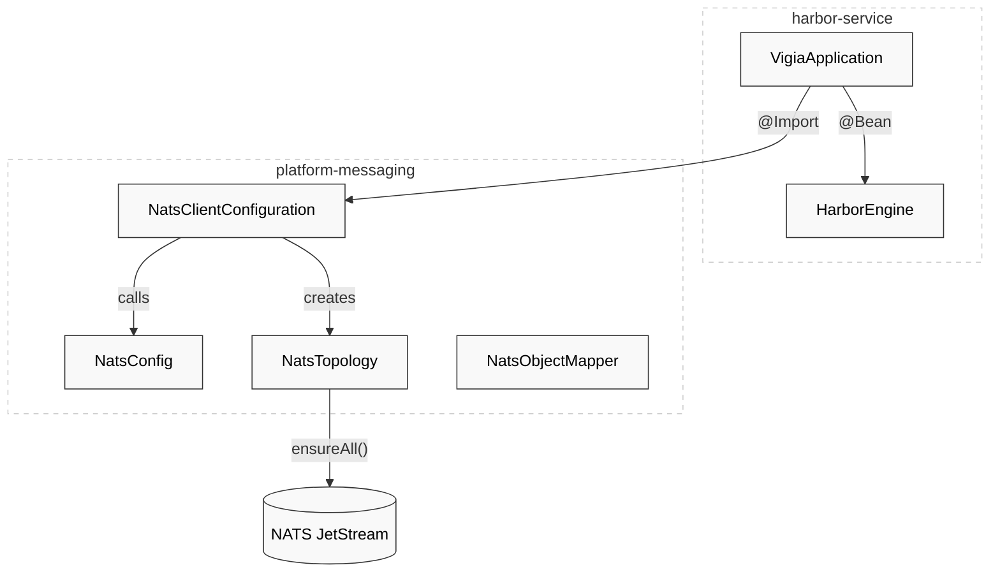

# Messaging Infrastructure (NATS)

Relevant source files

- 
- 
- 
- 
- 
- 

The Hisso platform utilizes **NATS JetStream** as its primary asynchronous communication backbone. This infrastructure facilitates decoupled interaction between the four core engines (Scene, Sentinel, Harbor, Recorder) and the Hub service. The messaging layer is designed for high resilience, strictly typed event envelopes, and a versioned subject taxonomy.

For deep dives into specific areas, see the child pages:

- [NATS Configuration & Topology](https://deepwiki.com/pbaalerta-wq/hisso1/6.1-nats-configuration-and-topology) — Detailed connection settings, JetStream stream/consumer declarations, and the subject hierarchy.
- [Per-Service NATS Adapters](https://deepwiki.com/pbaalerta-wq/hisso1/6.2-per-service-nats-adapters) — Implementation details of ingest/egress adapters for each microservice.

## Subject Taxonomy

Hisso uses a hierarchical subject structure that includes the version and the specific resource ID (e.g., `BedId` or `ResidentId`). This allows for fine-grained subscriptions and facilitates non-breaking upgrades by including the version in the subject path [platform/messaging/src/main/kotlin/com/manahive/messaging/Subjects.kt8-11](https://github.com/pbaalerta-wq/hisso1/blob/d9fca861/platform/messaging/src/main/kotlin/com/manahive/messaging/Subjects.kt#L8-L11)

|Category|Subject Pattern|Description|
|---|---|---|
|**Perception**|`perception.observation.v1.<bed>`|Raw sensor data ingest.|
|**Scene**|`scene.fact.v1.<bed>`|High-level facts (e.g., ResidentOutOfBed).|
|**Sentinel**|`sentinel.signal.v1.<bed>`|Alerts and signals (e.g., IncidentDeclared).|
|**Alarm**|`alarm.event.v1.<alert>`|Dispatch and delivery events.|
|**Policy**|`hub.policy.change.v1`|Global notifications of policy updates.|
|**Recorder**|`recorder.command.v1.<bed>`|NVR start/stop instructions.|

Sources: [platform/messaging/src/main/kotlin/com/manahive/messaging/Subjects.kt11-30](https://github.com/pbaalerta-wq/hisso1/blob/d9fca861/platform/messaging/src/main/kotlin/com/manahive/messaging/Subjects.kt#L11-L30)

## Wire Format: EventEnvelope

All domain events are wrapped in a standard `EventEnvelope` before being published to NATS. This envelope provides metadata for auditing, tracing, and polymorphic deserialization.

### NATS Serialization Logic

The platform uses a shared `NatsObjectMapper` to ensure consistency across all services. Key configurations include:

- **ISO-8601 Dates**: Dates are serialized as strings rather than timestamps to maintain human readability during bus audits [platform/messaging/src/main/kotlin/com/manahive/messaging/NatsObjectMapper.kt21-23](https://github.com/pbaalerta-wq/hisso1/blob/d9fca861/platform/messaging/src/main/kotlin/com/manahive/messaging/NatsObjectMapper.kt#L21-L23)
- **JavaTimeModule**: Registered globally to support `Instant` fields found in `EventEnvelope.occurredAt` [platform/messaging/src/main/kotlin/com/manahive/messaging/NatsObjectMapper.kt13-16](https://github.com/pbaalerta-wq/hisso1/blob/d9fca861/platform/messaging/src/main/kotlin/com/manahive/messaging/NatsObjectMapper.kt#L13-L16)

Sources: [platform/messaging/src/main/kotlin/com/manahive/messaging/NatsObjectMapper.kt27-32](https://github.com/pbaalerta-wq/hisso1/blob/d9fca861/platform/messaging/src/main/kotlin/com/manahive/messaging/NatsObjectMapper.kt#L27-L32) [hub/hub-service/src/main/kotlin/com/manahive/hub/nats/PolicyNatsEgress.kt69-78](https://github.com/pbaalerta-wq/hisso1/blob/d9fca861/hub/hub-service/src/main/kotlin/com/manahive/hub/nats/PolicyNatsEgress.kt#L69-L78)

## Infrastructure Resilience

The infrastructure is managed via `NatsClientConfiguration`, which provides the `Connection` bean and initializes the JetStream topology.

### Topology Management

To prevent message loss due to missing streams (which results in "503 No Responders"), the `NatsTopology` class executes `ensureAll()` upon service startup [platform/messaging/src/main/kotlin/com/manahive/messaging/NatsClientConfiguration.kt36-38](https://github.com/pbaalerta-wq/hisso1/blob/d9fca861/platform/messaging/src/main/kotlin/com/manahive/messaging/NatsClientConfiguration.kt#L36-L38) This ensures that the required streams and consumers exist before any messages are published or consumed.

### Connection Strategy

The connection logic is centralized in `NatsConfig`, utilizing a strategy that includes infinite reconnection attempts (`maxReconnects(-1)`) to handle transient network or broker failures.

Sources: [platform/messaging/src/main/kotlin/com/manahive/messaging/NatsClientConfiguration.kt20-39](https://github.com/pbaalerta-wq/hisso1/blob/d9fca861/platform/messaging/src/main/kotlin/com/manahive/messaging/NatsClientConfiguration.kt#L20-L39)

## Service Wiring & Adapters

Each service integrates with the bus through "Driving Adapters" (Ingest) and "Driven Adapters" (Egress).

### Data Flow Diagram: Hub to Sentinel

This diagram illustrates how the `PolicyNatsEgress` in the Hub service bridges the domain logic to the NATS infrastructure.

Sources: [hub/hub-service/src/main/kotlin/com/manahive/hub/nats/PolicyNatsEgress.kt32-34](https://github.com/pbaalerta-wq/hisso1/blob/d9fca861/hub/hub-service/src/main/kotlin/com/manahive/hub/nats/PolicyNatsEgress.kt#L32-L34) [hub/hub-service/src/main/kotlin/com/manahive/hub/nats/PolicyNatsEgress.kt57-61](https://github.com/pbaalerta-wq/hisso1/blob/d9fca861/hub/hub-service/src/main/kotlin/com/manahive/hub/nats/PolicyNatsEgress.kt#L57-L61) [hub/hub-service/src/main/kotlin/com/manahive/hub/nats/PolicyNatsEgress.kt88](https://github.com/pbaalerta-wq/hisso1/blob/d9fca861/hub/hub-service/src/main/kotlin/com/manahive/hub/nats/PolicyNatsEgress.kt#L88-L88)

### Infrastructure Wiring Diagram

This diagram shows how the `NatsClientConfiguration` is imported into services like `VigiaApplication` (Harbor) to provide the necessary messaging beans.

Sources: [engines/harbor/harbor-service/src/main/kotlin/com/manahive/harbor/service/VigiaApplication.kt27-29](https://github.com/pbaalerta-wq/hisso1/blob/d9fca861/engines/harbor/harbor-service/src/main/kotlin/com/manahive/harbor/service/VigiaApplication.kt#L27-L29) [platform/messaging/src/main/kotlin/com/manahive/messaging/NatsClientConfiguration.kt20-22](https://github.com/pbaalerta-wq/hisso1/blob/d9fca861/platform/messaging/src/main/kotlin/com/manahive/messaging/NatsClientConfiguration.kt#L20-L22) [platform/messaging/src/main/kotlin/com/manahive/messaging/NatsClientConfiguration.kt36-38](https://github.com/pbaalerta-wq/hisso1/blob/d9fca861/platform/messaging/src/main/kotlin/com/manahive/messaging/NatsClientConfiguration.kt#L36-L38)

### On this page

- [Messaging Infrastructure (NATS)](https://deepwiki.com/pbaalerta-wq/hisso1/6-messaging-infrastructure-\(nats\)#messaging-infrastructure-nats)
- [Subject Taxonomy](https://deepwiki.com/pbaalerta-wq/hisso1/6-messaging-infrastructure-\(nats\)#subject-taxonomy)
- [Wire Format: EventEnvelope](https://deepwiki.com/pbaalerta-wq/hisso1/6-messaging-infrastructure-\(nats\)#wire-format-eventenvelope)
- [NATS Serialization Logic](https://deepwiki.com/pbaalerta-wq/hisso1/6-messaging-infrastructure-\(nats\)#nats-serialization-logic)
- [Infrastructure Resilience](https://deepwiki.com/pbaalerta-wq/hisso1/6-messaging-infrastructure-\(nats\)#infrastructure-resilience)
- [Topology Management](https://deepwiki.com/pbaalerta-wq/hisso1/6-messaging-infrastructure-\(nats\)#topology-management)
- [Connection Strategy](https://deepwiki.com/pbaalerta-wq/hisso1/6-messaging-infrastructure-\(nats\)#connection-strategy)
- [Service Wiring & Adapters](https://deepwiki.com/pbaalerta-wq/hisso1/6-messaging-infrastructure-\(nats\)#service-wiring-adapters)
- [Data Flow Diagram: Hub to Sentinel](https://deepwiki.com/pbaalerta-wq/hisso1/6-messaging-infrastructure-\(nats\)#data-flow-diagram-hub-to-sentinel)
- [Infrastructure Wiring Diagram](https://deepwiki.com/pbaalerta-wq/hisso1/6-messaging-infrastructure-\(nats\)#infrastructure-wiring-diagram)
