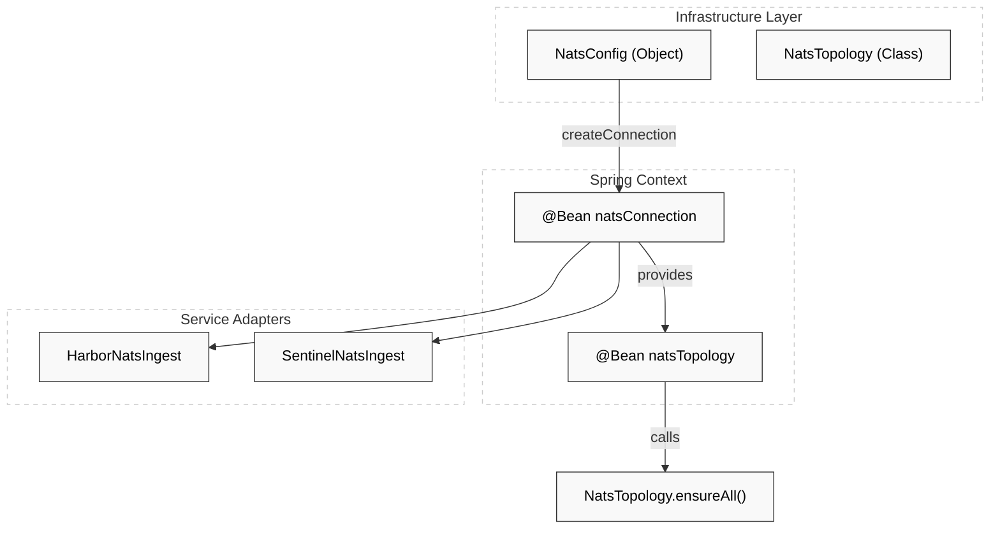
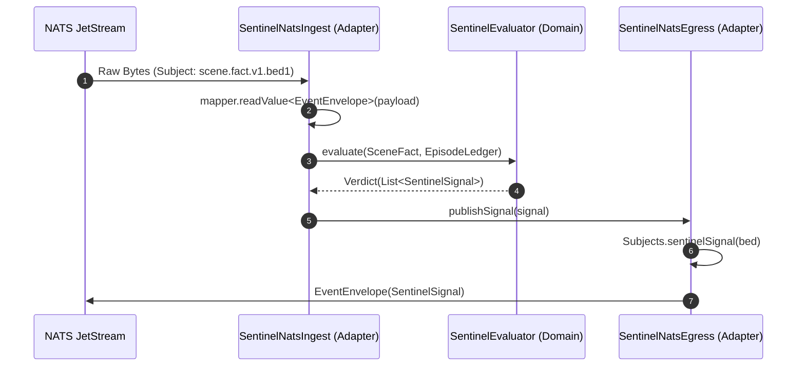

# NATS Configuration & Topology

Relevant source files

- 
- 
- 
- 
- 
- 
- 
- 
- 
- 
- 

The messaging infrastructure of Hisso is built upon NATS JetStream, serving as the asynchronous backbone that connects the four-engine pipeline. The system follows a "never-surrender" connectivity model, ensuring that services remain resilient to bus outages and can start independently of the NATS server's availability.

## NATS Connection Strategy

The connection logic is centralized in `NatsConfig` within the `platform:messaging` module. It is designed for 24/7 high-availability environments where the order of service startup should not be a point of failure.

### Resilience Parameters

The system uses specific `Options` to ensure infinite reconnection attempts and non-blocking startup:

- **`connectReconnectOnConnect`**: Used in `createConnection` to ensure that `Nats.connect` does not throw an exception if the bus is unavailable at startup. Instead, it returns a connection object that will automatically connect once the bus becomes available [platform/messaging/src/main/kotlin/com/manahive/messaging/NatsConfig.kt21-46](https://github.com/pbaalerta-wq/hisso1/blob/d9fca861/platform/messaging/src/main/kotlin/com/manahive/messaging/NatsConfig.kt#L21-L46)
- **`maxReconnects(-1)`**: Configures infinite reconnection attempts [platform/messaging/src/main/kotlin/com/manahive/messaging/NatsConfig.kt40](https://github.com/pbaalerta-wq/hisso1/blob/d9fca861/platform/messaging/src/main/kotlin/com/manahive/messaging/NatsConfig.kt#L40-L40)
- **`reconnectWait`**: Set to 1 second to balance recovery speed with server load [platform/messaging/src/main/kotlin/com/manahive/messaging/NatsConfig.kt39](https://github.com/pbaalerta-wq/hisso1/blob/d9fca861/platform/messaging/src/main/kotlin/com/manahive/messaging/NatsConfig.kt#L39-L39)
- **`connectAsync`**: An alternative method that uses `Nats.connectAsynchronously` to avoid blocking the Spring application context initialization thread [platform/messaging/src/main/kotlin/com/manahive/messaging/NatsConfig.kt60-73](https://github.com/pbaalerta-wq/hisso1/blob/d9fca861/platform/messaging/src/main/kotlin/com/manahive/messaging/NatsConfig.kt#L60-L73)

### Spring Integration

Connectivity is exposed to the services via `NatsClientConfiguration`. This configuration is not auto-discovered; services must explicitly `@Import` it to participate in the bus [platform/messaging/src/main/kotlin/com/manahive/messaging/NatsClientConfiguration.kt12-14](https://github.com/pbaalerta-wq/hisso1/blob/d9fca861/platform/messaging/src/main/kotlin/com/manahive/messaging/NatsClientConfiguration.kt#L12-L14)

**Diagram: Connection Lifecycle and Bean Wiring**

**Sources:** [platform/messaging/src/main/kotlin/com/manahive/messaging/NatsConfig.kt15-46](https://github.com/pbaalerta-wq/hisso1/blob/d9fca861/platform/messaging/src/main/kotlin/com/manahive/messaging/NatsConfig.kt#L15-L46) [platform/messaging/src/main/kotlin/com/manahive/messaging/NatsClientConfiguration.kt22-39](https://github.com/pbaalerta-wq/hisso1/blob/d9fca861/platform/messaging/src/main/kotlin/com/manahive/messaging/NatsClientConfiguration.kt#L22-L39)

## NATS Topology & JetStream Management

Hisso uses a limits-based retention policy for its streams. The bus is treated as a high-performance transport buffer, while the Hub serves as the ultimate System of Record [platform/messaging/src/main/kotlin/com/manahive/messaging/NatsTopology.kt13-17](https://github.com/pbaalerta-wq/hisso1/blob/d9fca861/platform/messaging/src/main/kotlin/com/manahive/messaging/NatsTopology.kt#L13-L17)

### Stream Declarations

The `NatsTopology` class ensures that all required streams exist with correct configurations. The `ensureAll()` method is called by every service at startup via `NatsClientConfiguration` [platform/messaging/src/main/kotlin/com/manahive/messaging/NatsClientConfiguration.kt37-38](https://github.com/pbaalerta-wq/hisso1/blob/d9fca861/platform/messaging/src/main/kotlin/com/manahive/messaging/NatsClientConfiguration.kt#L37-L38)

|Stream|Subject Pattern|Retention Policy|Purpose|
|---|---|---|---|
|**PERCEPTION**|`perception.observation.v1.>`|7 Days|Raw sensor data/observations|
|**SCENE**|`scene.fact.v1.>`|7 Days|Output from Scene Engine (Digital Twin facts)|
|**SENTINEL**|`sentinel.signal.v1.>`|7 Days|Evaluated signals and alerts|
|**ALARM**|`alarm.event.v1.>`|7 Days|Harbor dispatch commands|
|**POLICY**|`hub.policy.>`|7 Days|Policy changes and effective rules|
|**RECORDER**|`recorder.command.v1.>`|7 Days|NVR start/stop commands|
|**EVIDENCE**|`evidence.record.v1.>`|7 Days|Metadata about recorded clips|

**Sources:** [platform/messaging/src/main/kotlin/com/manahive/messaging/NatsTopology.kt20-28](https://github.com/pbaalerta-wq/hisso1/blob/d9fca861/platform/messaging/src/main/kotlin/com/manahive/messaging/NatsTopology.kt#L20-L28) [platform/messaging/src/main/kotlin/com/manahive/messaging/NatsTopology.kt30-42](https://github.com/pbaalerta-wq/hisso1/blob/d9fca861/platform/messaging/src/main/kotlin/com/manahive/messaging/NatsTopology.kt#L30-L42)

## Subject Hierarchy (`Subjects.kt`)

The subject taxonomy follows a strict versioning pattern: `domain.entity.version.identifier`. Breaking changes require a new version number (e.g., `v2`), allowing old and new consumers to coexist during transitions [platform/messaging/src/main/kotlin/com/manahive/messaging/Subjects.kt8-10](https://github.com/pbaalerta-wq/hisso1/blob/d9fca861/platform/messaging/src/main/kotlin/com/manahive/messaging/Subjects.kt#L8-L10)

- **Scene Facts**: `scene.fact.v1.${bed.value}` [platform/messaging/src/main/kotlin/com/manahive/messaging/Subjects.kt13](https://github.com/pbaalerta-wq/hisso1/blob/d9fca861/platform/messaging/src/main/kotlin/com/manahive/messaging/Subjects.kt#L13-L13)
- **Sentinel Signals**: `sentinel.signal.v1.${bed.value}` [platform/messaging/src/main/kotlin/com/manahive/messaging/Subjects.kt14](https://github.com/pbaalerta-wq/hisso1/blob/d9fca861/platform/messaging/src/main/kotlin/com/manahive/messaging/Subjects.kt#L14-L14)
- **Alarm Events**: `alarm.event.v1.${alert.value}` [platform/messaging/src/main/kotlin/com/manahive/messaging/Subjects.kt15](https://github.com/pbaalerta-wq/hisso1/blob/d9fca861/platform/messaging/src/main/kotlin/com/manahive/messaging/Subjects.kt#L15-L15)
- **Policy Changes**: `hub.policy.change.v1` [platform/messaging/src/main/kotlin/com/manahive/messaging/Subjects.kt17](https://github.com/pbaalerta-wq/hisso1/blob/d9fca861/platform/messaging/src/main/kotlin/com/manahive/messaging/Subjects.kt#L17-L17)

**Sources:** [platform/messaging/src/main/kotlin/com/manahive/messaging/Subjects.kt1-30](https://github.com/pbaalerta-wq/hisso1/blob/d9fca861/platform/messaging/src/main/kotlin/com/manahive/messaging/Subjects.kt#L1-L30)

## Serialization & Data Flow

All messages on the bus are wrapped in an `EventEnvelope` [platform/contracts/src/main/kotlin/com/manahive/contracts/EventEnvelope.kt](https://github.com/pbaalerta-wq/hisso1/blob/d9fca861/platform/contracts/src/main/kotlin/com/manahive/contracts/EventEnvelope.kt) The `NatsObjectMapper` provides a shared Jackson mapper configured with `JavaTimeModule` to ensure ISO-8601 compliance for `Instant` fields [platform/messaging/src/main/kotlin/com/manahive/messaging/NatsObjectMapper.kt](https://github.com/pbaalerta-wq/hisso1/blob/d9fca861/platform/messaging/src/main/kotlin/com/manahive/messaging/NatsObjectMapper.kt)

### Data Flow Example: Sentinel Ingest

1. **Subscription**: `SentinelNatsIngest` subscribes to `Subjects.SCENE_WILDCARD` (`scene.fact.v1.>`) [engines/sentinel/sentinel-service/src/main/kotlin/com/manahive/sentinel/service/nats/SentinelNatsIngest.kt71-72](https://github.com/pbaalerta-wq/hisso1/blob/d9fca861/engines/sentinel/sentinel-service/src/main/kotlin/com/manahive/sentinel/service/nats/SentinelNatsIngest.kt#L71-L72)
2. **Envelope Handling**: Incoming bytes are mapped to `EventEnvelope` [engines/sentinel/sentinel-service/src/main/kotlin/com/manahive/sentinel/service/nats/SentinelNatsIngest.kt65](https://github.com/pbaalerta-wq/hisso1/blob/d9fca861/engines/sentinel/sentinel-service/src/main/kotlin/com/manahive/sentinel/service/nats/SentinelNatsIngest.kt#L65-L65)
3. **Domain Mapping**: The `payloadJson` is deserialized into a `SceneFact` [engines/sentinel/sentinel-service/src/main/kotlin/com/manahive/sentinel/service/nats/SentinelNatsIngest.kt81](https://github.com/pbaalerta-wq/hisso1/blob/d9fca861/engines/sentinel/sentinel-service/src/main/kotlin/com/manahive/sentinel/service/nats/SentinelNatsIngest.kt#L81-L81)
4. **Evaluation**: The `SentinelEvaluator` processes the fact against a resident's `EpisodeLedger` [engines/sentinel/sentinel-service/src/main/kotlin/com/manahive/sentinel/service/nats/SentinelNatsIngest.kt96-97](https://github.com/pbaalerta-wq/hisso1/blob/d9fca861/engines/sentinel/sentinel-service/src/main/kotlin/com/manahive/sentinel/service/nats/SentinelNatsIngest.kt#L96-L97)
5. **Egress**: Resulting `SentinelSignal` objects are published back to NATS via `SentinelNatsEgress` [engines/sentinel/sentinel-service/src/main/kotlin/com/manahive/sentinel/service/nats/SentinelNatsIngest.kt103-104](https://github.com/pbaalerta-wq/hisso1/blob/d9fca861/engines/sentinel/sentinel-service/src/main/kotlin/com/manahive/sentinel/service/nats/SentinelNatsIngest.kt#L103-L104)

**Diagram: Natural Language to Code Entity Space (Messaging Flow)**

**Sources:** [engines/sentinel/sentinel-service/src/main/kotlin/com/manahive/sentinel/service/nats/SentinelNatsIngest.kt60-112](https://github.com/pbaalerta-wq/hisso1/blob/d9fca861/engines/sentinel/sentinel-service/src/main/kotlin/com/manahive/sentinel/service/nats/SentinelNatsIngest.kt#L60-L112) [engines/scene-engine/scene-service/src/main/kotlin/com/manahive/scene/service/nats/SceneNatsEgress.kt44-61](https://github.com/pbaalerta-wq/hisso1/blob/d9fca861/engines/scene-engine/scene-service/src/main/kotlin/com/manahive/scene/service/nats/SceneNatsEgress.kt#L44-L61)

### On this page

- [NATS Configuration & Topology](https://deepwiki.com/pbaalerta-wq/hisso1/6.1-nats-configuration-and-topology#nats-configuration-topology)
- [NATS Connection Strategy](https://deepwiki.com/pbaalerta-wq/hisso1/6.1-nats-configuration-and-topology#nats-connection-strategy)
- [Resilience Parameters](https://deepwiki.com/pbaalerta-wq/hisso1/6.1-nats-configuration-and-topology#resilience-parameters)
- [Spring Integration](https://deepwiki.com/pbaalerta-wq/hisso1/6.1-nats-configuration-and-topology#spring-integration)
- [NATS Topology & JetStream Management](https://deepwiki.com/pbaalerta-wq/hisso1/6.1-nats-configuration-and-topology#nats-topology-jetstream-management)
- [Stream Declarations](https://deepwiki.com/pbaalerta-wq/hisso1/6.1-nats-configuration-and-topology#stream-declarations)
- [Subject Hierarchy (`Subjects.kt`)](https://deepwiki.com/pbaalerta-wq/hisso1/6.1-nats-configuration-and-topology#subject-hierarchy-subjectskt)
- [Serialization & Data Flow](https://deepwiki.com/pbaalerta-wq/hisso1/6.1-nats-configuration-and-topology#serialization-data-flow)
- [Data Flow Example: Sentinel Ingest](https://deepwiki.com/pbaalerta-wq/hisso1/6.1-nats-configuration-and-topology#data-flow-example-sentinel-ingest)

