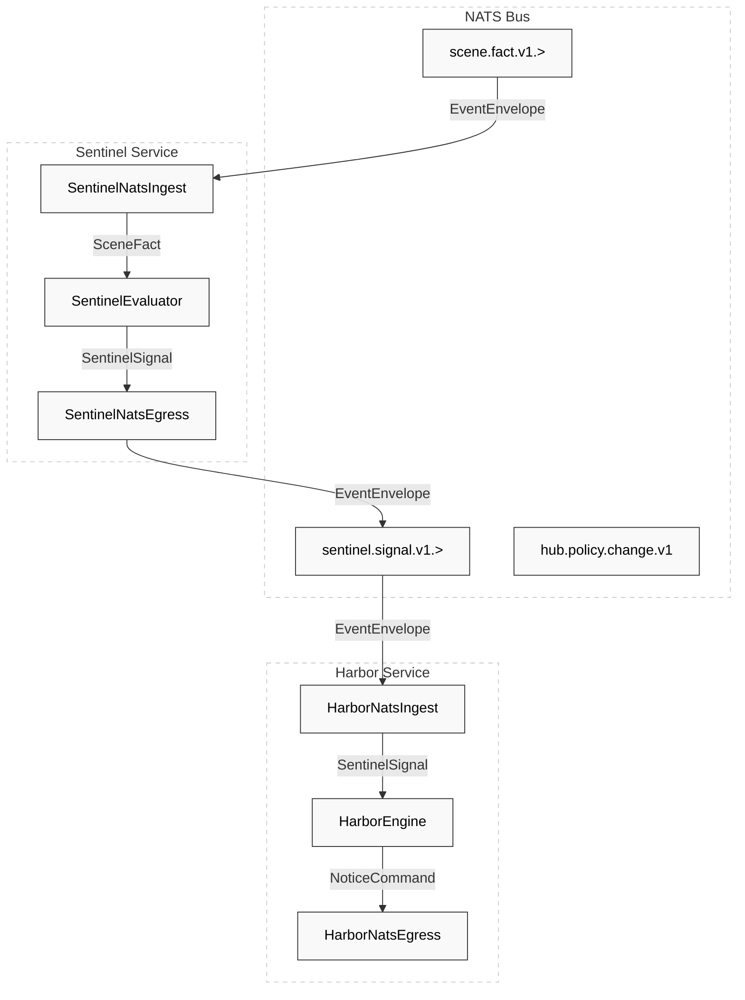
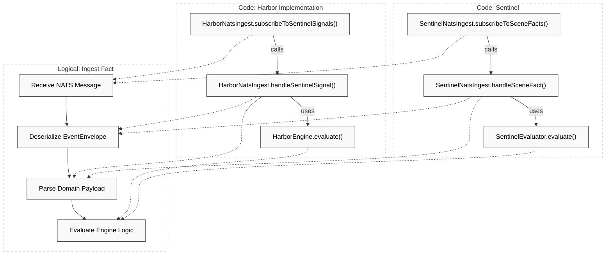

# Per-Service NATS Adapters

Relevant source files

- 
- 
- 
- 
- 
- 
- 
- 
- 
- 
- 

This page documents the technical implementation of the NATS ingest and egress adapters for each service in the Hisso platform. These adapters serve as the "Imperative Shell" around the pure-domain engines, translating NATS messages into domain entities and vice-versa.

The messaging infrastructure relies on a shared `NatsObjectMapper` that ensures consistent serialization of `Instant` fields via the `JavaTimeModule`, avoiding common failures in policy and event propagation [platform/messaging/src/main/kotlin/com/manahive/messaging/NatsObjectMapper.kt27-32](https://github.com/pbaalerta-wq/hisso1/blob/d9fca861/platform/messaging/src/main/kotlin/com/manahive/messaging/NatsObjectMapper.kt#L27-L32)

### Messaging Data Flow Overview

The following diagram illustrates how NATS adapters bridge the gap between the NATS JetStream subjects and the internal Engine logic.

**Diagram: NATS to Engine Connectivity**

**Sources:** [engines/sentinel/sentinel-service/src/main/kotlin/com/manahive/sentinel/service/nats/SentinelNatsIngest.kt29-36](https://github.com/pbaalerta-wq/hisso1/blob/d9fca861/engines/sentinel/sentinel-service/src/main/kotlin/com/manahive/sentinel/service/nats/SentinelNatsIngest.kt#L29-L36) [engines/harbor/harbor-service/src/main/kotlin/com/manahive/harbor/service/nats/HarborNatsIngest.kt29-33](https://github.com/pbaalerta-wq/hisso1/blob/d9fca861/engines/harbor/harbor-service/src/main/kotlin/com/manahive/harbor/service/nats/HarborNatsIngest.kt#L29-L33) [platform/messaging/src/main/kotlin/com/manahive/messaging/Subjects.kt1-10](https://github.com/pbaalerta-wq/hisso1/blob/d9fca861/platform/messaging/src/main/kotlin/com/manahive/messaging/Subjects.kt#L1-L10)

---

### 1. Sentinel NATS Adapters

The Sentinel service acts as the primary judgment engine, consuming facts about the physical scene and producing signals regarding resident safety.

#### SentinelNatsIngest

Subscribes to `Subjects.SCENE_WILDCARD` (`scene.fact.v1.>`) [engines/sentinel/sentinel-service/src/main/kotlin/com/manahive/sentinel/service/nats/SentinelNatsIngest.kt71](https://github.com/pbaalerta-wq/hisso1/blob/d9fca861/engines/sentinel/sentinel-service/src/main/kotlin/com/manahive/sentinel/service/nats/SentinelNatsIngest.kt#L71-L71)

- **State Management**: Maintains an `EpisodeLedger` per resident in a `ConcurrentHashMap` [engines/sentinel/sentinel-service/src/main/kotlin/com/manahive/sentinel/service/nats/SentinelNatsIngest.kt42](https://github.com/pbaalerta-wq/hisso1/blob/d9fca861/engines/sentinel/sentinel-service/src/main/kotlin/com/manahive/sentinel/service/nats/SentinelNatsIngest.kt#L42-L42)
- **Logic**: Deserializes `EventEnvelope.payloadJson` into a `SceneFact`, invokes `SentinelEvaluator.evaluate`, updates the ledger, and triggers egress for any generated signals [engines/sentinel/sentinel-service/src/main/kotlin/com/manahive/sentinel/service/nats/SentinelNatsIngest.kt79-111](https://github.com/pbaalerta-wq/hisso1/blob/d9fca861/engines/sentinel/sentinel-service/src/main/kotlin/com/manahive/sentinel/service/nats/SentinelNatsIngest.kt#L79-L111)

**Sources:** [engines/sentinel/sentinel-service/src/main/kotlin/com/manahive/sentinel/service/nats/SentinelNatsIngest.kt1-113](https://github.com/pbaalerta-wq/hisso1/blob/d9fca861/engines/sentinel/sentinel-service/src/main/kotlin/com/manahive/sentinel/service/nats/SentinelNatsIngest.kt#L1-L113)

---

### 2. Harbor (Vigia) NATS Adapters

Harbor manages the lifecycle of notifications and alerts, ensuring they are delivered to the correct channels (Console, Push, etc.).

#### HarborNatsIngest

Subscribes to `Subjects.SENTINEL_WILDCARD` (`sentinel.signal.v1.>`) [engines/harbor/harbor-service/src/main/kotlin/com/manahive/harbor/service/nats/HarborNatsIngest.kt70](https://github.com/pbaalerta-wq/hisso1/blob/d9fca861/engines/harbor/harbor-service/src/main/kotlin/com/manahive/harbor/service/nats/HarborNatsIngest.kt#L70-L70)

- **Concurrency**: Uses a `registryLock` to synchronize access to the `NoticeRegistry` state [engines/harbor/harbor-service/src/main/kotlin/com/manahive/harbor/service/nats/HarborNatsIngest.kt41-88](https://github.com/pbaalerta-wq/hisso1/blob/d9fca861/engines/harbor/harbor-service/src/main/kotlin/com/manahive/harbor/service/nats/HarborNatsIngest.kt#L41-L88)
- **Logic**: Converts `SentinelSignal` into `NoticeCommand` objects via the `HarborEngine`, which are then passed to `HarborNatsEgress.publishAlarmEvent` [engines/harbor/harbor-service/src/main/kotlin/com/manahive/harbor/service/nats/HarborNatsIngest.kt89-97](https://github.com/pbaalerta-wq/hisso1/blob/d9fca861/engines/harbor/harbor-service/src/main/kotlin/com/manahive/harbor/service/nats/HarborNatsIngest.kt#L89-L97)

#### VigiaApplication Wiring

The `VigiaApplication` defines the default `HarborCalibration`, setting escalation timeouts for different severities (e.g., 5 minutes for Alerts, immediate for Incidents) [engines/harbor/harbor-service/src/main/kotlin/com/manahive/harbor/service/VigiaApplication.kt32-46](https://github.com/pbaalerta-wq/hisso1/blob/d9fca861/engines/harbor/harbor-service/src/main/kotlin/com/manahive/harbor/service/VigiaApplication.kt#L32-L46)

**Sources:** [engines/harbor/harbor-service/src/main/kotlin/com/manahive/harbor/service/nats/HarborNatsIngest.kt1-107](https://github.com/pbaalerta-wq/hisso1/blob/d9fca861/engines/harbor/harbor-service/src/main/kotlin/com/manahive/harbor/service/nats/HarborNatsIngest.kt#L1-L107) [engines/harbor/harbor-service/src/main/kotlin/com/manahive/harbor/service/VigiaApplication.kt27-51](https://github.com/pbaalerta-wq/hisso1/blob/d9fca861/engines/harbor/harbor-service/src/main/kotlin/com/manahive/harbor/service/VigiaApplication.kt#L27-L51)

---

### 3. Recorder NATS Adapters

The Recorder service is unique as it consumes from multiple streams to determine when to trigger NVR (Network Video Recorder) evidence collection.

#### RecorderNatsIngest

Subscribes to both `SCENE` and `SENTINEL` streams [engines/recorder/recorder-service/src/main/kotlin/com/manahive/recorder/service/nats/RecorderNatsIngest.kt59-62](https://github.com/pbaalerta-wq/hisso1/blob/d9fca861/engines/recorder/recorder-service/src/main/kotlin/com/manahive/recorder/service/nats/RecorderNatsIngest.kt#L59-L62)

- **Multi-Stream Handling**: Maps incoming messages to `RecordingTrigger` types. `SceneFact` becomes `SceneFactTrigger`, and `SentinelSignal` becomes `SentinelSignalTrigger` [engines/recorder/recorder-service/src/main/kotlin/com/manahive/recorder/service/nats/RecorderNatsIngest.kt119-145](https://github.com/pbaalerta-wq/hisso1/blob/d9fca861/engines/recorder/recorder-service/src/main/kotlin/com/manahive/recorder/service/nats/RecorderNatsIngest.kt#L119-L145)
- **Egress**: Publishes `RecordingCommand` and `EvidenceRecord` objects based on the `RecorderEngine` verdict [engines/recorder/recorder-service/src/main/kotlin/com/manahive/recorder/service/nats/RecorderNatsIngest.kt107-108](https://github.com/pbaalerta-wq/hisso1/blob/d9fca861/engines/recorder/recorder-service/src/main/kotlin/com/manahive/recorder/service/nats/RecorderNatsIngest.kt#L107-L108)

**Sources:** [engines/recorder/recorder-service/src/main/kotlin/com/manahive/recorder/service/nats/RecorderNatsIngest.kt1-146](https://github.com/pbaalerta-wq/hisso1/blob/d9fca861/engines/recorder/recorder-service/src/main/kotlin/com/manahive/recorder/service/nats/RecorderNatsIngest.kt#L1-L146)

---

### 4. Scene and Policy Egress Adapters

These adapters handle the publication of facts and configuration changes.

#### SceneNatsEgress

Publishes `SceneFact` events to the subject `scene.fact.v1.<bed>` [engines/scene-engine/scene-service/src/main/kotlin/com/manahive/scene/service/nats/SceneNatsEgress.kt44-46](https://github.com/pbaalerta-wq/hisso1/blob/d9fca861/engines/scene-engine/scene-service/src/main/kotlin/com/manahive/scene/service/nats/SceneNatsEgress.kt#L44-L46) It uses the `SceneEventSerializer` to ensure polymorphic domain events are correctly represented in the `EventEnvelope` [engines/scene-engine/scene-service/src/main/kotlin/com/manahive/scene/service/nats/SceneNatsEgress.kt53](https://github.com/pbaalerta-wq/hisso1/blob/d9fca861/engines/scene-engine/scene-service/src/main/kotlin/com/manahive/scene/service/nats/SceneNatsEgress.kt#L53-L53)

#### PolicyNatsEgress

Located in the Hub service, this adapter implements `PolicyEventPublisher` [hub/hub-service/src/main/kotlin/com/manahive/hub/nats/PolicyNatsEgress.kt32-34](https://github.com/pbaalerta-wq/hisso1/blob/d9fca861/hub/hub-service/src/main/kotlin/com/manahive/hub/nats/PolicyNatsEgress.kt#L32-L34)

- `publishPolicyChange`: Sends `PolicyChangeDetected` to `hub.policy.change.v1` to trigger re-resolution in the Politica engine [hub/hub-service/src/main/kotlin/com/manahive/hub/nats/PolicyNatsEgress.kt57-63](https://github.com/pbaalerta-wq/hisso1/blob/d9fca861/hub/hub-service/src/main/kotlin/com/manahive/hub/nats/PolicyNatsEgress.kt#L57-L63)
- `publishEffectiveRules`: Sends resolved rules to `hub.policy.effective-rules.v1.<resident>` for Sentinel consumption [hub/hub-service/src/main/kotlin/com/manahive/hub/nats/PolicyNatsEgress.kt88-90](https://github.com/pbaalerta-wq/hisso1/blob/d9fca861/hub/hub-service/src/main/kotlin/com/manahive/hub/nats/PolicyNatsEgress.kt#L88-L90)

**Sources:** [engines/scene-engine/scene-service/src/main/kotlin/com/manahive/scene/service/nats/SceneNatsEgress.kt1-62](https://github.com/pbaalerta-wq/hisso1/blob/d9fca861/engines/scene-engine/scene-service/src/main/kotlin/com/manahive/scene/service/nats/SceneNatsEgress.kt#L1-L62) [hub/hub-service/src/main/kotlin/com/manahive/hub/nats/PolicyNatsEgress.kt1-106](https://github.com/pbaalerta-wq/hisso1/blob/d9fca861/hub/hub-service/src/main/kotlin/com/manahive/hub/nats/PolicyNatsEgress.kt#L1-L106)

---

### Implementation Mapping

The following diagram bridges the "Natural Language Space" (Logical Operations) to the "Code Entity Space" (Specific Classes and Methods).

**Diagram: Adapter Logic Mapping**

**Sources:** [engines/sentinel/sentinel-service/src/main/kotlin/com/manahive/sentinel/service/nats/SentinelNatsIngest.kt60-96](https://github.com/pbaalerta-wq/hisso1/blob/d9fca861/engines/sentinel/sentinel-service/src/main/kotlin/com/manahive/sentinel/service/nats/SentinelNatsIngest.kt#L60-L96) [engines/harbor/harbor-service/src/main/kotlin/com/manahive/harbor/service/nats/HarborNatsIngest.kt59-89](https://github.com/pbaalerta-wq/hisso1/blob/d9fca861/engines/harbor/harbor-service/src/main/kotlin/com/manahive/harbor/service/nats/HarborNatsIngest.kt#L59-L89)

### Summary Table: NATS Subjects & Adapters

|Service|Adapter Class|Primary Subject|Role|
|---|---|---|---|
|**Scene**|`SceneNatsEgress`|`scene.fact.v1.<bed>`|Egress (Facts)|
|**Sentinel**|`SentinelNatsIngest`|`scene.fact.v1.>`|Ingest (Facts)|
|**Sentinel**|`SentinelNatsEgress`|`sentinel.signal.v1.<bed>`|Egress (Signals)|
|**Harbor**|`HarborNatsIngest`|`sentinel.signal.v1.>`|Ingest (Signals)|
|**Recorder**|`RecorderNatsIngest`|`scene.fact.v1.>` & `sentinel.signal.v1.>`|Ingest (Triggers)|
|**Hub**|`PolicyNatsEgress`|`hub.policy.change.v1`|Egress (Policy)|

**Sources:** [platform/messaging/src/main/kotlin/com/manahive/messaging/Subjects.kt1-10](https://github.com/pbaalerta-wq/hisso1/blob/d9fca861/platform/messaging/src/main/kotlin/com/manahive/messaging/Subjects.kt#L1-L10) [platform/messaging/src/main/kotlin/com/manahive/messaging/NatsTopology.kt20-28](https://github.com/pbaalerta-wq/hisso1/blob/d9fca861/platform/messaging/src/main/kotlin/com/manahive/messaging/NatsTopology.kt#L20-L28)

### On this page

- [Per-Service NATS Adapters](https://deepwiki.com/pbaalerta-wq/hisso1/6.2-per-service-nats-adapters#per-service-nats-adapters)
- [Messaging Data Flow Overview](https://deepwiki.com/pbaalerta-wq/hisso1/6.2-per-service-nats-adapters#messaging-data-flow-overview)
- [1. Sentinel NATS Adapters](https://deepwiki.com/pbaalerta-wq/hisso1/6.2-per-service-nats-adapters#1-sentinel-nats-adapters)
- [SentinelNatsIngest](https://deepwiki.com/pbaalerta-wq/hisso1/6.2-per-service-nats-adapters#sentinelnatsingest)
- [2. Harbor (Vigia) NATS Adapters](https://deepwiki.com/pbaalerta-wq/hisso1/6.2-per-service-nats-adapters#2-harbor-vigia-nats-adapters)
- [HarborNatsIngest](https://deepwiki.com/pbaalerta-wq/hisso1/6.2-per-service-nats-adapters#harbornatsingest)
- [VigiaApplication Wiring](https://deepwiki.com/pbaalerta-wq/hisso1/6.2-per-service-nats-adapters#vigiaapplication-wiring)
- [3. Recorder NATS Adapters](https://deepwiki.com/pbaalerta-wq/hisso1/6.2-per-service-nats-adapters#3-recorder-nats-adapters)
- [RecorderNatsIngest](https://deepwiki.com/pbaalerta-wq/hisso1/6.2-per-service-nats-adapters#recordernatsingest)
- [4. Scene and Policy Egress Adapters](https://deepwiki.com/pbaalerta-wq/hisso1/6.2-per-service-nats-adapters#4-scene-and-policy-egress-adapters)
- [SceneNatsEgress](https://deepwiki.com/pbaalerta-wq/hisso1/6.2-per-service-nats-adapters#scenenatsegress)
- [PolicyNatsEgress](https://deepwiki.com/pbaalerta-wq/hisso1/6.2-per-service-nats-adapters#policynatsegress)
- [Implementation Mapping](https://deepwiki.com/pbaalerta-wq/hisso1/6.2-per-service-nats-adapters#implementation-mapping)
- [Summary Table: NATS Subjects & Adapters](https://deepwiki.com/pbaalerta-wq/hisso1/6.2-per-service-nats-adapters#summary-table-nats-subjects-adapters)

